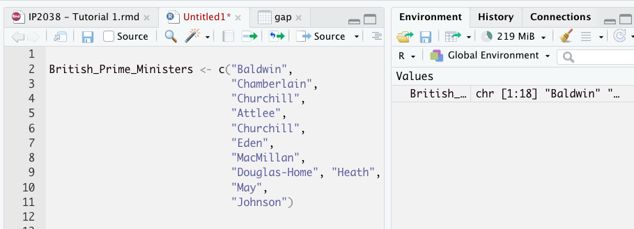
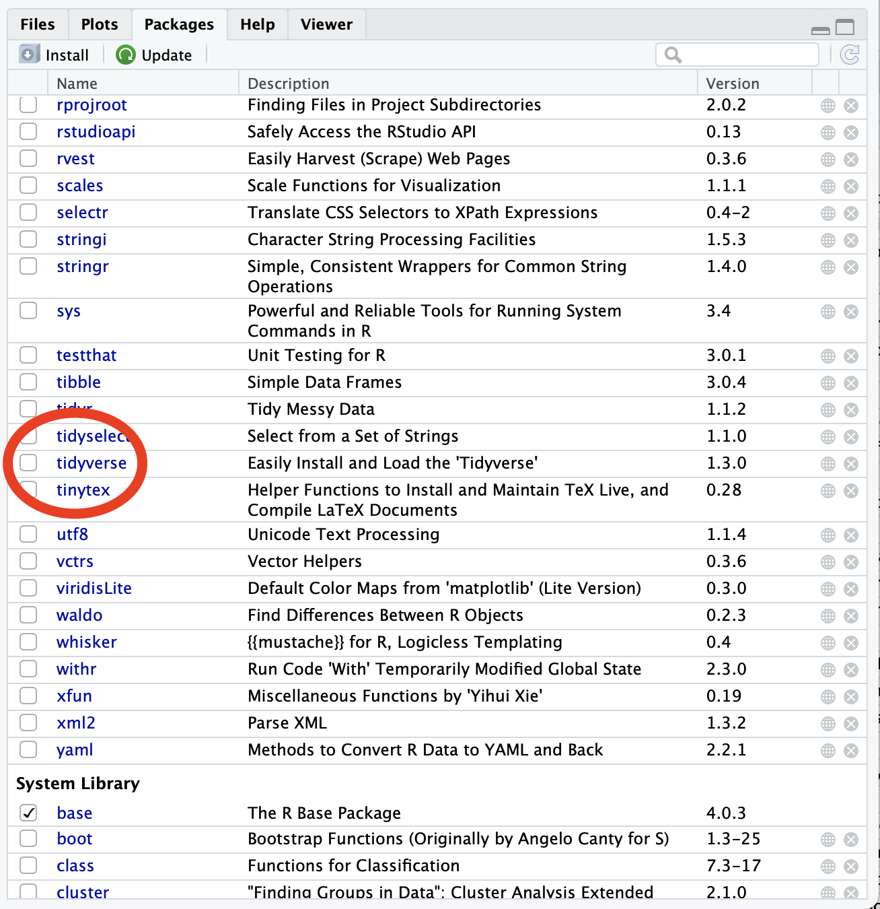

# Getting Started with R


## Objects in R

### Creating Objects
R is an object-oriented language, that is, data and code can be saved as **objects**.

Instead of sending the result of our command to the console, we can use the `<-` operator to assign the results to an object we create. This is a combination of the lesser than sign and the dash.

To see the results of what you stored in the object, you can simply type the name of the object in the console and hit return.  When you recall the name of the assigned office, R will output the value assigned to that object.


```r

British_Prime_Ministers <- c("Baldwin", "Chamberlain", "Churchill", "Attlee", "Churchill", "Eden", "MacMillan", "Douglas-Home", "Heath", "Wilson", "Callaghan", "Tatcher", "Major", "Blair", "Brown", "Cameron", "May", "Johnson")

British_Prime_Ministers
#>  [1] "Baldwin"      "Chamberlain"  "Churchill"   
#>  [4] "Attlee"       "Churchill"    "Eden"        
#>  [7] "MacMillan"    "Douglas-Home" "Heath"       
#> [10] "Wilson"       "Callaghan"    "Tatcher"     
#> [13] "Major"        "Blair"        "Brown"       
#> [16] "Cameron"      "May"          "Johnson"
```

It is helpful to think about the assignment operator  `<-` as the verb "*gets*" or "*is equal to*", reading left to right. The code above can be read "*The object British_Prime_Ministers gets the result of concatenating the following names ("Baldwin", "Chamberlain", "Churchill", etc...)  into a vector using the function `c()`*"


**Shortcuts**: it is possible to call the assignment operator `<-` by using the keyboard shortcut `Option+minus` on MacOS or `Alt+minus` on Windows.


When you create objects assigning things to names with the `<-` operator, they will appear in R’s workspace or environment. Your workspace is specific to your current project. 

{width=80%}

--- 

### Naming Object

You can give objects names, with a few restrictions:

- no spaces in the name. Instead it is common to use `_` to link different words
- no mathematical operators (-, +, *, /, etc...)
- object names must start with a letter but can include numbers

For instance, the code below returns an error when you run it since R is reading "My" and "Name" as two different objects. 


```r

My Name <- "Stefano"
 
My Name

#> Error: <text>:2:4: unexpected symbol
#> 1: 
#> 2: My Name
#>       ^
```


### Case Sensitive


Names in R are case sensitive. This means that the object my_data is not the same as the object My_Data.
For instance, see what happens when you run the code below:


```r
# Store your name in variable my_name
my_name <- "Stefano"

# Check if your name is the one assigned
My_Name == "Stefano"
#> Error in eval(expr, envir, enclos): object 'My_Name' not found
```

Running the code will result in the error `Object "My_Name" not found` since we initially stored our name in the object `my_name`

---

## Types of Objects

Objects can be many things:

- a string (character, word, or longer text)
- a number
- a vector (a sequence of strings or numbers)
- a function;
- a matrix (rows and columns of numbers)
- a dataframe (rectangular table consisting of observations and variables)
- a figure or set of figures.
- etc...

We can use the function `class()` to interrogate how a value  has been stored. Knowing an object’s class tells you a lot about what you can and can’t do with it


---

### Numbers

Objects can be numbers.


```r
  MyObject <- 2
  
  2 * MyObject
#> [1] 4
```

When a numerical object is created, this can can be manipulated as other numbers.


```r
  # Create object UK_GDP
  UK_GDP <- 2170000000000

  # Create object UK_Population
  UK_Population <- 67886004

  # Calculate gdp per capital
  UK_GDP_Per_Capita <- UK_GDP/UK_Population
  UK_GDP_Per_Capita
#> [1] 31965.35
```


### Characters

Objects can be characters. Any combination of words, numbers, and symbols within quotation marks will be stored as a "character" object 


```r

  #Store my name in an object called "my_name"
  my_name <- "Stefano"

  #Print the content of the object "my_name" in the console
  my_name
#> [1] "Stefano"
```

 If we store a number within quotation marks, R will treat this as a character and it won't be possible to perform any traditional mathematical operation on it.


```r
  UK_GDP <- "2170000000000"

  class(UK_GDP)
#> [1] "character"
```

For instance,  in the code below we would like to calculate the total population of the UK, but running the code will result in an error. Can you fix it?


```r
  # Save the Population of UK Nations in separate objects
  Pop_England <- "53107169"
  Pop_Scotland <- "5299900"
  Pop_Wales <- "3063758"
  Pop_NIreland <- "1814318"

  # Calculate Population United Kingdom
  Pop_UK <- Pop_England + Pop_Scotland + Pop_Wales + Pop_NIreland
#> Error in Pop_England + Pop_Scotland: non-numeric argument to binary operator
  
  # Print the results in the console
  Pop_UK
#> Error in eval(expr, envir, enclos): object 'Pop_UK' not found
```


---

### Logical

Objects can also be ***logical (booleans)*** statements that take either a `true` or `false` value.

For instance we can check whether an object has a certain value or wether two objects have the same value by using the equality operator (`==`). The result will be a logical value (true/false) that can also be stored in a object.


```r

  # Store my name into object called "my_name"
  my_name <- "Stefano"

  # check if my_name is equal to "Mark" and store it in an object called "am_I_Mark"
  am_I_Mark <- (my_name == "Mark") 

  # print the results of am_I_Mark
  am_I_Mark
#> [1] FALSE

  # check what type of object is "am_I_Mark"
  class(am_I_Mark)
#> [1] "logical"
```

 

```r
  two_plus_two_is_five <- (2 + 2 == 5)
  two_plus_two_is_five
#> [1] FALSE
```

---

### Vectors

A vector is a collection of values arranged in some order. Vectors are the building blocks of data sets.

We build vectors in R using the function `c()`, which is short for concatenate. The different elements of the vector are placed within parentheses and separated by a comma.

  

```r

#Create vector composed of 7 different strings, divided by a comma
Seven_Dwarves <- c("Doc", "Grumpy", "Happy", "Sleepy", "Bashful", "Sneezy", "Dopey")

Seven_Dwarves
#> [1] "Doc"     "Grumpy"  "Happy"   "Sleepy"  "Bashful"
#> [6] "Sneezy"  "Dopey"
```


The function `c()` can also be used to combine different vectors or objects into a single vector:


```r
Tory_Leader <- "Johnson"

Labour_Leader <- "Starmer"

Libdem_Leader <- "Davey"

SNP_Leader <- "Sturgeon"

UK_Party_Leader <- c(Tory_Leader, Labour_Leader, Libdem_Leader, SNP_Leader)

UK_Party_Leader
#> [1] "Johnson"  "Starmer"  "Davey"    "Sturgeon"
```

Many R commands can be applied to a vector. For instance, the function `max` returns the highest value in a numerical vector, while the function `min` returns the lowest value in a numerical vector.


```r
#Create vector including the monthly inflation rates in the US
US_Inflation_2020 <- c(0.39, 0.27, 0.22, 0.67, 0.002, 0.55, 0.51, 0.32, 0.14, 0.04, 0.06, 0.09 )

#identify the element of the vector with the highest value using 
max(US_Inflation_2020)
#> [1] 0.67

min(US_Inflation_2020)
#> [1] 0.002
```
 
The function `sum` adds up the different element of a numerical vector


```r
#Create vector including the monthly inflation rates in the US

Votes_Yay <- 120
Votes_Nay <- 84
Votes_Abstain <- 5

#Create vector with all votes
All_Votes <- c(Votes_Yay, Votes_Nay, Votes_Abstain)
 
sum(All_Votes)
#> [1] 209
```


---


## Functions in R


### What are Functions in R

**Functions** are commands called to perform specific actions on your **objects** or any other **input** that you assign. In order to have a function do something for us, we need to call it.

Functions include typical commands that you might execute to import data, analyze data, create maps using geographic data;  scrape text, pictures, links, and other data from webpages; to download documents and examine text for similarity, repetition, sentiment, etc…


### Recognizing functions

Functions are denoted by a name followed by a set of parentheses that contain an input (or object) or series of inputs (separated by commas) on which the function should be executed. 

R has many built-in functions. For example:

- `round()` to round a number up to a certain number of decimals


```r
round(3.4)
#> [1] 3
```


```r
round(3.6)
#> [1] 4
```

- `paste()` to combine two or more strings into a single string


```r

my_name <- "Stefano"

paste("Hi, my name is" , my_name)
#> [1] "Hi, my name is Stefano"
```

- `mean()` to calculate the average value of a vector of numbers


```r

US_Inflation_Jan2020 <- 0.39
US_Inflation_Feb2020 <- 0.27
US_Inflation_Mar2020 <- 0.22
US_Inflation_Apr2020 <- 0.67  
US_Inflation_May2020 <- 0.002
US_Inflation_Jun2020 <- 0.55
US_Inflation_Jul2020 <- 0.51
US_Inflation_Aug2020 <- 0.32
US_Inflation_Sept2020 <- 0.14
US_Inflation_Oct2020 <- 0.04
US_Inflation_Nov2020 <- 0.06
US_Inflation_Dec2020 <- 0.09

Average_US_Inflation <- mean(US_Inflation_Jan2020,
                       US_Inflation_Feb2020,
                       US_Inflation_Mar2020,
                       US_Inflation_Apr2020,
                       US_Inflation_May2020,
                       US_Inflation_Jun2020,
                       US_Inflation_Jul2020,
                       US_Inflation_Aug2020,
                       US_Inflation_Sept2020,
                       US_Inflation_Oct2020,
                       US_Inflation_Nov2020,
                       US_Inflation_Dec2020)

Average_US_Inflation					   
#> [1] 0.39
```


### Help with functions
  
If you want to learn more about a function, type ? and then the function name into the console. For example `?round`

  

```r
  ?round
```

### Activity: What do these functions do?

Run and edit the different code chunks below and find out what each of these functions does. You can find more information by typing `?` followed by the function's name?
What do these functions do?

- `tolower()`


```r
tolower("STRING")
#> [1] "string"

# You can find more information about this function by typing ?tolower 
```

- `length()`


```r
length(c("Doc", "Grumpy", "Happy", "Sleepy", "Bashful", "Sneezy", "Dopey")) 
#> [1] 7

# You can find more information about this function by typing ?length 
```

- `sqrt()`


```r
sqrt(81)
#> [1] 9

# You can find more information about this function by typing ?sqrt 
```

- `gsub()`


```r
gsub("Tuesday", "Wednesday", "Today is Tuesday")
#> [1] "Today is Wednesday"

# You can find more information about this function by typing ?gsub
```

- `sort()`


```r
sort(c(14, 12, 16, 9))
#> [1]  9 12 14 16

# You can find more information about this function by typing ?sort
```

- `grepl()`


```r
grepl("day", "Wednesday")
#> [1] TRUE

grepl("day", "March")
#> [1] FALSE
# You can find more information about this function by typing ?grepl
```


---

## R Packages

While a number of common function come pre-loaded when you open R, others need to be imported into your working environment by loading ***packages***.

Packages allow you to build upon the work done by others to complete your tasks when analyzing data or creating in R.


### How to install packages

In order to access the commands included in packages, you will need to *install* these packages into R the first time you use them, and *load* them in your workspace every time you use them.

In order to install a package you will call the function `install.packages("NAME OF THE PACKAGE")`. For instance, we install the tidyverse package by using this command. 


```r
install.packages("tidyverse")
```

You can install packages into R by hand-selecting Install, Packages from the Files/Help/Packages panel, and typing in the "package_name".

{width=50%}

### Loading packages

In order to use the functions contained in a package, you will need to first load them in your work environment using the `library()` function.

You must load the package into the R "library" in order to use it, after it is installed.

In RStudio Cloud, each time you open a new R session online, you will need to load the packages you wish to use in that session.

To load packages, you can:

- Type `library(package_name)`
- Select the package from the list of packages using the Files/Packages/Help panel.


### Tidyverse


{width=50%}

In this module we will do the bulk of the analysis a few important packages:

- `dplyr()` to manipulate the data
- `ggplot2()` to visualize the data
- `tidyr()` to clean the data


These packages are part of a common group of packages called `tidyverse`. You can install and load all the packages that are part of the tidyverse using

Example, in order to load the "tidyverse" package  

```r
install.packages("tidyverse")

library(tidyverse)
```
 

---
