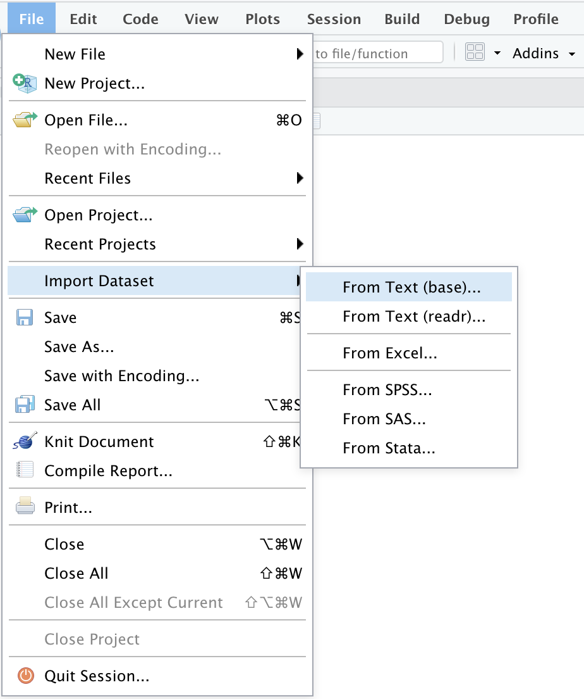
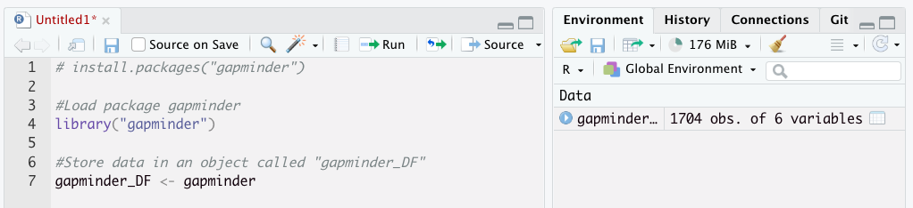
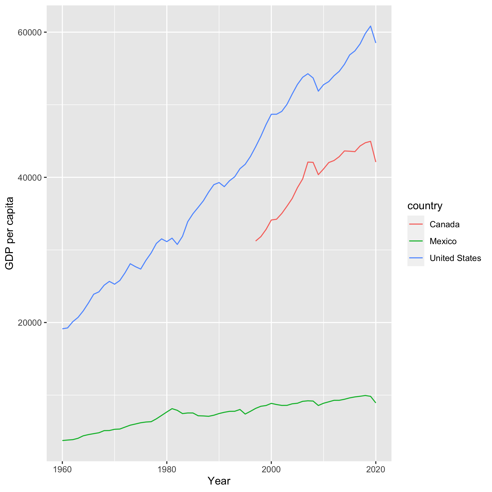
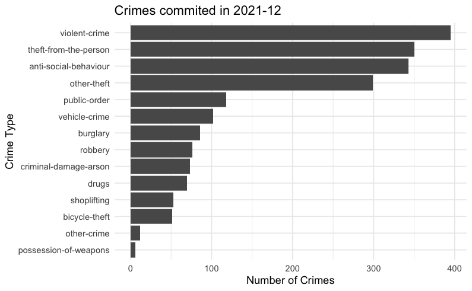

# Importing Data into R


## Importing a Dataframe from an Existing File


R includes a variety of packages and functions designed to import data in your working environment and to store them into an object `data.frame`. A  a `tibble` is a special type of dataframe.

Different functions are available depending on the file formats you need to import.

### CSV files

Comma-separated value (**CSV**) files a common way to store tabular data. They are just plain text files where the columns are separated by commas and the rows are separated by line breaks, like this:

```
person, class, role, programme
Stefano P., IP2038, instructor, IPE
Niko S., IP2038, student, Pol
Hana M., IP2038, student, IPE
```

Multiple packages are available in R to load a `.csv` file into your work environment. The `read_csv()` function is part the `readr` package, which is one piece of the `tidyverse`, so make sure you have the `tidyverse` package loaded.
The function `read_csv` takes as argument within brackets the name of the file to be imported. In the case the file is located in a subfolder of the project, you will need to indicate also the path where the file is located in your computer.

For instance, in thecode below we are loading the dataset called "UK_Inequality" which is located in the subfolder of our project named "Data", and store it in the object `Inequality_DF`. This object is a `tibble` which is a type of dataframe.


```r
library(tidyverse)
#> Warning: package 'tidyr' was built under R version 4.0.5
#> Warning: package 'readr' was built under R version 4.0.5
# Here's how we read that CSV data
Inequality_DF <- read_csv('data/UK_Inequality.csv')

# Print the beginning of the dataset imported
head(Inequality_DF)
#> # A tibble: 6 × 5
#>   country variable    year Bottom_50_Perc Top_1_Perc
#>   <chr>   <chr>      <dbl>          <dbl>      <dbl>
#> 1 GB      sptinc992j  1937             NA      0.205
#> 2 GB      sptinc992j  1949             NA      0.139
#> 3 GB      sptinc992j  1951             NA      0.132
#> 4 GB      sptinc992j  1952             NA      0.123
#> 5 GB      sptinc992j  1953             NA      0.118
#> 6 GB      sptinc992j  1954             NA      0.117
```

`read_csv` can also be used to import files that are stored on a website. To do so, you need to provide as the main argument the URL.

For instance, the  [Oxford Covid-19 Government Response Tracker](http://bsg.ox.ac.uk/covidtracker) is a research project based that collects data on the the policies introduced by different countries in response to the Covid-19 pandemic. Their datasets are stored on an [online data repository](https://github.com/OxCGRT/covid-policy-tracker) in a series of [csv files](https://github.com/OxCGRT/covid-policy-tracker/tree/master/data) . The URL of these csv files can be passed to `read_csv` to import the content of the data (please note that to download data from Github you will need to select the "raw" format)


```r
# load the tidyverse library to load the read_csv function
library(tidyverse)

# load the dataset at the URL below and store it in a element called "oxfordVaccine_DF"
oxfordVaccine_DF <- read_csv("https://raw.githubusercontent.com/OxCGRT/covid-policy-tracker/master/data/OxCGRT_vaccines_full.csv")
#> Warning: One or more parsing issues, see `problems()` for
#> details
# Print to the console the initial values of the dataset
head(oxfordVaccine_DF)
#> # A tibble: 6 × 171
#>   CountryName CountryCode     Date `V1_Vaccine Prioritisat…`
#>   <chr>       <chr>          <dbl>                     <dbl>
#> 1 Aruba       ABW         20200101                         0
#> 2 Aruba       ABW         20200102                         0
#> 3 Aruba       ABW         20200103                         0
#> 4 Aruba       ABW         20200104                         0
#> 5 Aruba       ABW         20200105                         0
#> 6 Aruba       ABW         20200106                         0
#> # … with 167 more variables: `V1_0-4 yrs infants` <dbl>,
#> #   `V1_5-15 yrs young people` <dbl>,
#> #   `V1_Airport/Border/Airline Staff` <dbl>,
#> #   `V1_At Risk 16-19 yrs` <dbl>,
#> #   `V1_At Risk 20-24 yrs` <dbl>,
#> #   `V1_At Risk 25-29 yrs` <dbl>,
#> #   `V1_At Risk 30-34 yrs` <dbl>, …
```


You can find more information on the `read_csv()` function, type `?read_csv` in the console.

 

### Excel files (.xls, .xlsx)

While `read_csv()` allows you to import csv files, R can read data in many different formats. 

The `readxl` package allows you to get data out of Excel and into R. The package is part of the tidyverse, but it needs to be loaded using `library(readxl)`. Once you have loaded the package, you can import excel files using the `read_excel` function


```r
library(readxl)

Global_Findex_Database <- read_excel(data/Global_Findex_Database.xlsx)
```

### SPSS and STATA 

Sometimes you will need to access data saved in other statistical packages like STATA and SPSS.
To do this, you can use the `haven` packages within the `tidyverse` world. Once this package is loaded you can import a data file from stata using the `read_stata()` function


```r
# Load package
library(haven)

#Import data
desiguales_stata <- read_stata("Data/desiguales.dta")
```

The `read_spss()` function can be used to import SPSS data files with extension .sav
 

```r
# Load package
library(haven)

#Import data
desiguales_spss <- read_spss("Data/desiguales.sav")
```


### Importing Other Types of Data

`rio` is a package that can import/export multiple types of data.

After you have installed and loaded the `rio` package, the function `import()` can be used to import data from a broad range of file formats. For more information on the data format supported by Rio, see the online [documentation](https://www.rdocumentation.org/packages/rio/versions/0.5.29) of the package


```r
#install the package
install.packages("rio")

#load the package the package
library(rio)

#Import csv file using "import" function
desiguales <- import('Data/desiguales.csv')

#Import excel file using "import" function
desiguales_xlsx <- import("Data/desiguales.xlsx")
```

### Importing data via RStudio helper

In order to faciliate the task of importing data, RStudio has a data import tool.


To access this feature, use the "Import Dataset" dropdown from the "Environment" pane


{width=80%}Source: [RStudio](https://support.rstudio.com/hc/en-us/articles/218611977-Importing-Data-with-the-RStudio-IDE) 

Alternatively this can be accessed by selecting the "File" menu, followed by the "Import Dataset" submenu.


{width=80%}Source: [RStudio](https://support.rstudio.com/hc/en-us/articles/218611977-Importing-Data-with-the-RStudio-IDE) 

This feature will allow you to import data from CSV files (select "From Text"), from Excel files, as well as from SPSS, SAS, and Stata files. This data importer includes some functionalities to select which columns will be imported and to change the data type. While this is a point-and-click wait to perform the same functions that are described above, the equivalent code can be found in the "code preview". Paste this code in your script to ensure the reprodicibility of your code.

{width=80%}Source: [RStudio](https://support.rstudio.com/hc/en-us/articles/218611977-Importing-Data-with-the-RStudio-IDE) 

For more information on this RStudio feature, please consult the documentation on the [RStudio webpage](https://support.rstudio.com/hc/en-us/articles/218611977-Importing-Data-with-the-RStudio-IDE)


## Import Data From a Package

In a number of cases, it is possible to load datasets in your working environment by using ad-hoc packages. This contains one or more functions designed to download entire datasets or part of datasets from an online source.

One example of this type that is often used for the purpose of teaching is the `gapminder` package which downloads a small subset of the data found in the website gapminder.org.


```r
#Install the package. This needs to be run only the first time the package is installed
# install.packages("gapminder") 

#Load package
library("gapminder") 

#Store data in an object called "gapminder_DF"

gapminder_DF <- gapminder
```

Running this code will download the gapminder dataset and store it in  in your working environment.



Other packages instead will allow you to select the specific parts of a larger dataset to be imported in your working environment.

For instance, the [`WDI`](https://vincentarelbundock.github.io/WDI/) package allows users to search and download data from over 40 datasets hosted by the World Bank, including the World Development Indicators (‘WDI’), International Debt Statistics, Doing Business, Human Capital Index, and Sub-national Poverty indicators. In this case, after having installed and loaded the package, we can use the `WDIsearch` function to search the available datasets containing a certain keyword.


```r
# The package needs to be installed only the first time it is run
#install.packages('WDI')

#Load the package
library("WDI")

#Search available datasets
WDIsearch('gdp per capita') 
```

Once we have identified the dataset we are interested in exploring, we can download it on our working environment using the `WDI` function. The code example below downloads the GDP per capita of Canada, Mexico, and United States from 1960 to 2020 and plot it


```r
# The package needs to be installed only the first time it is run
#install.packages('WDI')

#Load the package
library("WDI")

#Download the data regarding GDP per capita (constant 2000 US$) for a certain period and store it in an object called dat
dat = WDI(indicator='NY.GDP.PCAP.KD', country=c('MX','CA','US'), start=1960, end=2020)

#plot the data
library(ggplot2)
ggplot(dat, aes(x = year, y = NY.GDP.PCAP.KD, color=country)) + 
	geom_line() +
	xlab('Year') + 
	ylab('GDP per capita')
```

{width=80%}

### Examples of dataset available from a package

Some examples of packages that can be used to directly load relevant datasets in your working environment are:

- [`unvotes`](https://cran.r-project.org/web/packages/unvotes/index.html): Historical voting data of the United Nations General Assembly. 

- [`hansard`](https://cran.r-project.org/web/packages/hansard/vignettes/introduction.html): package to pull data from the UK parliament through the [http://www.data.parliament.uk/](http://www.data.parliament.uk/) API


```r
#install the package "hansard"
#install.packages("hansard")

#load the package "hansard"
library(hansard)

# Download and show data regarding how Jacob Rees-Mogg (MP 4099) voted between 25 Jan 2022 and 4 Feb 2022
mp_vote_record(4099, start_date = "2021-01-25",
                    end_date = "2021-02-04", verbose = FALSE)
```

- [`peacesciencer`](https://github.com/svmiller/peacesciencer/): Different datasets related to the study of conflict and peace
- [wid-r-tool](https://github.com/WIDworld/wid-r-tool): data from the [World Wealth and Income Database (WID.world)](https://wid.world)
- [`rqog`](https://ropengov.github.io/rqog/articles/rqog_tutorial.html): data from the Quality of Government Institute dataset
- [`imfr`](https://github.com/christophergandrud/imfr): download data from the International Monetary Fund's data API
- [`vdemdata`](https://github.com/vdeminstitute/vdemdata):  load the most recent [V-Dem (Varieties of Democracy)](https://www.v-dem.net/en/data/data/v-dem-dataset/) and [V-Party](https://www.v-dem.net/en/data/data/v-party-dataset/)datasets.
- [`OECD`](https://github.com/expersso/OECD): allows the user to download data from the OECD’s API
- [`ukpolice`](https://github.com/njtierney/ukpolice): data from the [UK police database](https://data.police.uk/)


```r
#Install packages
#install.packages("remotes")
#remotes::install_github("njtierney/ukpolice")

# load package
library(ukpolice)
library(tidyverse)

# Load the data regarding crime committed in a given location
crime_data <- ukp_crime(lat = 51.52765231, lng = -0.1024097940746401)

#Calculate the number of crimes by category
crime_data_summary = crime_data %>%
  group_by(category) %>%
  summarize(number_crimes = n()) 
  
#Plot the crimes committed in the selected location over last month

  ggplot(data = crime_data_summary, 
	  aes(x = reorder(category, number_crimes),
             y = number_crimes)) + 
  geom_col() + 
  labs(x = "Crime Type",
       y = "Number of Crimes",
       title = paste0("Crimes commited in ",crime_data$date[1])) +
  coord_flip() +
  theme_minimal()
```




