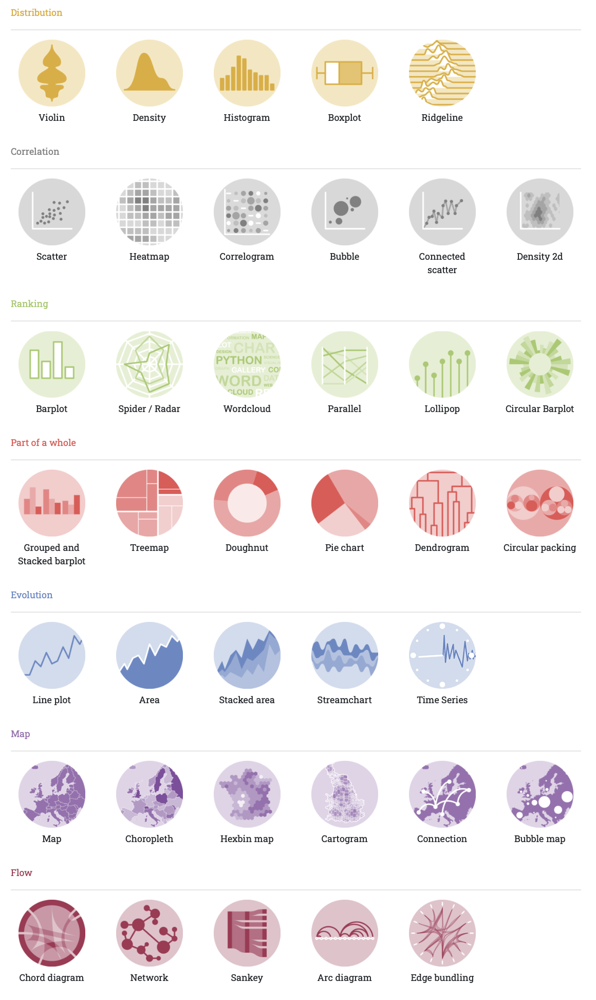
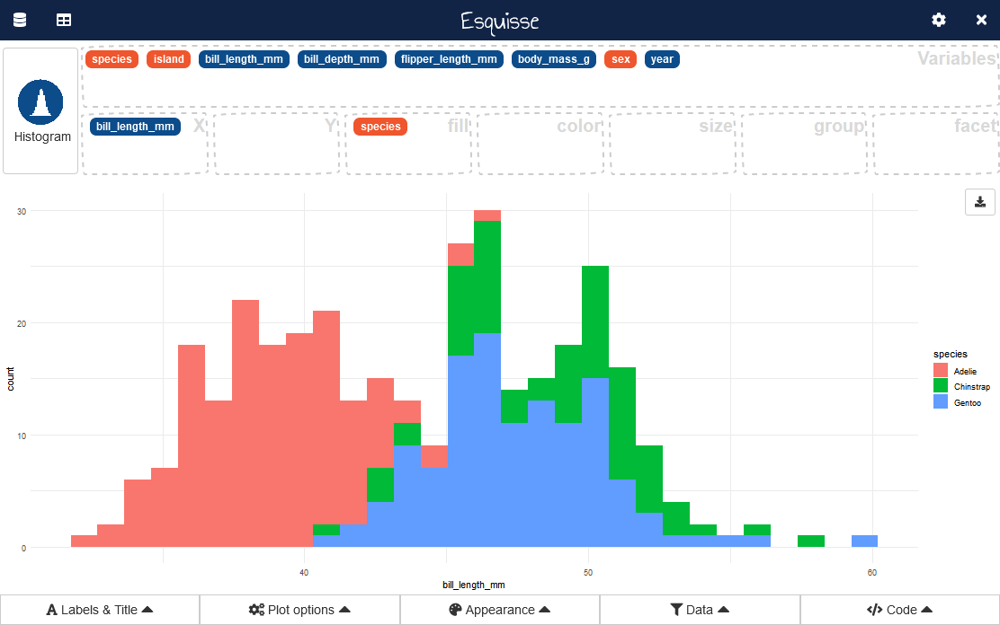
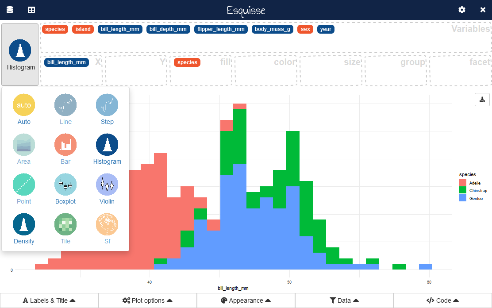

# Data Visualization with ggplot


## Introduction to ggplot

The ggplot2 package is widely used package for making plots in R. It allows us to draw a wide variety of graphs while preserving a consistent approach to building impressive  data visualizations.

The 'gg' at the begin of ggplot stands for the 'grammar of graphics', a reference to Leland Wilkinson’s book 'Grammar of Graphics' (1999). The Grammar of Graphics puts forward the notion that any plot (e.g. scatterplot, barplot) can be expressed from the same set of components that make up a plot or graphic, such as how data are represented on the plot (as lines, points, etc.), how variables are mapped to coordinates or plotting shape or color, what transformation or statistical summary is required, and so on.
 

`ggplot` allows you to build a visualization layer-by-layer by specifying

1. the `data` from which the individual variables will be extracted 
2. a `geom` which  specifies how the data is represented in the plot (e.g. points, lines, bars)
3. aesthetics (`aes`) that map variabels in the dataset to graphical elements in the plot (e.g. position on the axes, size, shape, colour)
 

Additional steps often necessary to improve the visualizations include adding layers to our graph to:

4. Specifying the coordinates 
5. Specifying the scales
6. Setting labels and guides
7. Dividing the visualization in different mini-plots (`facet`)
	

In what follows below we will build this graph step by step while introducing the key commands that part of `ggplot`.


## Selecting the Data

The initial step in drawing a plot with `ggplot()` involves selecting the dataset that we want to draw. Most of the functions used within ggplot require the data to have been 'tidied', which means, organizing the data so that every column is a variable, every row is an observation, and every cell is a single value

We specify the dataset by calling the  `ggplot()` function  and including within brackets the name of the dataframe we want to draw from.

In the examples below we will plot the `gapminder` dataset. For each of 142 countries, the package provides values for life expectancy, GDP per capita, and population, every five years, from 1952 to 2007. The dataset can be loaded through the package `gapminder`.  


```r
#Install package
#install.packages("gapminder")

#Load the package
library(gapminder)

#Show the first few rows
head(gapminder)
#> # A tibble: 6 × 6
#>   country     continent  year lifeExp      pop gdpPercap
#>   <fct>       <fct>     <int>   <dbl>    <int>     <dbl>
#> 1 Afghanistan Asia       1952    28.8  8425333      779.
#> 2 Afghanistan Asia       1957    30.3  9240934      821.
#> 3 Afghanistan Asia       1962    32.0 10267083      853.
#> 4 Afghanistan Asia       1967    34.0 11537966      836.
#> 5 Afghanistan Asia       1972    36.1 13079460      740.
#> 6 Afghanistan Asia       1977    38.4 14880372      786.
```


We can tell ggplot to use this data by typing `ggplot(data = gapminder)` (the code will also work if we omit `data =` and simply specify the dataset within parentheses)


```r
#load ggplot (it could be loaded from the tidyverse package)
library(ggplot2)

ggplot(data = gapminder)
```


Only specifying the dataset within the `ggplot()` function without any additional command will result in the plotting  of an empty grey panel. This is because we need to specify how different columns of the data frame should be represented in the plot.


## Map variables to plot elements ('aes')

Generating visualization in R requires that we specify the connections between the variables in our data and the plot elements on the screen, such as colours, points, and shapes.  When using `ggplot()` these connections are called *aesthetic* mappings.


In ggplot we map variables in our data to properties we can see in the graph using the `aes()` function (*aes* is short for 'aesthetic'). 
Column names are given as ‘aesthetic’ elements to the ggplot function, and are wrapped in the `mapping = aes(...)` argument. We give these specifications separated by a comma and without quotation marks.
 
The most common aesthetics that are defined within the `mapping = aes(...)` argument are:

- `x`: variable whose values will be plotted on the x axis
- `y`: variable whose values will be plotted on the y axis


In this example from Kieran Healy's book ["*Data Visualization. A Practical Introduction*"](https://socviz.co) we will plot  life expectancy against per capita GDP for all country-years in the data.  In the code below, we are specifying what dataset we will work with (`gapminder`), which variable we want to plot on the *x* axis (`gdpPercap`) and on the *y* axis (`lifeExp`)


```r
ggplot(data = gapminder, 
	mapping = aes(x = gdpPercap, y = lifeExp))
```


Specifying the dataset within the `ggplot()` function and the mappings (variables to be visualized) will however only generate an empty plot with the variables listed on the axis. This is because we have yet to declare what sort of plot we want to use to visualize these variables. In order to plot our selected variables we need to add a layer to the plot by picking a `geom_` functions.


## Select the geometric representations ('geom')

Once we have specified the mapping, we add another 'layer' by calling a function specifying what graphical representation of our mappings we would like to see. We do this by calling one of the many `geom_` functions. This is preceded by a `+` sign because  we are adding a **layer** to the plot.

In the example below, we select the function `geom_point()` to plot the x and y values in a scatterplot. Each row in the gapminder dataset now has an x coordinate (`gdpPercap`), a y coordinate (`lifeExp`), and a designated geometric representation (point).


```r
ggplot(data = gapminder, 
	mapping = aes(x = gdpPercap, y = lifeExp)) +
	geom_point()
```


### Available geoms

In the graph below, we have represented the variables `gdpPercap` and `lifeExp` as coordinates for points by selecting the geom `geom_point`.


A broader range of of geometric representation is available in a ggplot graph:

-  **Bar charts** with [`geom_bar()`](https://ggplot2.tidyverse.org/reference/geom_bar.html) [`geom_col()`](https://ggplot2.tidyverse.org/reference/geom_bar.html)[`stat_count()`](https://ggplot2.tidyverse.org/reference/geom_bar.html)


```r
ggplot(data = gapminder, 
       mapping = aes(x=continent)) + 
  geom_bar()
```


- **Histograms and frequency polygons** with [`geom_freqpoly()`](https://ggplot2.tidyverse.org/reference/geom_histogram.html)[`geom_histogram()`](https://ggplot2.tidyverse.org/reference/geom_histogram.html)[`stat_bin()`](https://ggplot2.tidyverse.org/reference/geom_histogram.html)


```r
ggplot(data=gapminder, 
       mapping = aes(x=lifeExp)) + 
    geom_histogram(bins=60)
```


- **Smoothed density estimates** with [`geom_density()`](https://ggplot2.tidyverse.org/reference/geom_density.html)[`stat_density()`](https://ggplot2.tidyverse.org/reference/geom_density.html)


```r
library(gapminder)
ggplot(data=gapminder, aes(x=lifeExp)) + 
    geom_density()
```


- **A box and whiskers plot** with [`geom_boxplot()`](https://ggplot2.tidyverse.org/reference/geom_boxplot.html)[`stat_boxplot()`](https://ggplot2.tidyverse.org/reference/geom_boxplot.html)


```r
ggplot(data=gapminder, 
       aes(x=continent, 
           y=lifeExp)) +
    geom_boxplot(outlier.size=2)
```


- **Connect observations** with [`geom_path()`](https://ggplot2.tidyverse.org/reference/geom_path.html) [`geom_line()`](https://ggplot2.tidyverse.org/reference/geom_path.html) [`geom_step()`](https://ggplot2.tidyverse.org/reference/geom_path.html)


```r
gapminder %>%
  filter(country == "United Kingdom") %>%
   ggplot(mapping = aes(x = year, 
                     y = gdpPercap)) +
  geom_line()
```


- [](https://ggplot2.tidyverse.org/reference/geom_abline.html) **Reference lines: horizontal, vertical, and diagonal** with [`geom_abline()`](https://ggplot2.tidyverse.org/reference/geom_abline.html) [`geom_hline()`](https://ggplot2.tidyverse.org/reference/geom_abline.html)[`geom_vline()`](https://ggplot2.tidyverse.org/reference/geom_abline.html) 
- [](https://ggplot2.tidyverse.org/reference/geom_bin_2d.html) **Heatmap of 2d bin counts** with [`geom_bin_2d()`](https://ggplot2.tidyverse.org/reference/geom_bin_2d.html)[`stat_bin_2d()`](https://ggplot2.tidyverse.org/reference/geom_bin_2d.html) 


- [](https://ggplot2.tidyverse.org/reference/geom_dotplot.html) **Dot plot** with [`geom_dotplot()`](https://ggplot2.tidyverse.org/reference/geom_dotplot.html)

- [](https://ggplot2.tidyverse.org/reference/geom_jitter.html) **Jittered points** with [`geom_jitter()`](https://ggplot2.tidyverse.org/reference/geom_jitter.html)
- [](https://ggplot2.tidyverse.org/reference/geom_map.html) **Polygons from a reference map** with [`geom_map()`](https://ggplot2.tidyverse.org/reference/geom_map.html)
- [](https://ggplot2.tidyverse.org/reference/geom_point.html) **Points** [`geom_point()`](https://ggplot2.tidyverse.org/reference/geom_point.html)
- [](https://ggplot2.tidyverse.org/reference/geom_smooth.html) **Smoothed conditional means** with [`geom_smooth()`](https://ggplot2.tidyverse.org/reference/geom_smooth.html)[`stat_smooth()`](https://ggplot2.tidyverse.org/reference/geom_smooth.html)
- [](https://ggplot2.tidyverse.org/reference/geom_text.html) **Text** with [`geom_label()`](https://ggplot2.tidyverse.org/reference/geom_text.html)[`geom_text()`](https://ggplot2.tidyverse.org/reference/geom_text.html) 
- [](https://ggplot2.tidyverse.org/reference/geom_tile.html) **Rectangles** with [`geom_raster()`](https://ggplot2.tidyverse.org/reference/geom_tile.html) [`geom_rect()`](https://ggplot2.tidyverse.org/reference/geom_tile.html)[`geom_tile()`](https://ggplot2.tidyverse.org/reference/geom_tile.html)
- [](https://ggplot2.tidyverse.org/reference/geom_violin.html) **Violin plot** with [`geom_violin()`](https://ggplot2.tidyverse.org/reference/geom_violin.html)
 

Additional geoms can be loaded through specific packages that extends the functionalities of ggplot. Some popular examples are:

- [ggridges](https://www.rdocumentation.org/packages/ggridges/versions/0.5.0) package to create ridgeline plots
- [ggrepel](https://cran.r-project.org/web/packages/ggrepel/vignettes/ggrepel.html) package to repel overlapping text labels.


### Layer different geoms

It is possible to layer different `geom_` on the same plot (e.g. a line on top of a scatterplot) by using the `+` sign to introduce a new layer. Any `geom_` function will inherit from the ggplot function the instructions regarding what variables should be mapped, although it is possible to give geoms different commands regarding the variables to be plotted within parentheses.

For instance, in the example below we add an additional layer on top of our scatterplot by calling `geom_smooth()` to calculate and draw a smoothed line, including a ribbon showing the standard error.


```r
ggplot(data = gapminder, 
	mapping = aes(x = gdpPercap, y = lifeExp)) +
	geom_point() +
	geom_smooth()
```


 
Note that the trend line is blocking out certain points, because it is the ‘top layer’ of the plot. The `geom` layers that appear early in the command are drawn first, and can be obscured by the `geom` layers that come after them. 


## Additional aesthetics

The position of an element on the x and y axis are not the only aesthetics of the plot that can be defined. Other aesthetics that are common in different ggplot visualizations are:

- `color`: variable whose values will determine the color of lines and points
- `fill`: variable whose values will determine the color of filled objects
- `size`: variable whose values will determine the size of points
- `shape`: variable whose values will determine the shapes of points
- `linetype`: variable whose values will determine the line type

 

### Mapping Aesthetics to a Variable

The first way is to map an aesthetic to the values of a variable in our dataset. To do so, we need to set the properties inside the `mapping = aes()` function. The name of the variable does not need to be wrapped within quotation marks.

For instance in the figure below individual data points have been colored according to the continent of the country represented. As a result, 5 different colours have been selected, one for each distinct value of the `continent` variable. A legend explaining which colors have been linked to which continents is added automatically to the plot. It is also possible to map continuous variables to the color aesthetic. In this case ggplot will produce a gradient scale.


```r
ggplot(data = gapminder, 
	mapping = aes(x = gdpPercap, 
	              y = lifeExp, 
	              color = continent)) +
	geom_point()	
```


 
When mapping the `fill` or `colour` aesthetic to a variable, the colour applied to each value are selected automatically by ggplot out of a colour scale. It is possible to change this scale by applying a different colour palette.

For instance, `scale_fill_brewer` (for the inside of the geom) and `scale_colour_brewer` (for the border of the geom) can also be added to use some of the pre-created palettes from <https://colorbrewer2.org> (for a list see <https://ggplot2.tidyverse.org/reference/scale_brewer.html>)


```r
ggplot(data = gapminder, 
	mapping = aes(x = gdpPercap, y = lifeExp, color = continent)) +
	geom_point() +
  scale_colour_brewer(palette = "Greens") 
```


It is also possible to set manually the colour assigned to the variables using `scale_fill_manual()` and `scale_colour_manual()`.


```r
# Import the dataset world
ggplot(data = gapminder, 
	mapping = aes(x = gdpPercap, y = lifeExp, color = continent)) +
	geom_point() +
  scale_colour_manual(values=c("red", "blue", "green", "gray", "pink"))
```


### Setting the aesthetic manually

In some cases however we may want to set a property to a specific value (e.g. to change the colour of all the points in our scatterplot to blue). To do so, we need to set the properties outside the `mapping = aes() layer` and instead do this inside the `geom()`. When the value we are assigning is not the name of an object in the R environment, this needs to be wrapped within quotation marks.


For instance, in the example below from Healy we have set the color of the points in the scatterplot to purple, set the color of the line to orange, and manually set its size.


```r
ggplot(data = gapminder, 
	mapping = aes(x = gdpPercap, y = lifeExp)) +
	geom_point(color = "purple") +
	geom_smooth(color = "orange", size = 2) 
```


Colours can be assigned using:
-   **Colour name** (e.g. `geom_bar(colour="red")`)
-   **Hexidecimal Color Codes**: (e.g. `geom_bar(colour="#FF9999")`). See [http://www.cookbook-r.com/Graphs/Colors\_(ggplot2)/](http://www.cookbook-r.com/Graphs/Colors_(ggplot2)/)


Other aesthetic be specified manually by setting their value inside of the specific geom. For instance, in the visualization below we have specified not only the colour of the points, but also their shape (`pch`), size (`size`), and transparency (`alpha`).


```r
ggplot(data = gapminder, 
	mapping = aes(x = gdpPercap, y = lifeExp)) +
	geom_point(color="blue", pch=17, size=2, alpha=1/4) +
	geom_smooth(color = "orange", size = 2) 
```


## Axes 

ggplot will automatically pick the scale for each axis, and the type of coordinate space. Most plots are in Cartesian (linear X vs linear Y) coordinate space.

### Axis Limits

In the case of the plot of gapminder, the axes are selected based on the values in the data and the origin of the x and y axis is not set to zero.
It is possible to modify the limits of the  x axis using the function `xlim(START, END)`  and the y axis using the function `ylim(START, END)` 

For instance, we may want to plot the life expectancy on a scale that starts from 0 instead of the lowest value in the plot


```r
ggplot(data = gapminder, 
	mapping = aes(x = gdpPercap, y = lifeExp)) +
	geom_point(color = "purple") +
	geom_smooth(color = "orange", size = 1.5) +
  ylim(0,90)
```


### Transform the Coordinates

Further, we can control the coordinate space using coord() functions. 

`coord_flip()` interchanges the X and Y axes. For instance, in the code below, we use `coord_flip()` to make a horizontal bar chart.


```r
ggplot(gapminder, aes(x=continent)) + 
    geom_bar(aes(y=..count../12)) +
    labs(y="Number of countries") +
    coord_flip()
```


## Scales

A graph scale, or simply scale, refers to a set of numbers that indicate certain intervals on a graph used for measurement. In simple words,  a scale is a set of numbers that help to measure or quantify objects.  

When using ggplot2, scales are automatically generated, but the packages provides a set of tools to override the default breaks, labels, and transformations when this is necessary to facilitate the interpretation of thed data 

For instance in the example above from Healy's book, the GDP per Capita has a few countries with a comparative high gdp per capita on the right end of the x axis, while a large number of observations are bunched up on the left side. In order to improve the legibility of the graph is possible to transform the x-axis scale from a linear scale to a log scale using the `scale_x_log10()` function.


```r
ggplot(data = gapminder, 
	mapping = aes(x = gdpPercap, y = lifeExp)) +
	geom_point() +
	geom_smooth() +
	scale_x_log10()
```


Some of the built in functions for axis transformations in the case of numberical variables are:

-   scale_x_log10(), scale_y_log10() : for log10 transformation
-   scale_x_sqrt(), scale_y_sqrt() : for sqrt transformation
-   scale_x_reverse(), scale_y_reverse() : to reverse coordinates
 
By default ggplot will present large numbers such as those on the x axis using the scientific notation. We can replace the scientific notation on the x-axis with the dollar value it actually represents using the scale_ functions. 


```r
ggplot(data = gapminder, 
	mapping = aes(x = gdpPercap, y = lifeExp)) +
	geom_point() +
	geom_smooth() +
	scale_x_log10(labels = scales::dollar)
```


For more examples on how to manually alter the scales in a graph, see this [page](https://bookdown.org/Maxine/ggplot2-maps/posts/2019-11-27-using-scales-package-to-modify-ggplot2-scale/).


## Labels

In ggplot we can alter the labels found on our graph using the `labs()` function. Values that can be set within this function include:

- `x`
- `y`
- `title`
- `subtitle`
- `caption`


```r
ggplot(data = gapminder, 
	mapping = aes(x = gdpPercap, y = lifeExp)) +
	geom_point() +
	geom_smooth() +
	scale_x_log10(labels = scales::dollar) +
	labs(x = "GDP Per Capita", 
		 y = "Life Expectancy in Years", 
		 title = "Economic Growth and Life Expectancy", 
		 subtitle = "Data points are country-years", 
		 caption = "Source: Gapminder.")
```


## Facets

In some cases there is too much data to display clearly in a single plot. As a result, we want to break up a single plot into sub-plots according to the values of one or more variables. This is called ‘faceting’. Facets are commonly used when there is too much data to display clearly in a single plot. 

### facet_wrap()

To do this we call the function`facet_wrap()`. Within this command, we the use the tilde symbol ‘~’ to indicate the column name that will form each facet. We can also use the `ncol` argument to facet_wrap() to control the number of columns used to lay out the facets.

Overall, the facet_wrap() function is best used when you want a series of small multiples based on a single categorical variable.

In the example below we break down the visualization into different facets, each of them containing the observations for a given value in the variable `continent`.


```r
ggplot(data = gapminder, 
	mapping = aes(x = gdpPercap, y = lifeExp)) +
	geom_point() +
	geom_smooth() +
	scale_x_log10(labels = scales::dollar) +
	labs(x = "GDP Per Capita", 
		 y = "Life Expectancy in Years", 
		 title = "Economic Growth and Life Expectancy", 
		 subtitle = "Data points are country-years", 
		 caption = "Source: Gapminder.") +
	facet_wrap( ~ continent, ncol=1)
```


### facet_grid()

It is also possible to cross-classify some data by two categorical variables. In that case you can use the function `facet_grid()` to lay out your plot in a true two-dimensional arrangement.

For instance, in the graph below we break the plot into separate sub-plot, each one including only the data for one specific year and one continent. These are organized in a grid using `facet_grid()`.


```r
library(tidyverse)

ggplot(data = filter(gapminder, year %in% c(1977, 1987, 1997, 2007)), 
       mapping = aes(x = lifeExp)) +
    geom_histogram() +
    labs(x = "Life Expectancy in Years", 
         title = "Life Expectancy", 
         caption = "Source: Gapminder.") +
    facet_grid(continent ~ year)
```


 

## Themes
The overall appearance of the plot can be modified using theme() functions. The default theme has a grey background which maximizes contrast, but a number of other existing themes can be loaded.

For instance, in the figure below the apply to our plot the `theme_bw`.


```r
ggplot(data = gapminder, 
	mapping = aes(x = gdpPercap, y = lifeExp)) +
	geom_point() +
	geom_smooth() +
	scale_x_log10(labels = scales::dollar) +
	labs(x = "GDP Per Capita", 
		 y = "Life Expectancy in Years", 
		 title = "Economic Growth and Life Expectancy", 
		 subtitle = "Data points are country-years", 
		 caption = "Source: Gapminder.") +
	 theme_bw()
```


GGplot comes with a list of complete graphical themes that can be applied to your graph and further customised (see <https://ggplot2.tidyverse.org/reference/ggtheme.html>)

-   `theme_grey()`
-   `theme_bw()`
-   `theme_linedraw()`
-   `theme_light()`
-   `theme_dark()`
-   `theme_minimal()`
-   `theme_classic()`
-   `theme_void()`
-   `theme_test()`

Other custom themes can be launched by installing and loading packages:

-   E.g. package `ggthemes` (<https://jrnold.github.io/ggthemes/index.html>) includes an "Economist"-type theme


```r
#install.packages("ggthemes")
library(ggthemes)

#Plotting geom_bar without count variable
ggplot(data = gapminder, 
	mapping = aes(x = gdpPercap, y = lifeExp)) +
	geom_point() +
	geom_smooth() +
	scale_x_log10(labels = scales::dollar) +
	labs(x = "GDP Per Capita", 
		 y = "Life Expectancy in Years", 
		 title = "Economic Growth and Life Expectancy", 
		 subtitle = "Data points are country-years", 
		 caption = "Source: Gapminder.") +
  theme_economist() 
```


### Customizing Themes
The function `theme()` can be used to manually define different graphical elements of the plot, including legends, axis lines, grid lines, panel borders, background color, etc.

Through the function `theme()` it is possible to edit:

-   Some elements affect the plot as a whole

| Element         | Setter                                                                   | Description         |
|-----------------|--------------------------------------------------------------------------|---------------------|
| plot.background | [`element_rect()`](https://ggplot2.tidyverse.org/reference/element.html) | plot background     |
| plot.title      | [`element_text()`](https://ggplot2.tidyverse.org/reference/element.html) | plot title          |
| plot.margin     | [`margin()`](https://ggplot2.tidyverse.org/reference/element.html)       | margins around plot |

-   Axes Elements

| Element           | Setter                                                                   | Description                                      |
|-------------------|--------------------------------------------------------------------------|--------------------------------------------------|
| axis.line         | [`element_line()`](https://ggplot2.tidyverse.org/reference/element.html) | line parallel to axis (hidden in default themes) |
| axis.text         | [`element_text()`](https://ggplot2.tidyverse.org/reference/element.html) | tick labels                                      |
| axis.text.x       | [`element_text()`](https://ggplot2.tidyverse.org/reference/element.html) | x-axis tick labels                               |
| axis.text.y       | [`element_text()`](https://ggplot2.tidyverse.org/reference/element.html) | y-axis tick labels                               |
| axis.title        | [`element_text()`](https://ggplot2.tidyverse.org/reference/element.html) | axis titles                                      |
| axis.title.x      | [`element_text()`](https://ggplot2.tidyverse.org/reference/element.html) | x-axis title                                     |
| axis.title.y      | [`element_text()`](https://ggplot2.tidyverse.org/reference/element.html) | y-axis title                                     |
| axis.ticks        | [`element_line()`](https://ggplot2.tidyverse.org/reference/element.html) | axis tick marks                                  |
| axis.ticks.length | [`unit()`](https://rdrr.io/r/grid/unit.html)                             | length of tick marks                             |

-   Legend

| Element            | Setter                                                                   | Description                                  |
|--------------------|--------------------------------------------------------------------------|----------------------------------------------|
| legend.background  | [`element_rect()`](https://ggplot2.tidyverse.org/reference/element.html) | legend background                            |
| legend.key         | [`element_rect()`](https://ggplot2.tidyverse.org/reference/element.html) | background of legend keys                    |
| legend.key.size    | [`unit()`](https://rdrr.io/r/grid/unit.html)                             | legend key size                              |
| legend.key.height  | [`unit()`](https://rdrr.io/r/grid/unit.html)                             | legend key height                            |
| legend.key.width   | [`unit()`](https://rdrr.io/r/grid/unit.html)                             | legend key width                             |
| legend.margin      | [`unit()`](https://rdrr.io/r/grid/unit.html)                             | legend margin                                |
| legend.text        | [`element_text()`](https://ggplot2.tidyverse.org/reference/element.html) | legend labels                                |
| legend.text.align  | 0--1                                                                     | legend label alignment (0 = right, 1 = left) |
| legend.title       | [`element_text()`](https://ggplot2.tidyverse.org/reference/element.html) | legend name                                  |
| legend.title.align | 0--1                                                                     | legend name alignment (0 = right, 1 = left)  |

-   **Panel Element**

| Element            | Setter                                                                   | Description                   |
|--------------------|--------------------------------------------------------------------------|-------------------------------|
| panel.background   | [`element_rect()`](https://ggplot2.tidyverse.org/reference/element.html) | panel background (under data) |
| panel.border       | [`element_rect()`](https://ggplot2.tidyverse.org/reference/element.html) | panel border (over data)      |
| panel.grid.major   | [`element_line()`](https://ggplot2.tidyverse.org/reference/element.html) | major grid lines              |
| panel.grid.major.x | [`element_line()`](https://ggplot2.tidyverse.org/reference/element.html) | vertical major grid lines     |
| panel.grid.major.y | [`element_line()`](https://ggplot2.tidyverse.org/reference/element.html) | horizontal major grid lines   |
| panel.grid.minor   | [`element_line()`](https://ggplot2.tidyverse.org/reference/element.html) | minor grid lines              |
| panel.grid.minor.x | [`element_line()`](https://ggplot2.tidyverse.org/reference/element.html) | vertical minor grid lines     |
| panel.grid.minor.y | [`element_line()`](https://ggplot2.tidyverse.org/reference/element.html) | horizontal minor grid lines   |
| aspect.ratio       | numeric                                                                  | plot aspect ratio             |

### Legend Position

You can control the position of the legend using `legend.position` within the theme.

-   `theme(legend.position="none")` to hide the legend
-   `theme(legend.position="bottom")` to move the legend underneath the graph
-   `theme(legend.position="top")` to move the legend above the graph
-   `theme(legend.position="left")` to move the legend on the left of the graph
-   `theme(legend.position=c(0.2, 0.7))`to move the legend on a specific point within the graph

 


## Exporting a graph

There are multiple ways to export your graphs.

### GGSave()
You can use the `ggsave()` function to save the most recent plot displayed. This function requires that you specify the name of the file. to be generated.


```r
ggsave(filename = "my_figure.png")
```


### RMarkdown
If your code is within a RMarkdown document, then the plot will be automatically be embedded in your report once this is knitted. It is possible to specify the size of the figure by setting the parameter `fig.width` and `fig.height` inside the curly braces at the beginning of the code chunk. For instance, starting a code chunk with `{r mygraph, fig.width = 9, fig.height = 6}` in the braces section will resize the image and make a figure that is 9 inch wide and 6 inch high.


## Extensions and Galleries


### Graph Gallery

Numerous galleries and examples of plots generated using ggplot can be found online. 
An excellent starting point to understand the different types of visualizations that can be built using ggplot is [r-graph-gallery.com](https://www.r-graph-gallery.com/)

You can browse the examples available and identify the code snippets that can be reused in your code:

{witdh=90%}

### Extensions

While the ggplot package is able to draw a large number of plot types and it is capable of handling an almost endless range of customizations, it is also possible to augment its functionalities by installing extensions that come in the form of packages that can be installed and loaded in your R environment.

An helpful starting point to identify these extensions is the [ggplot2 Extension Gallery](https://exts.ggplot2.tidyverse.org/gallery/).

{witdh=90%} 

### Esquisse

Esquisse is an extension that provide a point-and-click interface to help you generating the code required to generate ggplot visualisations. 

This extension is contained in a package that needs to be installed (only the first time) and loaded before as any other package


```r
install.packages("esquisse")

library(esquisse)
```

Once the package is loaded, you can initiate the plotting of a dataset in your environment by using the function `esquisser()`, adding the name of the dataset within parentheses.

For instance, to plot the gapminder dataset we can use the following code


```r
#load gapminder dataset
library(gapminder)

#load esquisse
library(esquisse)

esquisser(gapminder)
```

The `esquisser()` will launch this interface

{witdh=90%}

You can then map variables onto the different graphical elements by selecting the variable names and then drag-and-drop into aesthetics boxes. 

{witdh=90%}


Finally, you can select an other geom with button in top left corner. A geometry is automatically selected to represent the data, according to data type. 

{witdh=90%}

In the bottom-right corner you can  retrieve the code used to produce the plot. You can copy code to clipboard and insert in your current script, where you can amend it further.


{witdh=90%}

 
 

