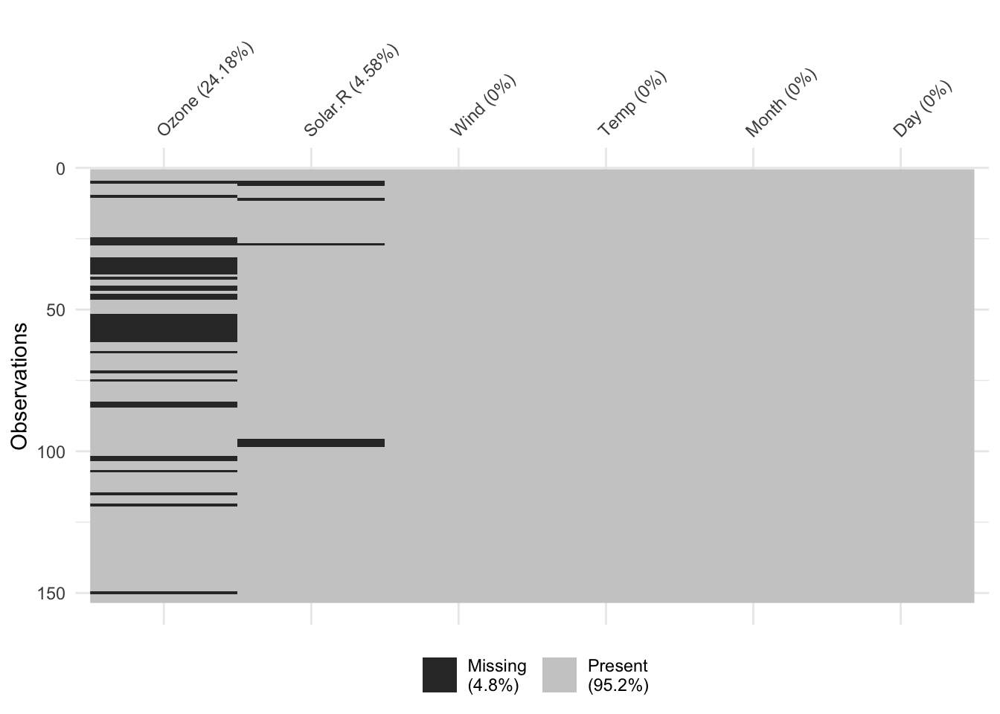
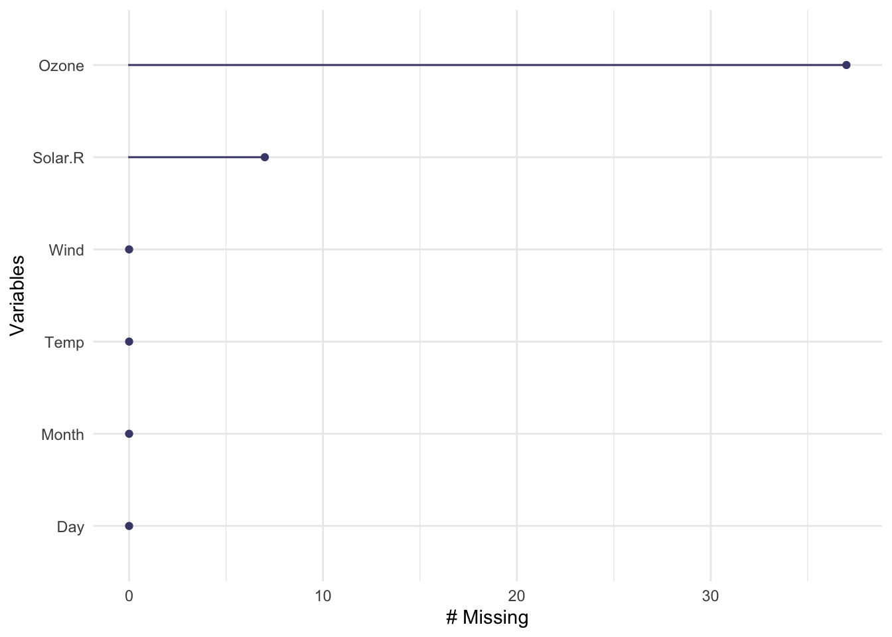

# Missing Values


Missing values are ubiquitous in data and need to be carefully explored and handled in the initial stages of analysis. Large datasets often have missing values for various reasons: coding errors, governments that hide information, data not collected yet, among others. In some cases, the source of the dataset will explain the source of missing values and how they were treated, while in others you will have to figure out yourself the extent to which the data contains missing value and how this may influence your analysis.

Whatever the case, we need to take this into account when doing our analysis.

R registers missing values as `NA` (not available). Note that this is not
a character value with the letters “N” and “A”, but a distinct type of
value.


## Checking for missing values 

In R, we can control for the presence of missing values using the function `is.na()`

For instance, in the code below we first create a sample vector that includes missing values and we then use the function `is.na()` to control for the presence of missing data. This returns a vector of equal length, where each element takes value `true` if the corresponding element in the original vector was missing. 


```r

#Create vector including the monthly inflation rates in the US
Inflation_Data <- c(45, 23, NA, 21, NA)
is.na(Inflation_Data)
#> [1] FALSE FALSE  TRUE FALSE  TRUE
```


We can calculate the number of missing values by summing up the elements  of the vector where the `is.na()` has returned a true value.


```r

#Create vector including the monthly inflation rates in the US
Inflation_Data <- c(45, 23, NA, 21, NA)

#Store in a vector a logic element recording whether the value was missing
Missing_Inflation_Data <- is.na(Inflation_Data)

#Sum the number of NA (TRUE value in "missing votes")
SumNA <- sum(Missing_Inflation_Data)

paste("There are ", SumNA, " missing votes in our initial vector" )
#> [1] "There are  2  missing votes in our initial vector"
```


There are also other tools to look at missing data.

For instance the `naniar` package provides different tools to identify the presence of missing data in a dataset.  


Once the package is loaded, the function `miss_var_summary()` then returns the number of missing values in a variable, and the percent missing in that variable.

Here is the number and percentage of missing values across different variables in the package "airquality".

```r
#install.packages("naniar") #This needs to be run only the fist time
library(naniar)
miss_var_summary(airquality)
#> # A tibble: 6 × 3
#>   variable n_miss pct_miss
#>   <chr>     <int>    <dbl>
#> 1 Ozone        37    24.2 
#> 2 Solar.R       7     4.58
#> 3 Wind          0     0   
#> 4 Temp          0     0   
#> 5 Month         0     0   
#> 6 Day           0     0
```

The `visdat` package instead provides a number of functions to provide a graphical overview of the presence of missing data in our dataset.

For instance, the `vis_miss` function in the `visdat` package can be called to illustrate whether the data is missing or not in each columns of a dataframe.


```r

#install.packages("visdat") #the package needs to be installed only the first time
library(visdat)

vis_miss(airquality)
```




In the same package the `gg_miss_var()` function can be used to visualise the missing data across different variables 


```r

gg_miss_var(airquality)
#> Warning: It is deprecated to specify `guide = FALSE` to
#> remove a guide. Please use `guide = "none"` instead.
```



There are more visualisations available in `naniar` (each starting with `gg_miss_`) - you can see these in the [“Gallery of Missing Data Visualisations” vignette.](https://cran.r-project.org/package=naniar/vignettes/naniar-visualisation.html).

## Cleaning missing values
Other datasets may have other ways of representing missing values, such as “99”, or “Missing”, or “Unknown”, or empty character value "" which looks “blank”, or a single space " ". 

It is possible to clean the missing values espressed in a dataset with characters (e.g. "99", "Missing") by converging them to `NA`.
The `na_if()` function from the `dplyr` package (part of the `tidyverse`) will replace the specified value with `NA`.

For instance, this vector includes a sequence of numbers capturing the level of GDP growth in a country. A glimpse at the values show that there is a significant discrepancy between most of the values reported and the value 99, which suggests this could be a missing number. If we are able to ascertain that this is the case, we can replace it with NA using the `na_if()`


```r
library(tidyverse)

GDP_Growth <- c(3.2, 2.2, 99, 3.2, 1.7, 1.2, 1.0, 99)

GDP_Growth_Clean <- na_if(GDP_Growth, 99)

GDP_Growth_Clean
#> [1] 3.2 2.2  NA 3.2 1.7 1.2 1.0  NA
```


```r
library(tidyverse)

London_Borough <- c("Sutton", "Missing", "Croydon", "Bromley", "Lewisham", "Greenwich", "Bexley", "Havering", "Barking and Dagenham")

London_Borough_Clean <- na_if(GDP_Growth, "Missing")

London_Borough_Clean
#> [1]  3.2  2.2 99.0  3.2  1.7  1.2  1.0 99.0
```


In other cases, instead of replacing a missing value with `NA` we may want to replace with another value.
The function `replace_na()` replaces a given value in a dataset, variable, or a vector with `NA`.

For instance, let's imagine that we have collected data on the number of hours spent by each day consuming news on the internet in a week, and have missing values in  those days when we did not consume any. In this case, we may want to replace the `NA` value with 0


```r
TV_Hours <- c(1, 2, NA, NA, 1, 1.5, 1.5)

GDP_Growth_Clean <- replace_na(TV_Hours, 0)
```

 
## Operations with Missing Values

By default, most R operations performed with missing values fail , alerting you that they cannot compute what you need. For instance, When you run a mathematical function such as [`max()`](https://rdrr.io/r/base/Extremes.html), [`min()`](https://rdrr.io/r/base/Extremes.html), [`sum()`](https://rdrr.io/r/base/sum.html) or [`mean()`](https://rdrr.io/r/base/mean.html), if there are any `NA` values present the returned value will be `NA`.


For instance, see what happens when we try to calculate the average number of a vector that includes missing values

```r

#Create vector including the monthly inflation rates in the US
Votes <- c(45, 23, NA, 21, NA)

#Calculate the Mean value, excluding the NA. 
Mean_Results <- mean(Votes)

#Display the results in the console
Mean_Results 
#> [1] NA
```

You can avoid this problem by removing missing values from the calculation. In most functions, you can specify this with the argument `na.rm = TRUE` to let R know that it should ignore the missing values in the
vector to carry out the function. 


```r

#Create vector including NA value
Votes <- c(45, 23, NA, 21, NA)

#Calculate the Mean value, excluding the NA
Mean_Results <- mean(Votes, na.rm = T)
 
#Display the results in the console
Mean_Results 
#> [1] 29.66667
```


### Dropping Missing Values

In some cases it may be appropriate to remove those observations where data is not available in one or more of the variables we are interested in exploring.

 The `drop_na()` function is part of the `dplyr` package (included in the `tidyverse` library). If run with the parentheses empty, the function can be used to filter a dataset and retain only the rows without missing values.

If instead column names are specified within the parentheses, rows with missing values in those columns will be dropped.
 
