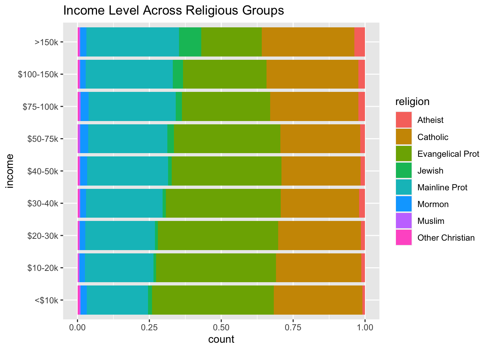
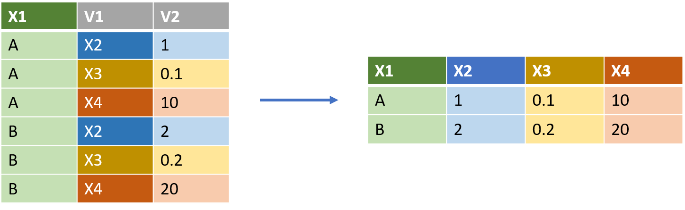
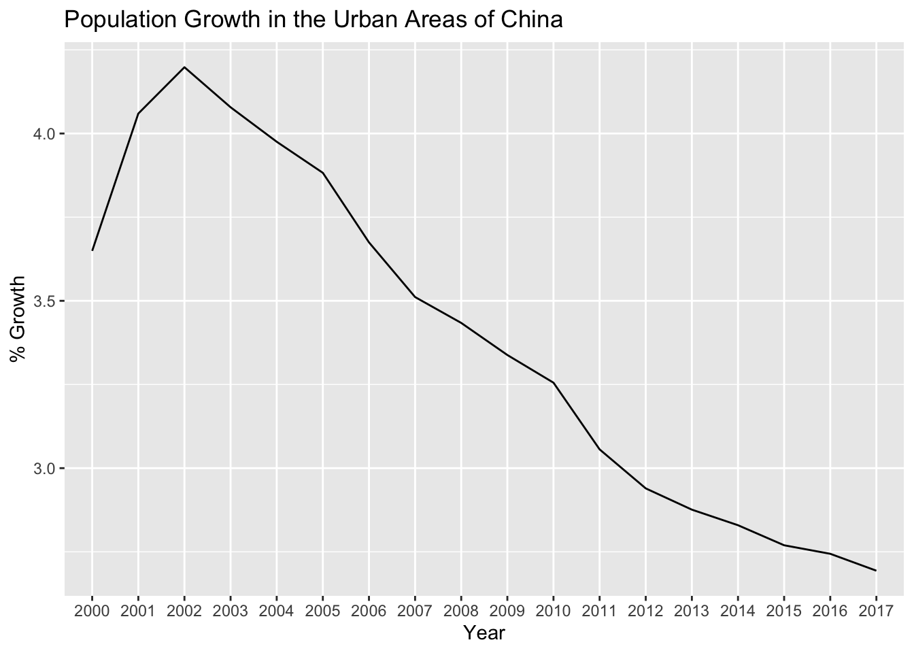

# Tidying the data with tidyr()


A common way to organize data in a tabular object is by adopting a 'tidy format'. From this perspective

- each column represents a single measurement type
- each row represents a single observation
- each cell contains a single value


dplyr, ggplot2, and all the other packages in the tidyverse are designed to handle data that is organized in this format. 

Unfortunately, most of the real world datasets are not in this format. Data is often organised to facilitate some use other than analysis, for instance to facilitate data entry. As a result, it is common for one variable to be spread across multiple columns, or one observation to be scattered across multiple rows.

The `tidyr` package (part of the tidyverse) includes a series of functions designed to help users to convert data into a ‘tidy format’.  In particular, the two most important functions in tidyr to reshape the data are: `pivot_longer()` and `pivot_wider()`.

## Reshaping the data from wide to long with pivot_longer()

A common problem when analyzing real world datasets is the case when some of the column names are not names of variables, but values of a variable. This is often the preferred format to visually compare the differences across different groups but it not necessarily the best format in terms of ease of analysis.

mm In the one on the right, the variable capturing the year of the observation is spread across different columns, one for each year. 

In order to more easily manipulate these datasets with dplyr and visualize them with ggplot we would need to reshape these columns into a new pair of variables (`year` and `cases`) like in the example on the left:


The function `pivot_longer()` (from the `tidyr` package, part of the `tidyverse`) makes datasets longer by increasing the number of rows and decreasing the number of columns.

`pivot_longer()` takes three commands, specifying

- `cols =`: a vector of the names of the columns that need to be reshaped and converted to values in long form. Importantly, in cases where there mant column names to convert to long format, it is simpler to use cols = to specify those columns that we don’t want to convert, which are usually the left-most columns. This is done with the `-` symbol 
- `names_to =`: a name for the new column containing the names from `cols`. The new column names need to be in quotes.
- `values_to =`: a name for the new column containing the values corresponding to `cols`. The new column names need to be in quotes 


So for the figure above, to convert from the left table (table4b) to the long table at right, would require: 


```r
table4a %>% 
  pivot_longer(cols = c(`1999`, `2000`), 
               names_to = "year", 
               values_to = "cases")
```

In this case:

- The first argument provided (cols = c(`1999`, `2000`)) indicates what columns need to be reshaped. In this case it is two separate columns, whicih therefore need to be included in a vector
- The second argument (`names_to = "year"`) indicates the name of the variable that will be created from the data in the column names, in this case `year`
- The third argument (`values_to = "cases"`) indicates the name of the variable that will be created from the data stored in the cell value, in this case `cases`

Another example of a dataset that may need to be transformned from a wider to a longer format is the dataset `relig_income` (preloaded with the package `tidyr`). This is based on a survey which asked people about their religion and annual income.
This dataset contains three variables:

- *religion*: stored in the rows,
- *income*: spread across the column names, and
- *count*: stored in the cell values.


```r
head(relig_income)
#> # A tibble: 6 × 11
#>   religion   `<$10k` `$10-20k` `$20-30k` `$30-40k` `$40-50k`
#>   <chr>        <dbl>     <dbl>     <dbl>     <dbl>     <dbl>
#> 1 Agnostic        27        34        60        81        76
#> 2 Atheist         12        27        37        52        35
#> 3 Buddhist        27        21        30        34        33
#> 4 Catholic       418       617       732       670       638
#> 5 Don’t kno…      15        14        15        11        10
#> 6 Evangelic…     575       869      1064       982       881
#> # … with 5 more variables: `$50-75k` <dbl>,
#> #   `$75-100k` <dbl>, `$100-150k` <dbl>, `>150k` <dbl>,
#> #   `Don't know/refused` <dbl>
```


To facilitate the analysis we can 'tidy' this dataset using `pivot_longer()`. 

- The first argument provided (`-religion`) indicates what columns need to be reshaped. In this case it is every column apart from `religion`
- The second argument (`names_to = "income"`) indicates the name of the variable that will be created from the data in the column names, in this case `income`
- The third argument (`values_to = "count"`) indicates the name of the variable that will be created from the data stored in the cell value, in this case `count`


```r
relig_income %>% 
  pivot_longer(-religion, 
               names_to = "income", 
               values_to = "count")
#> # A tibble: 180 × 3
#>    religion income             count
#>    <chr>    <chr>              <dbl>
#>  1 Agnostic <$10k                 27
#>  2 Agnostic $10-20k               34
#>  3 Agnostic $20-30k               60
#>  4 Agnostic $30-40k               81
#>  5 Agnostic $40-50k               76
#>  6 Agnostic $50-75k              137
#>  7 Agnostic $75-100k             122
#>  8 Agnostic $100-150k            109
#>  9 Agnostic >150k                 84
#> 10 Agnostic Don't know/refused    96
#> # … with 170 more rows
```

Once the data is reshaped in this format is it easier to visualize it using ggplot. For instance, the code below reshapes the dataset from a wide to a long format and it then passes this data to ggplot to map the prevalence of different religion within each income group.
 

```r
relig_income_longer <- relig_income %>% 
  pivot_longer(!religion, 
               names_to = "income", 
               values_to = "count") %>%
  mutate(income = fct_relevel(income, 
                              "<$10k",
                              "$10-20k",
                              "$20-30k",
                              "$30-40k",
                              "$40-50k",
                              "$50-75k",
                              "$75-100k",
                              "$100-150k",
                              ">150k"  
                              )) %>% #Change the order of the values in the income
  filter(income != "Don't know/refused") %>%
  filter(religion %in% c("Atheist", "Jewish", "Muslim", "Catholic", "Mainline Prot", "Other Christian", "Evangelical Prot", "Mormon"))


  ggplot(data = relig_income_longer,
         mapping = aes(x = income,
                       y = count,
                       fill = religion)) +
  geom_col(position = "fill") +
  coord_flip() +
  labs (title = "Income Level Across Religious Groups")
```




## Reshaping the data from long to wide with pivot_wider()

While reshaping a dataset from a wider to a longer format with `pivot_longer()` is needed when some of the column names are values of a variable, in some cases the opposite transformation is needed. This is in particular when an observation is spread across multiple rows.


For instance, the table on the left (from Wickham and Grolemund) contains information on the `cases` and `population` different different countries in different years, but each country/year observation is found in two different rows.



The function `pivot_wider()` can be used to "widen" the dataset by increasing the number of columns and decreasing the number of observations. It does so by converting the values in one column into new columns names.  
It’s relatively rare to need pivot_wider() to make tidy data, but it’s often useful for creating summary tables for presentation, or data in a format needed by other tools.


`pivot_wider()` requires two commands, both of which are column names in the original table.

- `names_from` indicates the column containing the labels which will become the new column names.
- `values from` indicates the column containing the values that will populate the the new 


To illustrate this change, we can observe the `us_rent_income` dataset. This dataset includes information from the 2017 American Community Survey regarding the US rent and income data that is pre-loaded when the tidyverse is loaded on your work environment.


```r
library(tidyverse)

head(us_rent_income)
#> # A tibble: 6 × 5
#>   GEOID NAME    variable estimate   moe
#>   <chr> <chr>   <chr>       <dbl> <dbl>
#> 1 01    Alabama income      24476   136
#> 2 01    Alabama rent          747     3
#> 3 02    Alaska  income      32940   508
#> 4 02    Alaska  rent         1200    13
#> 5 04    Arizona income      27517   148
#> 6 04    Arizona rent          972     4
```


When we observe the dataset, we can see that the column named `variable` has two values: `income` and `rent`. Both the column `estimate` (estimated value) and the column `moe` (90% margin of error) include values for  both of income and rent in different American states.


To transform the illustrative table above at left (`df_long`) into the result at right, would require:


```r
us_rent_income %>%
  pivot_wider(
    names_from = variable,
    values_from = c(estimate, moe)
  )
#> # A tibble: 52 × 6
#>    GEOID NAME       estimate_income estimate_rent moe_income
#>    <chr> <chr>                <dbl>         <dbl>      <dbl>
#>  1 01    Alabama              24476           747        136
#>  2 02    Alaska               32940          1200        508
#>  3 04    Arizona              27517           972        148
#>  4 05    Arkansas             23789           709        165
#>  5 06    California           29454          1358        109
#>  6 08    Colorado             32401          1125        109
#>  7 09    Connectic…           35326          1123        195
#>  8 10    Delaware             31560          1076        247
#>  9 11    District …           43198          1424        681
#> 10 12    Florida              25952          1077         70
#> # … with 42 more rows, and 1 more variable: moe_rent <dbl>
```

In this case, since there are two different columns with the values to be added to `values_from`, these need to be included inside a vector `c()`.


This transformation increase the number of columns, replacing the column `estimate` with two distinct columns (`estimate_rent` and `estimate_income`), each of them including the values of the estimated value of rent and income in a specific state, and replacing the column `moe` with two distinct columns (`moe_rent` and `moe_income`).

The name of the new columns automatically combines the values found in the column listed in `names from` (income, rent) with the name of the variables listed in `values from` (estimate, moe). It is possible to change how this name is constructed by specifying the parameter `names_sep`.

## Reshape longer, then wider

In some cases, datasets need to be repshaped both from wide to long format and vice versa. This example from the [documentation](https://cran.r-project.org/web/packages/tidyr/vignettes/pivot.html) of pivot_longer() and pivot_wider()  show how you might combine both functions to solve more complex problems.

The `world_bank_pop` (preloaded with the tidyverse) contains data from the World Bank about population per country from 2000 to 2018.A glimpse at the data reveals that the values for the population of a country in a given year are stored in different variables, one for each year.


```r
head(world_bank_pop)
#> # A tibble: 6 × 20
#>   country indicator      `2000` `2001` `2002` `2003`  `2004`
#>   <chr>   <chr>           <dbl>  <dbl>  <dbl>  <dbl>   <dbl>
#> 1 ABW     SP.URB.TOTL    4.24e4 4.30e4 4.37e4 4.42e4 4.47e+4
#> 2 ABW     SP.URB.GROW    1.18e0 1.41e0 1.43e0 1.31e0 9.51e-1
#> 3 ABW     SP.POP.TOTL    9.09e4 9.29e4 9.50e4 9.70e4 9.87e+4
#> 4 ABW     SP.POP.GROW    2.06e0 2.23e0 2.23e0 2.11e0 1.76e+0
#> 5 AFG     SP.URB.TOTL    4.44e6 4.65e6 4.89e6 5.16e6 5.43e+6
#> 6 AFG     SP.URB.GROW    3.91e0 4.66e0 5.13e0 5.23e0 5.12e+0
#> # … with 13 more variables: `2005` <dbl>, `2006` <dbl>,
#> #   `2007` <dbl>, `2008` <dbl>, `2009` <dbl>, `2010` <dbl>,
#> #   `2011` <dbl>, `2012` <dbl>, `2013` <dbl>, `2014` <dbl>,
#> #   `2015` <dbl>, `2016` <dbl>, `2017` <dbl>
```

We can reshape this dataset with `pivot_longer` in order to bring the value of the population variable in a single column. In this case, instead of manually listing all the columns to be reshaped, we can indicate the range of names (`2000`:`2017`)


```r
pop2 <- world_bank_pop %>% 
  pivot_longer(cols = `2000`:`2017`, 
               names_to = "year", 
               values_to = "value")
pop2
#> # A tibble: 19,008 × 4
#>    country indicator   year  value
#>    <chr>   <chr>       <chr> <dbl>
#>  1 ABW     SP.URB.TOTL 2000  42444
#>  2 ABW     SP.URB.TOTL 2001  43048
#>  3 ABW     SP.URB.TOTL 2002  43670
#>  4 ABW     SP.URB.TOTL 2003  44246
#>  5 ABW     SP.URB.TOTL 2004  44669
#>  6 ABW     SP.URB.TOTL 2005  44889
#>  7 ABW     SP.URB.TOTL 2006  44881
#>  8 ABW     SP.URB.TOTL 2007  44686
#>  9 ABW     SP.URB.TOTL 2008  44375
#> 10 ABW     SP.URB.TOTL 2009  44052
#> # … with 18,998 more rows
```

The newly created `value` columns however still contains different variables that are listed in the `indicator` column. This includes four different values:

- SP.POP.GROW is population growth, 
- SP.POP.TOTL is total population, 
- SP.URB.GROW is population growth for urban areas
- SP.URB.TOTL is total population  for urban areas


```r
pop2 %>% count(indicator)
#> # A tibble: 4 × 2
#>   indicator       n
#>   <chr>       <int>
#> 1 SP.POP.GROW  4752
#> 2 SP.POP.TOTL  4752
#> 3 SP.URB.GROW  4752
#> 4 SP.URB.TOTL  4752
```

Since these represent different quantities observed for the same observation (country/year), we can use `pivot_wider` to split the different types of population count across four different variables.


```r
pop3 <- pop2 %>%
  pivot_wider(names_from = indicator, values_from = value)

pop3
#> # A tibble: 4,752 × 6
#>    country year  SP.URB.TOTL SP.URB.GROW SP.POP.TOTL
#>    <chr>   <chr>       <dbl>       <dbl>       <dbl>
#>  1 ABW     2000        42444      1.18         90853
#>  2 ABW     2001        43048      1.41         92898
#>  3 ABW     2002        43670      1.43         94992
#>  4 ABW     2003        44246      1.31         97017
#>  5 ABW     2004        44669      0.951        98737
#>  6 ABW     2005        44889      0.491       100031
#>  7 ABW     2006        44881     -0.0178      100832
#>  8 ABW     2007        44686     -0.435       101220
#>  9 ABW     2008        44375     -0.698       101353
#> 10 ABW     2009        44052     -0.731       101453
#> # … with 4,742 more rows, and 1 more variable:
#> #   SP.POP.GROW <dbl>
```

It is now possible to plot the data. For instance, the figure below plots the evolution in the growth of the urban population in China.


```r
ggplot(data = pop3 %>% filter(country == "CHN"),
       mapping = aes(x = year,
                     y = SP.URB.GROW,
                     group = country)) +
  geom_line() +
  labs(title = "Population Growth in the Urban Areas of China",
       x = "Year",
       y = "% Growth")
```




## Separating and Uniting Columns

### Separate()

As we have seen above `pivot_longer` is used when colum names include values, and `pivot_wider` when observations are spread across multiple rows. A different type of issue when it comes to analyzing real world dataset comes those cases when a column includes multiple values or when a value is spread across columns.

The function `separate()` can be used to divide a column into multiple columns. The values in that column will be split when the function identifies a non-alphanumeric separator character (e.g. "/", "-").

The function takes three values:

- `col = `: the title of the column containing multiple values that need to be split
- `into = c()`: a vector containing the name of the two or more columns to be created 
- `sep = `: it is possible to specify what character should be used to separate the values. If this is not specified, the function will split the values at the forward slash since this is the first non-alphanumeric character found.

The table below on the left (from Wickham and Grolemund) shows an example where the column `rate` provides two different values, the numerator and the denominator, separated by a "/".


We can split the values in the `rate` column across two different columns by using the `separate()` function. 


```r
table3 %>% 
  separate(col = rate, 
           into = c("cases", "population"), 
           sep = "/")
#> # A tibble: 6 × 4
#>   country      year cases  population
#>   <chr>       <int> <chr>  <chr>     
#> 1 Afghanistan  1999 745    19987071  
#> 2 Afghanistan  2000 2666   20595360  
#> 3 Brazil       1999 37737  172006362 
#> 4 Brazil       2000 80488  174504898 
#> 5 China        1999 212258 1272915272
#> 6 China        2000 213766 1280428583
```


### Unite()

While `separate()` can be used to split a column into multiple ones, `unite() can be used to combine multiple columns into a single one when the data is split.

The figure below provides an example from (from Wickham and Grolemund) where the date is split into two different column, one for the century and the other for the year.
We can use `unite()` to rejoin the century and year columns into a single one.


```r
table5 %>% 
  unite(new, century, year)
#> # A tibble: 6 × 3
#>   country     new   rate             
#>   <chr>       <chr> <chr>            
#> 1 Afghanistan 19_99 745/19987071     
#> 2 Afghanistan 20_00 2666/20595360    
#> 3 Brazil      19_99 37737/172006362  
#> 4 Brazil      20_00 80488/174504898  
#> 5 China       19_99 212258/1272915272
#> 6 China       20_00 213766/1280428583
```


