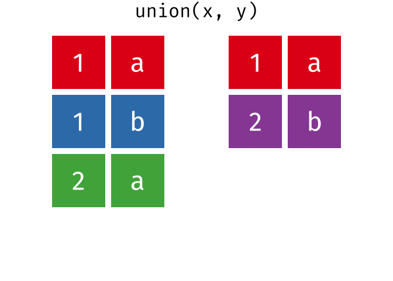

# Relational Data


While in some cases data analysis involves looking only at a single table of data, often the data we need to arriving at answer to our question is spread across different data. In this case, we need to find ways to combine different datasets in order to perform our analysis. 

The term **relational data** refers to the analysis of data across spread across different tables. 

For instance, let's for instance imagine we want investigate how the electoral success of different political parties in the UK relates to the economic profile of the voters. One common starting point to answer this question is looking at the share of votes of different parties across different electoral constituencies. We can access this data from the British Election Study, a large selection of open data covering elections and referenda. This can be downloaded using the `parlitools` package.


```r
#nstall.packages("parlitools")
library(parlitools)

bes_2017 <- parlitools::bes_2017
head(bes_2017)
#> # A tibble: 6 × 123
#>    pano ons_const_id constituency_name       country  region
#>   <dbl> <chr>        <chr>                   <chr>    <chr> 
#> 1     1 W07000049    Aberavon                Wales    Wales 
#> 2     2 W07000058    Aberconwy               Wales    Wales 
#> 3     3 S14000001    Aberdeen North          Scotland Scotl…
#> 4     4 S14000002    Aberdeen South          Scotland Scotl…
#> 5     5 S14000058    West Aberdeenshire and… Scotland Scotl…
#> 6     6 S14000003    Airdrie and Shotts      Scotland Scotl…
#> # … with 118 more variables: constituency_type <chr>,
#> #   winner_17 <fct>, con_17 <dbl>, lab_17 <dbl>,
#> #   ld_17 <dbl>, snp_17 <dbl>, pc_17 <dbl>, ukip_17 <dbl>,
#> #   green_17 <dbl>, other_17 <dbl>, majority_17 <dbl>,
#> #   turnout_17 <dbl>, con_vote_17 <dbl>, lab_vote_17 <dbl>,
#> #   ld_vote_17 <dbl>, snp_vote_17 <dbl>, pc_vote_17 <dbl>,
#> #   ukip_vote_17 <dbl>, green_vote_17 <dbl>, …
```

While this dataset includes information on the share of vote of different parties across different constituencies, it does not include information on the characteristics of the voters. We can retrieve this information from the census (accessible via the `parlitools` package). The dataset `census_11` includes a variety of socio-economic characteristics of the British citizens divided across the different constituencies.


```r
#nstall.packages("parlitools")
library(parlitools)

census_11 <- parlitools::census_11
head(census_11)
#> # A tibble: 6 × 191
#>    pano ons_const_id constituency_name       country  region
#>   <dbl> <chr>        <fct>                   <fct>    <fct> 
#> 1     1 W07000049    Aberavon                Wales    Wales 
#> 2     2 W07000058    Aberconwy               Wales    Wales 
#> 3     3 S14000001    Aberdeen North          Scotland Scotl…
#> 4     4 S14000002    Aberdeen South          Scotland Scotl…
#> 5     5 S14000058    West Aberdeenshire and… Scotland Scotl…
#> 6     6 S14000003    Airdrie and Shotts      Scotland Scotl…
#> # … with 186 more variables: constituency_type <fct>,
#> #   population <dbl>, population_density <dbl>, male <dbl>,
#> #   female <dbl>, households <dbl>, communal <dbl>,
#> #   age_0_to_4 <dbl>, age_5_to_7 <dbl>, age_8_to_9 <dbl>,
#> #   age_10_to_14 <dbl>, age_15 <dbl>, age_16_to_17 <dbl>,
#> #   age_18_to_19 <dbl>, age_20_to_24 <dbl>,
#> #   age_25_to_29 <dbl>, age_30_to_44 <dbl>, …
```


In order to analyze how different characteristics of the voters are related to the share vote of different parties, we need to find a way combine the two datasets (`census_11` and `bes_2017`)

The dplyr package includes a number of "two-table verbs" that work with two tables at a time. All these verbs work similarly taking as input two tables(`x` and `y`) and returning a new table.

## Joining Datasets
 
Let's say we wanted to combine variables from the two tables `bes_2017` and `census_11`. 

We can combine the data from the British Electoral Studies and the Census. Since both datasets have a large number of variables, we first only select those columns that are of interest to our analysis. In the case of the British Electoral Studies we are interested in the data on the share of votes to the Conservative party in different constituencies. In the case of the Census, we are interested in the % of households that are home-owners in different constituencies (`house_owned`). In the case the case of the British Electoral Studies dataset, we are interested in this case in the variable `con_17` capturing the vote share for the Conservative party crisis across different constitutencies.

Moreover, in order to be able to link the relevant observations from both dataset, we also need a variable uniquely identifying different observations across the two dataset.  Both in the British Electoral Study dataset (`bes_2017`) and in the UK Census data (`census_11`) downloaded before each electoral constituency is characterized by a unique name (e.g. Aberdeen North) and a unique constituency code that is used by the Office for National Statistics (e.g. S14000001 in the case of [Aberdeen North](https://statistics.data.gov.uk/atlas/resource?uri=http://statistics.data.gov.uk/id/statistical-geography/S14000001)).  
In this case we select the name of the constituency for this purpose as captured by the variable `constituency_name`.

We merge dataset `census_11` to `bes_2017` join the two datasets using the function `left join`, specifying the key using `by = "constituency_name"`. 


```r
#install.packages("parlitools")
library(parlitools)  #Load package parlitools
library(dplyr)   #Load package dplyr. You can also use library(tidyverse)

census_11 <- parlitools::census_11 #download census 2011 and store it in object census_11

census_11 <-  census_11 %>%
  select(constituency_name, house_owned)  #select variables constituency_name and  house_owned

bes_2017 <- parlitools::bes_2017 #download BES 2017 and store it in object bes_2017
bes_2017 <- bes_2017 %>%
  select(constituency_name, con_17) #select variables constituency_name and  con_17

bes_2017_joined <- left_join(bes_2017, census_11, by = "constituency_name" ) #join the two dataset in new object bes_2017_joined

head(bes_2017_joined)
#> # A tibble: 6 × 3
#>   constituency_name                 con_17 house_owned
#>   <chr>                              <dbl>       <dbl>
#> 1 Aberavon                            17.7        66.8
#> 2 Aberconwy                           44.6        69.7
#> 3 Aberdeen North                      22.7        45.5
#> 4 Aberdeen South                      42.1        62.5
#> 5 West Aberdeenshire and Kincardine   47.9        75.3
#> 6 Airdrie and Shotts                  23.2        60.2
```


Having combined the the data from the two dataset we can then visualize it


```r
library(ggplot2)
ggplot(data = bes_2017_joined,
       aes(x = house_owned, y = con_17)) +
        geom_smooth(size=1.75, colour = "red") +
        ylab("Share of Votes Cast for Conservatives") + 
      xlab("Percentage of Home-Owners") +
         geom_point() +
         geom_smooth()
```


### Defining keys

In order to be able to connect different tables, these need to have  a variable (or set of variables) in common. This is often called *keys*. The key will uniquely identify an observation. 

There are two types of keys:

- A **primary key** uniquely identifies an observation in its own table.
- A **foreign key** uniquely identifies an observation in another table.
 
In very simple cases, a single variable is sufficient to identify an observation.

In the example above, the two tables were joined by a single variable, and that variable has the same name in both tables. The key was specified by stating inside the function the parameter `by = "key_name"`.

In other cases multiple variables are needed. For instance, when dealing with longitudinal data capturing a number of countries across many years, one observation will be identified by a combination of the `country` variable and the `date` variable. 

It is possible to specify multiple variables that should be used as key within  a character vector, by = c("x", "y")`. 

For instance, in the example below  we are merging the `gapminder` dataset with another dataset (`polity`) capturing country/year observations. The `left_join()` specify that the two datasets should be merged on the basis of matching values along two different variables (`by = c("country", "year")`).


```r
#Import Gapminder dataset
library(gapminder)

#Import Polity dataset
polity <- read.csv("data/polity_sub.csv")

# Left join 
gap_extended <- gapminder %>% #Take the gapminder dataset
  left_join(polity, #join with polity dataset keeping all observations of the first dataset (gapminder)
  by = c("country", "year")) #select the variable country and year as keys to join the two datasets
      #Store the results in object called gap1

# Left join (alternative formulation without %>%)
gap_extended <- left_join(gapminder, polity, by = c("country", "year"))

head(gap_extended)

```


It is often the  case that the variables to be linked have different names across the two tables. It is possible to use a named character vector: `by = c("a" = "b")`. This will match variable `a` in table `x` to variable `b` in table `y`. The variables from `x` will be used in the output.

## Join Functions

The package dplyr contains different `join` functions that can be used to merge different datasets. These function first first matches observations by their keys, then copies across variables from one table to the other, adding them to the right.

In these visualizations, the coloured columns represent the "key" variable used to match the observations in the two tables being joined, while the grey column represents the "value" column that is being added as a result of the join.
 
### left_join()

The most commonly used join is the `left_join()`: you use this whenever you look up additional data from another table. For example, a `left_join()` on the dataset `x` and the dataset `y` pulls in variables from `y` while preserving all the observations in `x`. This function preserves the original observations from the first table `x` even when there is not a match `y`. NA will appear in cells for which there is no match in `y`. 

This is often the default option when joining datasets unless there are specific reasons for wanting a different format.


 [source: tidyexplain](https://github.com/gadenbuie/tidyexplain)


### Right_join()
In addition to left_join, there are four other join options.

A `right_join` is similar to `left_join` but it keeps all observations in the second dataset (`y`) rather than the first one.

 [source: tidyexplain](https://github.com/gadenbuie/tidyexplain)


### Inner_join()

The `inner_join` keeps observations that appear in both tables. Any observation where the key appears only in one of the two tables will be removed.

 [source: tidyexplain](https://github.com/gadenbuie/tidyexplain)


### Full_join

An outer_join instead keeps observations that appear in at least one of the two  tables. Any observation from any of the two tables will bebe removed.
 [source: tidyexplain](https://github.com/gadenbuie/tidyexplain)
 
 


## Filtering observations based on another dataset

The dplyr package also includes two different join functions that influence the observations based on the relation between two datasets.

### semi-join()
The function `semi_join(x, y)` when applied to two datasets (`x` and `y`) keeps only those rows in the first dataset that have a match in the second dataset. This function does not duplicate rows if multiple matches are found

 [source: tidyexplain](https://github.com/gadenbuie/tidyexplain)

### anti-join

the `anti-join()` function instead is the opposite of `semi-join()` as it drops all observations in the first dataset that have a match in the second one. As a result, it can be used to identify observations in one dataset that do not have a match in the other one. 

 [source: tidyexplain](https://github.com/gadenbuie/tidyexplain)


## Identify common/different rows across datasets

The dplyr package also includes three helpful functions that can be used to idenetify entire rows that are common or different across datasets.

### intersect()

When called to compare the dataset `x` and `y`, the function `intersect(x, y)` returns only the obervations found in both datasets.

 [source: tidyexplain](https://github.com/gadenbuie/tidyexplain)


### union()

When called to compare the dataset `x` and `y`, the function `union(x, y)` returns only the observations that are unique to each dataset, excluding those that are in common.

 [source: tidyexplain](https://github.com/gadenbuie/tidyexplain)

### setdiff ()
When called to compare the dataset `x` and `y`, the function `setdiff(x, y)` returns only the observations that are unique to the first dataset (`x`).

 [source: tidyexplain](https://github.com/gadenbuie/tidyexplain)


