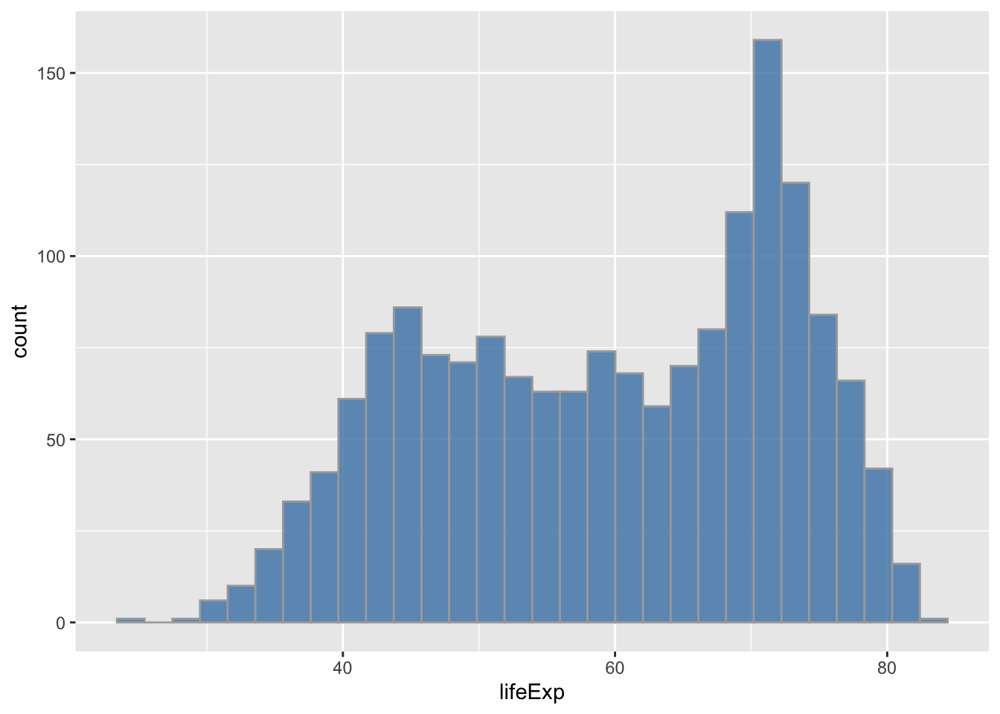
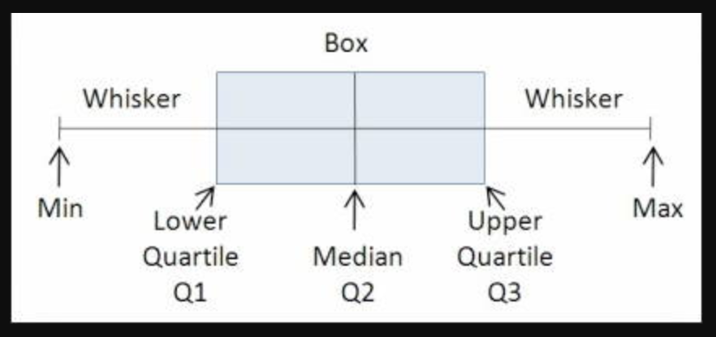
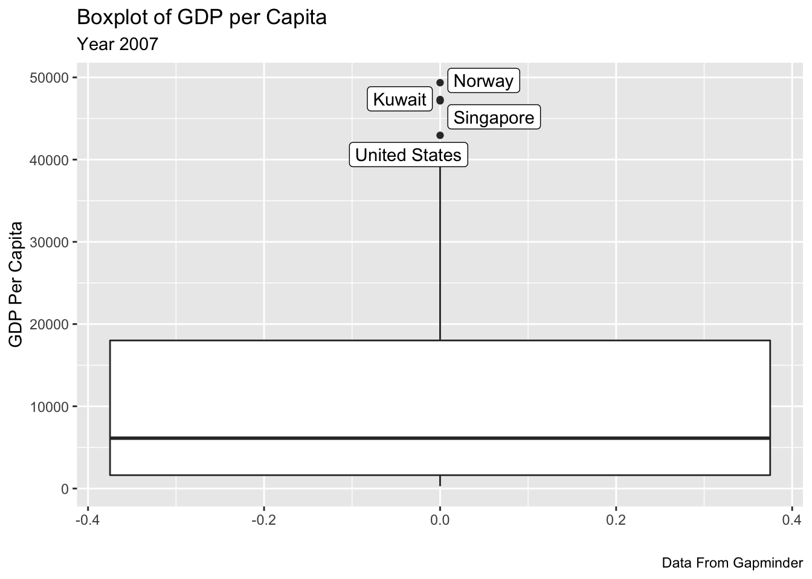
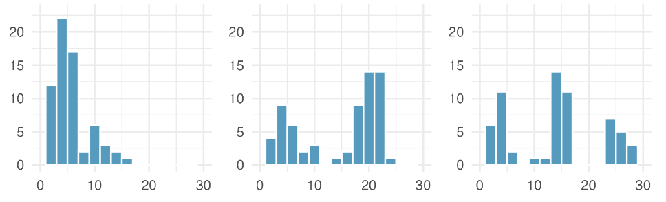
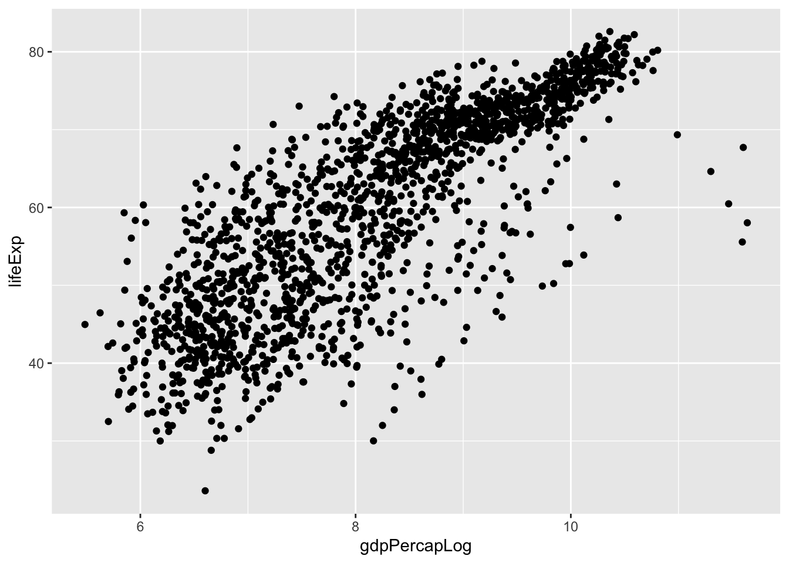
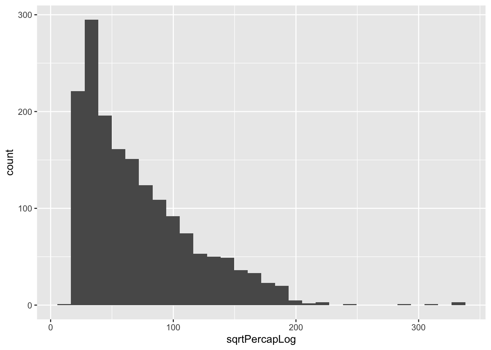

# Exploring Numerical Data

This section discusses how we can explore numerical data using summary statistics and visualizations.


## Univariate Visualizations of Numerical Variable

When analyzing a variable, one of the main things we want to know is how the data is distributed.
In this section we will show examples of how to create graphical displays of a single variable - with examples for both quantitative and categorical variables.

A number of plots and summary statistics are available to explore the distribution of our data. The extent to which they are appropriate often depends on the type of variable.


### Dot Plot

The dot plot is one of the most basic visualizations to display the distribution of a single numerical variable. This visualization uses a dot to display the value of each observation. The position of this dot on x-axis reflects the value of the selected for the observatation.

In R, we can draw a dot plot with `ggplot2` using the `geom_dotplot()`. 

In the example below we load the "gapminder" dataset and show the distribution of life expectancy across different countries in the year 1997


```r
library(tidyverse)
#> ── Attaching packages ─────────────────── tidyverse 1.3.1 ──
#> ✓ ggplot2 3.3.5     ✓ purrr   0.3.4
#> ✓ tibble  3.1.6     ✓ dplyr   1.0.7
#> ✓ tidyr   1.1.4     ✓ stringr 1.4.0
#> ✓ readr   2.1.1     ✓ forcats 0.5.1
#> ── Conflicts ────────────────────── tidyverse_conflicts() ──
#> x dplyr::filter() masks stats::filter()
#> x dplyr::lag()    masks stats::lag()
library(gapminder)


gap_1997 <- gapminder %>% filter(year==1997) 

ggplot(data = gap_1997,
       aes(x = lifeExp)) +
  geom_dotplot() +
  labs(x = "Life Expectancy (years)",
       y = "Frequency")
#> Bin width defaults to 1/30 of the range of the data. Pick better value with `binwidth`.
```


### Histogram

Dotplots are helpful to visualize small datasets but are harder to read when we are dealing with a larger number of observations. In these cases, fitting different values into "bins" is more appropriate. This visualization is known as histogranm

While a dot plot shows the value of each observation, a histogram represents a continuous variable by allocating the different observations into different segments or "bins". The height of the bar reflects the count of number of observations belonging to that bin in the data. Higher bars represent where the data are relatively more common.

Histograms can be built with `ggplot2` thanks to the `geom_histogram()` geom. It requires only a single numeric variable to be mapped as input. This function automatically cut the variable in bins and count the number of data point per bin.


```r

library(gapminder)
library(ggplot2)

ggplot(data = gapminder,  #Select the dataset to be plotted
	mapping = aes(x = lifeExp)) + #select the variables to be plotted in 
  geom_histogram()  
#> `stat_bin()` using `bins = 30`. Pick better value with
#> `binwidth`.
```


#### Bin Size

When drawing a histogram, one important decision is how finely to bin the data. The bin size can have a big impact on the histogram appearance. 
For instance, the two graphs below illustrate the distribution of the same variable while changing the size of the bins. In the first case, the different values are divided across 10 bins. In the second case they are divided across 60 bins.

You change the size of the bin using the `binwidth` argument of the geom_histogram function. You can also specify the number of bins using `bins=` in the geom_histogram function.


```r
ggplot(data = gapminder,  #Select the dataset to be plotted
	mapping = aes(x = lifeExp)) + #select the variables to be plotted in 
  geom_histogram(bins = 10) #set the bins
```


```r
ggplot(data = gapminder,  #Select the dataset to be plotted
	mapping = aes(x = lifeExp)) + #select the variables to be plotted in 
  geom_histogram(bins = 60) #set the bins
```



### Density Plot


When working with a continuous variable, an alternative to binning the data into a histogram is to draw smoothed version of the same histogram by drawing a kernel density estimate of the same distribution. In ggplot() this can be done using the geom `geom_density(`.

This transformation requires a smoothing parameter to be selected to determine how smooth or sharp the curve will be. By default ggplot adopts a smoothing parameter (called rule-of-thumb) but this can be changed manually if needed.


```r
ggplot(data = gapminder,  #Select the dataset to be plotted
	mapping = aes(x = lifeExp)) + #select the variables to be plotted in 
  geom_density() #select the geom
```


### Box plot

The boxplot is a frequently used visualization to compactly display the distribution of a continuous variable. It visualises five summary statistics (the median, two hinges and two whiskers), and all "outlying" points individually.

{width=70%}

In a box plot, the length of the box is called the interquartile range (IQR). The more variable is the data, the longer the length of the box will be.

The two boundaries of the box represent the first quartile (the 25th percentile, i.e., 25% of the data fall below this value) and the third quartile (the 75th percentile, i.e., 75% of the data fall below this value). The central line of the box represents the median value for the distribution.

Outside the box, the whiskers of a box plot reach to the minimum and the maximum values in the data, unless there are are data points that are potential outliers, that is  values that are considered particularly high or low compared to the rest of the distribution. In this case, outliers are labelled with a dot. By visualising the outliers separately, the boxplot is helpful to identify those observations that are unusually high/low compared to the rest of the distribution.

We can draw a boxplot in ggplot using the geom `geom_boxplot()`. This requires one numerical variable to be mapped to either the `x` aesthetic (for a vertical orientation) or the `y` aesthetic (for a horizontal orientation)


```r
ggplot(data = gapminder,  #Select the dataset to be plotted
	mapping = aes(y = lifeExp)) + #select the variables to be plotted in 
  geom_boxplot() + #select the geom 
  labs(y = "Life Expectancy")
```


It is possible to further augment the visualization of the distribution in a boxplot by overlaying points on top. We do this by adding a layer with includes the geom `geom_point()`.Note the `position=position_jitter` option to the geom_point puts some random horizontal jitter so that the points don’t overlay each other. The points has an argument alpha=0.5 signifying a slightly transparent plot symbol. 


```r

gap_1997 <- gapminder %>% filter(year==1997) 

ggplot(data = gap_1997,  #Select the dataset to be plotted
	mapping = aes(x = year, y = lifeExp)) + #select the variables to be plotted in 
  geom_boxplot() + #select the geom 
  geom_point(alpha=0.5, position=position_jitter(width=0.25)) +
  labs(y = "Life Expectancy")
```


 
## Descriptive Statistics for Numerical Data 

### Measures of Central Tendency 

When analyzing a variable, measures of central tendency are used to identify the central or typical value in a distribution.


When working with numerical data, the most common measures used to identify the central tendency are the **mean** and the **median**.

The average (mean) is the most common way to identify a measure of central tendency in the case of a continuous variable.
The calculation of mean tends to be more significantly influenced by the presence of outliers. For instance, the presence of extremely high value could pull the mean up. When variables have extreme values, we may want to use a different measure of central tendency: the median.
 

The median is calculated by arranging the data in order from lowest to highest value, then finding the value of the middle case,  that is, the case at the 50th percentile. 
If the data contains an odd number of cases, the median is the middle data point, with an equal number of cases to each side. For example, in the case of the following distribution (1, 2, 3, 4, 5, 6, 7, 8, 9), the median is 5.
If the data contains an even number of cases, the median is the average of the two middle cases. For example, in the case of the following distribution (1, 2, 3, 4, 5, 6, 7, 8, 10), the median is the average of the two central values (5, 6), that is 5.5.

The median is called robust statistic because extreme observations have little effect on their values: moving the most extreme value generally has little influence on this central tendency measure compared to the mean. While this is an advantage when outliers are not representative of what we are observing, in many cases extreme values are important for our analysis.


In R, these two measures of central tendency can be calculated using the respective function `mean()` and `median()` applied to a numerical vector.


```r
#Create numerical vector
vector <- c(1,2,3,4,5,6,7,8,9)

mean(vector)
#> [1] 5
median(vector)
#> [1] 5
```

When working with a dataset, we can calculate the mean for a variable using the function `summarize()` from the dplyr package. 


```r
library(gapminder)
library(dplyr)

gapminder %>%
	summarize(mean_lifeExp = mean(lifeExp),
	          median_lifeExp = median(lifeExp))
#> # A tibble: 1 × 2
#>   mean_lifeExp median_lifeExp
#>          <dbl>          <dbl>
#> 1         59.5           60.7
```


We can overlay the mean and/or the median value to a histogram by using the geom `geom_vline`, mapping the position of the line (`xintercept`) to the value of the mean.


```r
ggplot(data = gapminder,  #Select the dataset to be plotted
	mapping = aes(x = lifeExp)) + #select the variables to be plotted in 
  geom_histogram() +
  geom_vline(mapping = aes(xintercept = mean(lifeExp)), colour = "red") +
  geom_label(mapping = aes(x = mean(lifeExp)-5, 
                           y = 140, 
                           label = paste("Mean = ", round(mean(lifeExp),1))), 
             colour = "red") +
  geom_vline(mapping = aes(xintercept = median(lifeExp)), colour = "blue") +
  geom_label(mapping = aes(x = median(lifeExp)+5, 
                           y = 140, 
                           label = paste("Median = ", round(median(lifeExp),1))), 
             colour = "blue") 
#> `stat_bin()` using `bins = 30`. Pick better value with
#> `binwidth`.
```


  

### Measures of Dispersion

Once we have identified the central tendency measure of a variable, we want to know the typical distance of the values from the this measure.
 
For instance, when studying economic inequality in a country we might know what is the average level of inequality across all regions, but in  preparing policy we might want to know whether all regions in our country have generally the same average rate or rather they vary quite dramatically in their rates.

#### Range


The range is a measure that captures the distance between the minimum and the maximum value in a distribution.

This measure can be useful to identifying the the lowest and highest extremes in the data we are looking. For instance, when examining GDP per capita across the world in given period, the range will give an indication of the difference between the poorest and the richest countries.

There are different ways to identify the range in R.

The `min()` function identifies the lowest value in a numerical vector or in a variable of a dataset.


```r
min(gapminder$lifeExp)
#> [1] 23.599

gapminder %>% summarize(minLifeExp = min(lifeExp))
#> # A tibble: 1 × 1
#>   minLifeExp
#>        <dbl>
#> 1       23.6
```

The `max()` function identifies the highest value in a numerical vector or in a variable of a dataset.


```r
gapminder %>% summarize(maxLifeExp = max(lifeExp))
#> # A tibble: 1 × 1
#>   maxLifeExp
#>        <dbl>
#> 1       82.6
```


The `range()` function identifies both the lowest and the highest values in a numerical vector or in a variable of a dataset.


```r
gapminder %>% summarize(rangeLifeExp = range(lifeExp))
#> # A tibble: 2 × 1
#>   rangeLifeExp
#>          <dbl>
#> 1         23.6
#> 2         82.6
```


#### Inter-Quartile Range

Knowing the range of values in our distribution and the median is helpful but it does not provide us with information on where most values like. 
For instance, are many observations closer to the extreme values? or are most values to the central (median) value? The inter-quartile range provides that information.


Similarly to the median, the inter-quartile range is based on the order of the observations and how they relate to each other. 
Distinct from the median, instead of focusing on the middle case, the inter-quartile range identifies the values at the 25th and 75th percentile case and calculates the range between them. In other words, this is where the middle half of the data lie.

Similarly to the median, the inter-quartile range is not sensitive to outliers. As the value of any  outlier at the upper end of the distribution grows or at the lower end of the distribution decrease, the middle half of the data stays the same.


It is possible to calculate the inter-quartile range in R using the `IQR()` function. 


```r
gapminder %>% summarize(IQRLifeExp = IQR(lifeExp))
#> # A tibble: 1 × 1
#>   IQRLifeExp
#>        <dbl>
#> 1       22.6
```

#### Outliers

In statistics, an outlier is a value that differs significantly from other observations. This includes both observations that have a particularly high or particularly low value.

In a boxplot, outliers are visualized as individual dots beyond the whiskers.
 
 

```r
gap_2007 <- gapminder %>%
  filter(year == 2007)

ggplot(data = gap_2007,
       mapping=aes(y = gdpPercap))+
  geom_boxplot()
```


This visualization of the gdp per capita from the gapminder dataset shows the presence of a few outliers. We can identify these values using the `boxplot.stats` function

```r
Outlier_Vec <- boxplot.stats(gap_2007$gdpPercap)$out #create a vector of outliers

gap_2007 %>%
  filter(gdpPercap %in% Outlier_Vec)
#> # A tibble: 4 × 6
#>   country       continent  year lifeExp       pop gdpPercap
#>   <fct>         <fct>     <int>   <dbl>     <int>     <dbl>
#> 1 Kuwait        Asia       2007    77.6   2505559    47307.
#> 2 Norway        Europe     2007    80.2   4627926    49357.
#> 3 Singapore     Asia       2007    80.0   4553009    47143.
#> 4 United States Americas   2007    78.2 301139947    42952.
  
Outlier_Vec
#> [1] 47306.99 49357.19 47143.18 42951.65
```

We can then add labels for these outlying cases in our boxplot. In order to avoid the labels overlapping, we can use the `geom_label_repel` 


```r

#install.packages("ggrepel")
library(ggrepel)

gap_2007 <- gapminder %>%
  filter(year == 2007)

ggplot(data = gap_2007,
       mapping=aes(y = gdpPercap))+
  geom_boxplot() +
  geom_label_repel(data = gap_2007 %>% 
                     filter(gdpPercap %in% Outlier_Vec),
                   aes(x = 0, y=gdpPercap, label = country)) +
  labs(title="Boxplot of GDP per Capita",
    x = "",
    y = "GDP Per Capita",
    subtitle = "Year 2007",
    caption = "Data From Gapminder")
```


#### Standard Deviation


While the mean and median are helpful tools to describe the center of a variable, often it is also important to observe the variability of data.
 
The standard deviation is an often-used summary of dispersion of a variable. It roughly describes how far away the typical observation is from the mean. As the average distance between all cases and the mean grows, so does the dispersion and spread of the data around the mean.

More specifically, the standard deviation is calculated as follow
$$ 
\sigma_x = \sqrt{\frac{{\sum_{i}(x_i -\overline{x})^2}}{n}}
$$

  •	Calculate the distance of each observation from the mean
  •	Square the distance for each observation
  •	Sum the squared distances for each observation
  •	Divide by the number of observations
  •	Take the square root
  
It is possible to calculate the standard deviation in R using the `sd()` function.


```r
gapminder %>% summarize(sdLifeExp = sd(lifeExp))
#> # A tibble: 1 × 1
#>   sdLifeExp
#>       <dbl>
#> 1      12.9
```
  
  
### Skewness

Skewness is a measure of the symmetry of a data distribution.

When the distribution of a variable  trails off has a longer right tail, the shape is said to be right skewed or to have positive skewness. Positive skewness would indicate that the mean of the data values is larger than the media. Right skewed distributions are fairly common in the economic data and they often indicate the presence of a handful of exceptionally high outliers. For example,  distribution of income and wealth in many societies are often characterized by a number of extremely high values which raise the average above the median value.


```r
gap_2007 <- gapminder %>% 
  filter(year == 2007)
ggplot(data = gap_2007,  #Select the dataset to be plotted
	mapping = aes(x = gdpPercap)) + #select the variables to be plotted in 
  geom_histogram() +
  geom_vline(mapping = aes(xintercept = mean(gdpPercap)), colour = "red") +
  geom_label(mapping = aes(x = mean(gdpPercap)-5, 
                           y = 35, 
                           label = paste("Mean = ", round(mean(gdpPercap),1))), 
             colour = "red") +
  geom_vline(mapping = aes(xintercept = median(gdpPercap)), colour = "blue") +
  geom_label(mapping = aes(x = median(gdpPercap)+5, 
                           y = 40, 
                           label = paste("Median = ", round(median(gdpPercap),1))), 
             colour = "blue") 
#> `stat_bin()` using `bins = 30`. Pick better value with
#> `binwidth`.
```




Instead, variables with a loner tail to the left are left skewed (negative skewness). Negative skewness indicates that the mean of the data values is less than the median, and the data distribution is left-skewed. 
 
{width=80%}


The term "normal distribution" indicates a case where the distribution of values does not have a positive or negative skew but rather it is a symmetrical bell curve:

- most observations lie around the mean
- where the mean is equal to the median
- very few observations lie at the extremes

While the extent to which the distribution can often be easily assessed by plotting a histogram, a descriptive statistics can also be calculated using the `skewness()` function which is part of the `moments` package. A negative value means the distribution is negatively skewed. A positive value means the distribution is positively skewed. The larger the value, the larger the distribution differs from a normal distribution.


```r

#install.packages("moments")
library(moments)

gapminder %>% summarize(skewnessLifeExp = skewness(lifeExp))
#> # A tibble: 1 × 1
#>   skewnessLifeExp
#>             <dbl>
#> 1          -0.252
```

### Modality

The modality of a distribution is determined by the number of peaks it contains.

A distribution with a single "peak" is called unimodal. 
A distribution with two prominent peaks is called bimodal. Any distribution with more than two prominent peaks is called multimodal.

{width=90%}(Source: Çetinkaya-Rundel and Hardin, 2022, p. 82)


## Bivariate Analysis of Numerical and Categorical Data

While the visualizations and summary statistics described above gives us important insights into a given numerical variable, often our analysis requires us to break down how these vary across different groups that are mapped in a categorical variable.


### Multiple Histograms

Histograms can be used to compare distributions of the same variable across different groups of observations.  One option to achieve this objective is to assign a variable to the `fill` mapping in order to colour the different bin according to the value of the selected variable.


```r
ggplot(data = gapminder, 
	mapping = aes(x = lifeExp, fill = continent)) + 
  geom_histogram()  
#> `stat_bin()` using `bins = 30`. Pick better value with
#> `binwidth`.
```


Alternatively, we can split histograms in different plot window (*facet*) based on different levels of a categorical value.


```r
ggplot(data = gapminder, mapping = aes(x = lifeExp)) + #Select the dataset to be plotted
  geom_histogram()  +
  facet_wrap(~continent, ncol = 1)
#> `stat_bin()` using `bins = 30`. Pick better value with
#> `binwidth`.
```


### Stacked and Conditional Density Plots
 

Similarly to the case of histograms described above, it is possible to use a density plot to compare the distribution of the same variable across groups of observations based on the value on a different variable. This can be achieved by assigning this variable to the colour and/or fill aesthetics.


```r

ggplot(data = gapminder, mapping = aes(x = lifeExp, fill = continent)) + #Select the dataset to be plotted
  geom_density(alpha = 0.1) 
```


It is also possible to "*stack*" different groups of observations (stacked density plot) by adding `position = "stack"` to the `geom_density` function.
In this case, it is helpful to specify that the y value should be a 'count' by using the expression `y = after_stat(count)`.
 

```r
ggplot(data = gapminder, 
       mapping = aes(x = lifeExp, 
                     after_stat(count), 
                     fill = continent)) +
  geom_density(position = "stack")
```


 


A **conditional density** plot is a way to visualize the conditional distribution of a categorical variable `y` changes over a numerical variable `x`.
You can use `position="fill"` within `geom_density` to produce a conditional density estimate


```r

ggplot(data = gapminder, 
       mapping = aes(x = lifeExp, 
                     after_stat(count), 
                     fill = continent)) +
  geom_density(position = "fill")
```



### Boxplot of different qualities


Within ggplot, we can draw a boxplot using the `geom_boxplot()` function that compares the distribution of different variable. This function  requires the following variable (within `aes()`):

-   y = the value

-   x = the categorical variable to be mapped on the x axis 


```r

#Filter the data for the year 2007
gap_2007 <- gapminder %>%
  filter(year == 2007) 

#Plot the distribution of gdp per capita in 2007
ggplot(data = gap_2007) +
  geom_boxplot(aes(y = gdpPercap, 
                   x = continent)) 
```


## Building Summary Tables for Numerical Variable

There are different tools available in R to produce a table that includes one or more of the summary statistics listed in this page

### Summary()

The `summary()` function provides an overview of a number of key summary statistics, including the minimum value, the maximum value, the mean, and the median.
While passing the name of the entire dataset to the function will generate a summary for all the variables, it is possible to print to the console the results for only one variable by adding a `$` between the name of the dataset (in the case below `gapminder`) and the name of the function (in the case below `lifeExp`)


```r
summary(gapminder$lifeExp)
#>    Min. 1st Qu.  Median    Mean 3rd Qu.    Max. 
#>   23.60   48.20   60.71   59.47   70.85   82.60
```

alternatively the same outcome can be achieved by first isolating the variable of interest using `select()` from the `dplyr` package and then calling the `summary()` function


```r
gapminder %>%
  select(lifeExp) %>%
  summary()
```

### Dplyr Summarise function

It is also possible  to use the dplyr package summarise command in the analysis pipeline system.


```r
gapminder %>% dplyr::filter(year==1997) %>% 
      summarise(meanLE=mean(lifeExp,na.rm=TRUE),
                       medLE=median(lifeExp,na.rm=TRUE),
                       sd=sd(lifeExp,na.rm=TRUE),
                       iqr=IQR(lifeExp,na.rm=TRUE),
                      Q1=quantile(lifeExp,probs=0.25,na.rm=TRUE),
                      Q3=quantile(lifeExp,probs=0.75),
                      numObs=n())
#> # A tibble: 1 × 7
#>   meanLE medLE    sd   iqr    Q1    Q3 numObs
#>    <dbl> <dbl> <dbl> <dbl> <dbl> <dbl>  <int>
#> 1   65.0  69.4  11.6  18.5  55.6  74.2    142
```

### Skimr


The `skimr` package can also be used to produce summary statistics about variables. 
In the code below, the function `skim()` is applied to the variable lifeExp to produce a series of descriptive statistics for two numeric variables (`gdpPercap` and `lifeExp`).

 


```r
library(skimr)
gapminder %>%
  select(lifeExp, gdpPercap) %>%
  skim()
```


Table: (\#tab:unnamed-chunk-30)Data summary

|                         |           |
|:------------------------|:----------|
|Name                     |Piped data |
|Number of rows           |1704       |
|Number of columns        |2          |
|_______________________  |           |
|Column type frequency:   |           |
|numeric                  |2          |
|________________________ |           |
|Group variables          |None       |


**Variable type: numeric**

|skim_variable | n_missing| complete_rate|    mean|      sd|     p0|     p25|     p50|     p75|     p100|hist  |
|:-------------|---------:|-------------:|-------:|-------:|------:|-------:|-------:|-------:|--------:|:-----|
|lifeExp       |         0|             1|   59.47|   12.92|  23.60|   48.20|   60.71|   70.85|     82.6|▁▆▇▇▇ |
|gdpPercap     |         0|             1| 7215.33| 9857.45| 241.17| 1202.06| 3531.85| 9325.46| 113523.1|▇▁▁▁▁ |

