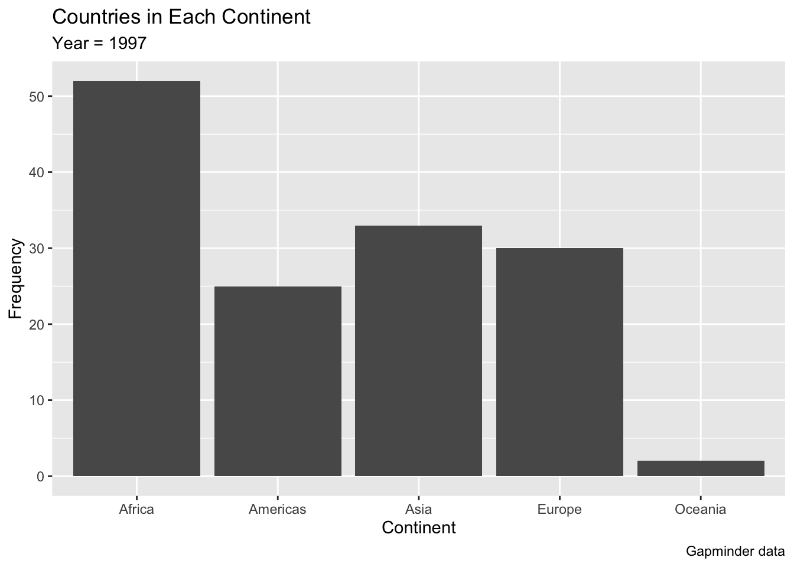
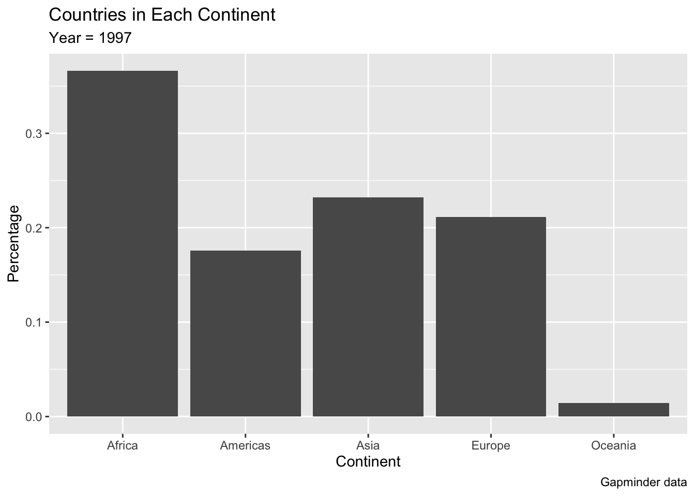
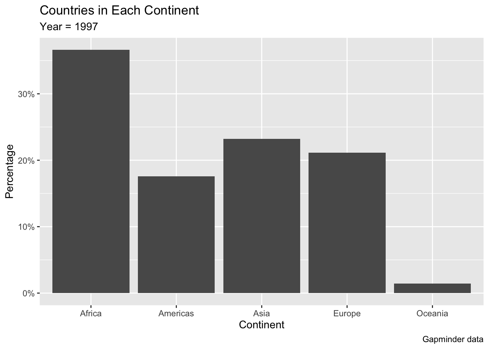

# Exploring Categorical Data

This section focuses on exploring categorical data using summary statistics and visualizations. We start by looking at ways to analyze a single variable (univariate analysis) before introducing multivariate plots that visualize the relationship between multiple categorical variables.

## Univariate Analysis of Categorical Data

### Frequency Tables

A frequency table is a table that displays the frequency of various values in a variable. Each entry in the table contains the frequency or count of the occurrences of values within that variable.

The value that appears most often in a set of data values is known as the **mode**.

We can calculate how many cases fall into each category of our categorical variable of interest using the `count()` function from the dplyr package.

For instance, let's look at the gapminder data, and identify the  frequency of different continents.


```r
library(gapminder)
library(dplyr)
#> 
#> Attaching package: 'dplyr'
#> The following objects are masked from 'package:stats':
#> 
#>     filter, lag
#> The following objects are masked from 'package:base':
#> 
#>     intersect, setdiff, setequal, union

gapminder %>% 
  filter(year == 2007) %>%
	count(continent) %>%
	arrange(desc(n()))
#> # A tibble: 5 × 2
#>   continent     n
#>   <fct>     <int>
#> 1 Africa       52
#> 2 Americas     25
#> 3 Asia         33
#> 4 Europe       30
#> 5 Oceania       2
```
  


### Bar Chart

A common visual tool to display the distribution of values in a categorical variable is through a bar chart.

A bar chart can be plotted in ggplot using the geom `geom_bar()`.

This function requires a single categorical variable to be mapped to the `x` aestetic within the `aes()` function.

Behind the scenes, the geom calculates the number of individual set of observations for each level of the selected variable, and makes the height of the bar proportional to this value.

For instance in the example below we visualize the distribution of the `continent` variable in the gapminder dataset, filtering for a single year. The resulting bar chart produce a different bar for each of the values in the selected variable, while the height is proportional to the number of types each value occurs. In this case the height of each bar represents the number of countries that belong to each of the five continents.


```r
library(gapminder)
library(tidyverse)
#> ── Attaching packages ─────────────────── tidyverse 1.3.1 ──
#> ✓ ggplot2 3.3.5     ✓ purrr   0.3.4
#> ✓ tibble  3.1.6     ✓ stringr 1.4.0
#> ✓ tidyr   1.1.4     ✓ forcats 0.5.1
#> ✓ readr   2.1.1
#> ── Conflicts ────────────────────── tidyverse_conflicts() ──
#> x dplyr::filter() masks stats::filter()
#> x dplyr::lag()    masks stats::lag()

gap_2007 <- gapminder %>% 
  filter(year==1997)

#Plotting geom_bar without count variable
ggplot(data = gap_2007, 
       mapping = aes(x=continent)) +
  geom_bar() +
  labs(title="Countries in Each Continent",
       subtitle = "Year = 1997",
       caption = "Gapminder data",
       x="Continent", 
       y="Frequency")
```




#### Relative Frequencies

While by default `geom_bar()` visualizes a count of the number of observations associated with different values in the selected variable, in some cases we may want to chart the relative frequencies.


We can let geom_bar do the calculation by specifying within the function that the height of the bar should be  a proportion, adding `y = ..prop..`,as in the example below.


```r
 
ggplot(data = gapminder,
	mapping = aes(x = continent)) +
  geom_bar(mapping = aes(y = ..prop.., group = 1)) +
  labs(title="Countries in Each Continent",
       subtitle = "Year = 1997",
       caption = "Gapminder data",
       x="Continent", 
       y="Percentage")
```




#### `geom_col()`

When we call geom_bar(), ggplot behind the scenes calculates  the counts or proportions it displays. When the information we want to use to determine the heights of the bars is already stored in a variable  in our dataset, we can use a related geom called `geom_col()` 

This function requires the following variables to be mapped within the `aes()` function:

- `x` = the categorical variable to be mapped on the x axis
- `y` = the height of the bars

For instance, in the example below we replicate the previous visualization but we first create a new dataset that contains a variable `Continent_Count` that contains a count of the number of observations for each continent, and then calculate the percentage of all the observations that are associated with each continent in the variable `Pct_Continent`. This variable is then mapped to the y axis.
The expression `scale_y_continuous(labels = scales::percent)` is added to change the label of the y axis to from a simple number (e.g. 0.3) to a percentage (e.g. 30%).


```r
#Create new dataset with  count variable
ds <- gapminder %>% 
  filter(year==1997) %>% 
  group_by(continent)  %>%
  summarise (Continent_Count = n()) %>%
  mutate(Pct_Continent = Continent_Count / sum(Continent_Count))

#Plot with ggplot
ggplot(data = ds) + 
  geom_col(aes(x=continent, y= Pct_Continent)) +
  scale_y_continuous(labels = scales::percent) +
  labs(title="Countries in Each Continent",
       subtitle = "Year = 1997",
       caption = "Gapminder data",
       x="Continent", 
       y="Percentage")
```




#### Horizontal bars

Sometimes it is more convenient to have the bars oriented horizontally. In this case we set up the aesthetic mappings as usual and then flip the axes with the `coord_flip()` command.


```r
ggplot(data = gapminder,
	mapping = aes(x=continent)) +
  geom_bar() +
  coord_flip() 
```


#### Ordering the bars

`ggplot2` does not order the bars in the order you observe in your data frame. Sorting your data frame with `arrange()` will not have any impact on your ggplot2 output. In order to change the order of the bars, we can use the function `reorder()`. For instance, in the example below we map the x axis to `x = reorder(continent, -Count_Continent)`, which is the list of continent reordered according to the value on the variable `Count_Continent`. The `-` sign indicates a descending order.

You can reorder the bars based on a value:


```r

Gap_Count <- gapminder %>% 
  filter(year == 2007) %>%
  group_by(continent) %>%
  summarise(Count_Continent = n()) 

ggplot(data = Gap_Count,
       mapping = aes(x = reorder(continent, -Count_Continent), 
                     y = Count_Continent)) +
    geom_col() +
  labs(title="Countries in Each Continent",
       subtitle = "Year = 1997",
       caption = "Gapminder data",
       x="Continent", 
       y="Frequency")
```


It is also possible to reorder the bars manually. `ggplot2` does not order the bars in the order you observe in your data frame. Sorting your data frame with `arrange()` will not have any impact on your ggplot2 output. In order to change the order of the bars, we can use the function `reorder()`. For instance, in the example below we map the x axis to `x = reorder(continent, -Count_Continent)`, which is the list of continent reordered according to the value on the variable `Count_Continent`. The `-` sign indicates a descending order.


```r
gapminder %>%
  filter(year == 2007) %>%
  mutate(continent = fct_relevel(continent, "Africa",
                             "Americas",
                             "Asia",
                             "Europe",
                             "Oceania"))  %>%
  ggplot(aes(x=continent)) + 
  geom_bar() 
```


### Pie Chart

A pie chart can be used to represent the same information as a bar chart. While pie charts are helpful to provide an overview of the main cases, they are less clear than bar charts when it comes with comparing the size of different groups.


```r
Gap_Count <- gapminder %>% 
  filter(year == 2007) %>%
  group_by(continent) %>%
  summarise(Count_Continent = n()) %>%
  mutate(Perc_Continent = Count_Continent / sum(Count_Continent))


ggplot(data = Gap_Count, 
       mapping = aes(x="", y=Perc_Continent, fill=continent)) +
  geom_col(width=1) +
  coord_polar("y", start=0) +
  labs(title="Countries in Each Continent",
       subtitle = "Year = 1997",
       caption = "Gapminder data",
       y="Percentage")
```


 

## Bivariate Analysis of Two Categorical Variables

### Contingency Table

A **contingency table** is a table that summarize data for two categorical variables. Each value in the table summarize the number of times a combination of different values in the two categorical variables is found.

TO BE COMPLETED
