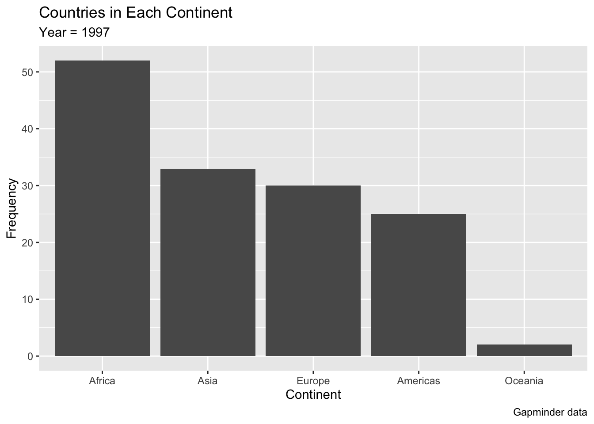
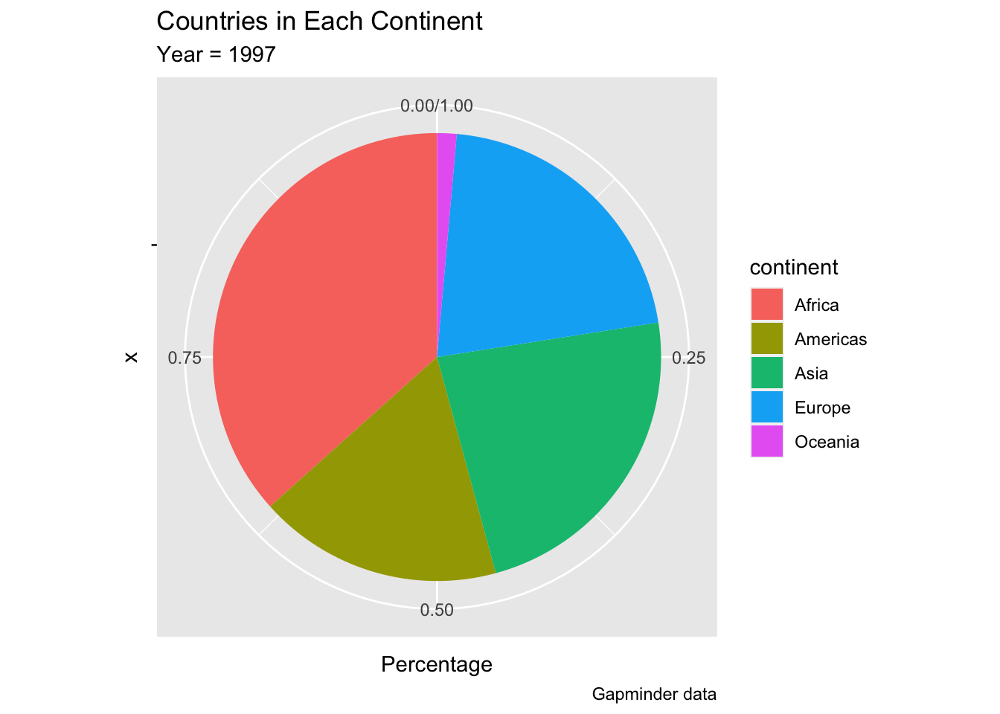
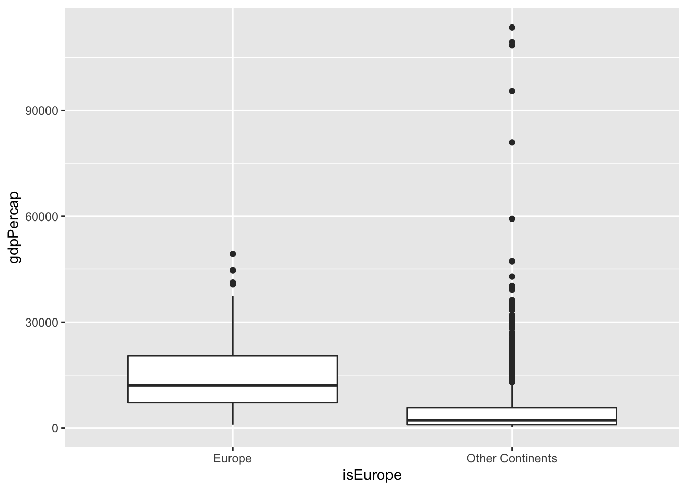
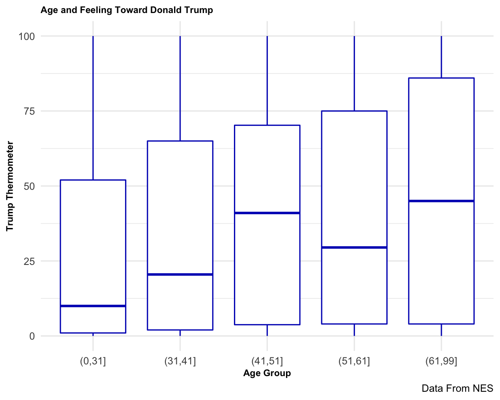

# Exploring Categorical Data

This section discusses how we can explore the distribution of a categorical variable using summary statistics and visualizations. 

We will do so by analyzing the gapminder dataset. This dataset includes two different categorical variables capturing the name of a country where an observation is taken and the continent where the country is located.

## Summarizing Categorical Data

### Unique values

The different measures of central tendency and dispersion that are often used to analyze numerical variables are not possible when working with categorical variables.

Instead, in this case we often want to start from trying to gain a better understanding of the construction of the variable by identifying what values does this take.

We can do this using the `unique()` function applied to the variable.


```r
library(gapminder)
unique(gapminder$continent)
#> [1] Asia     Europe   Africa   Americas Oceania 
#> Levels: Africa Americas Asia Europe Oceania
```

For instance, the example above shows that the continent variable in the gapminder dataset includes five different levels (Africa, Americas, Asia, Europe and Oceania)


### Frequency Tables

A frequency table is a table that displays the frequency of various values in a variable. Each entry in the table contains the frequency or count of the occurrences of values within that variable.


We can calculate how many cases fall into each category of our categorical variable of interest using the `count()` function from the dplyr package.

For instance, let's look at the gapminder data, and identify the frequency of different values in the continent variable.


```r
library(gapminder)
library(dplyr)
#> 
#> Attaching package: 'dplyr'
#> The following objects are masked from 'package:stats':
#> 
#>     filter, lag
#> The following objects are masked from 'package:base':
#> 
#>     intersect, setdiff, setequal, union

gapminder %>% 
	count(continent) 
#> # A tibble: 5 × 2
#>   continent     n
#>   <fct>     <int>
#> 1 Africa      624
#> 2 Americas    300
#> 3 Asia        396
#> 4 Europe      360
#> 5 Oceania      24
```
  
Raw frequencies give us information about the rates of occurance of different categories in a dataset. However, it’s difficult to compare raw counts across different data sets if the sample sizes vary (which they usually do). This is why we often convert counts to proportions. To do this, we have to divide each count by the total count across all categories. 


```r
library(gapminder)
library(dplyr)

gapminder %>% 
	count(continent) %>%
  mutate(freq = n/sum(n))  
#> # A tibble: 5 × 3
#>   continent     n   freq
#>   <fct>     <int>  <dbl>
#> 1 Africa      624 0.366 
#> 2 Americas    300 0.176 
#> 3 Asia        396 0.232 
#> 4 Europe      360 0.211 
#> 5 Oceania      24 0.0141
```

### Measures of Central Tendency: Mode 

The value that appears most often in a set of data values is known as the **mode**.

We can easily identify the mode of a categorical variable by sorting the results of a frequency table based on the number each category occurs.


```r
gapminder %>% 
	count(continent) %>%
  arrange(desc(n)) %>%
  top_n(1)
#> Selecting by n
#> # A tibble: 1 × 2
#>   continent     n
#>   <fct>     <int>
#> 1 Africa      624
```


## Graphical summaries of categorical variables

### Bar Chart

A common visual tool to display the distribution of values in a categorical variable is through a bar chart.

A bar chart can be plotted in ggplot using the geom `geom_bar()`.

This function requires a single categorical variable to be mapped to the `x` aestetic within the `aes()` function.

Behind the scenes, the geom calculates the number of individual set of observations for each level of the selected variable, and makes the height of the bar proportional to this value.

For instance in the example below we visualize the distribution of the `continent` variable in the gapminder dataset, filtering for a single year. The resulting bar chart produce a different bar for each of the values in the selected variable, while the height is proportional to the number of types each value occurs. In this case the height of each bar represents the number of countries that belong to each of the five continents.


```r
library(gapminder)
library(tidyverse)
#> ── Attaching packages ─────────────────── tidyverse 1.3.1 ──
#> ✓ ggplot2 3.3.5     ✓ purrr   0.3.4
#> ✓ tibble  3.1.6     ✓ stringr 1.4.0
#> ✓ tidyr   1.1.4     ✓ forcats 0.5.1
#> ✓ readr   2.1.1
#> ── Conflicts ────────────────────── tidyverse_conflicts() ──
#> x dplyr::filter() masks stats::filter()
#> x dplyr::lag()    masks stats::lag()

gap_2007 <- gapminder %>% 
  filter(year==1997)

#Plotting geom_bar without count variable
ggplot(data = gap_2007, 
       mapping = aes(x=continent)) +
  geom_bar() +
  labs(title="Countries in Each Continent",
       subtitle = "Year = 1997",
       caption = "Gapminder data",
       x="Continent", 
       y="Frequency")
```


#### Relative Frequencies

While by default `geom_bar()` visualizes a count of the number of observations associated with different values in the selected variable, in some cases we may want to chart the relative frequencies.


We can let geom_bar do the calculation by specifying within the function that the height of the bar should be  a proportion, adding `y = ..prop..`,as in the example below.


```r
 
ggplot(data = gapminder,
	mapping = aes(x = continent)) +
  geom_bar(mapping = aes(y = ..prop.., group = 1)) +
  labs(title="Countries in Each Continent",
       subtitle = "Year = 1997",
       caption = "Gapminder data",
       x="Continent", 
       y="Percentage")
```


#### `geom_col()`

When we call geom_bar(), ggplot behind the scenes calculates  the counts or proportions it displays. When the information we want to use to determine the heights of the bars is already stored in a variable  in our dataset, we can use a related geom called `geom_col()` 

This function requires the following variables to be mapped within the `aes()` function:

- `x` = the categorical variable to be mapped on the x axis
- `y` = the height of the bars

For instance, in the example below we replicate the previous visualization but we first create a new dataset that contains a variable `Continent_Count` that contains a count of the number of observations for each continent, and then calculate the percentage of all the observations that are associated with each continent in the variable `Pct_Continent`. This variable is then mapped to the y axis.
The expression `scale_y_continuous(labels = scales::percent)` is added to change the label of the y axis to from a simple number (e.g. 0.3) to a percentage (e.g. 30%).


```r
#Create new dataset with  count variable
ds <- gapminder %>% 
  filter(year==1997) %>% 
  group_by(continent)  %>%
  summarise (Continent_Count = n()) %>%
  mutate(Pct_Continent = Continent_Count / sum(Continent_Count))

#Plot with ggplot
ggplot(data = ds) + 
  geom_col(aes(x=continent, y= Pct_Continent)) +
  scale_y_continuous(labels = scales::percent) +
  labs(title="Countries in Each Continent",
       subtitle = "Year = 1997",
       caption = "Gapminder data",
       x="Continent", 
       y="Percentage")
```


#### Horizontal bars

Sometimes it is more convenient to have the bars oriented horizontally. In this case we set up the aesthetic mappings as usual and then flip the axes with the `coord_flip()` command.


```r
ggplot(data = gapminder,
	mapping = aes(x=continent)) +
  geom_bar() +
  coord_flip() 
```


#### Ordering the bars

`ggplot2` does not order the bars in the order you observe in your data frame. Sorting your data frame with `arrange()` will not have any impact on your ggplot2 output. In order to change the order of the bars, we can use the function `reorder()`. For instance, in the example below we map the x axis to `x = reorder(continent, -Count_Continent)`, which is the list of continent reordered according to the value on the variable `Count_Continent`. The `-` sign indicates a descending order.

You can reorder the bars based on a value:


```r

Gap_Count <- gapminder %>% 
  filter(year == 2007) %>%
  group_by(continent) %>%
  summarise(Count_Continent = n()) 

ggplot(data = Gap_Count,
       mapping = aes(x = reorder(continent, -Count_Continent), 
                     y = Count_Continent)) +
    geom_col() +
  labs(title="Countries in Each Continent",
       subtitle = "Year = 1997",
       caption = "Gapminder data",
       x="Continent", 
       y="Frequency")
```



It is also possible to reorder the bars manually. `ggplot2` does not order the bars in the order you observe in your data frame. Sorting your data frame with `arrange()` will not have any impact on your ggplot2 output. In order to change the order of the bars, we can use the function `reorder()`. For instance, in the example below we map the x axis to `x = reorder(continent, -Count_Continent)`, which is the list of continent reordered according to the value on the variable `Count_Continent`. The `-` sign indicates a descending order.


```r
gapminder %>%
  filter(year == 2007) %>%
  mutate(continent = fct_relevel(continent, "Africa",
                             "Americas",
                             "Asia",
                             "Europe",
                             "Oceania"))  %>%
  ggplot(aes(x=continent)) + 
  geom_bar() 
```


### Pie Chart

A pie chart can be used to represent the same information as a bar chart. While pie charts are helpful to provide an overview of the main cases, they are less clear than bar charts when it comes with comparing the size of different groups.


```r
Gap_Count <- gapminder %>% 
  filter(year == 2007) %>%
  group_by(continent) %>%
  summarise(Count_Continent = n()) %>%
  mutate(Perc_Continent = Count_Continent / sum(Count_Continent))


ggplot(data = Gap_Count, 
       mapping = aes(x="", y=Perc_Continent, fill=continent)) +
  geom_col(width=1) +
  coord_polar("y", start=0) +
  labs(title="Countries in Each Continent",
       subtitle = "Year = 1997",
       caption = "Gapminder data",
       y="Percentage")
```




## Transforming Categorical Data

### Recoding Categories

Sometimes we might need to reduce the number of categories in our categorical variable. This is particularly the case when the data comes in too many categories for our purpose.
We can do this by applying a logical filter like `ifelse()` or `recode()` to recode our variable.

For instance, let's assume that we want to compare the gdp per capita across countries in Europe and outside Europe. The gapminder dataset includes a continent variable which has five different levels (Africa, Americas, Asia, Europe, Oceania). We can recode this variable and create a new variable (`isEurope`) that takes only two levels (`Europe`,`Other Continents`). 


```r
#Load Data
library(gapminder)
library(tidyverse)

gap_is_Europe <- gapminder %>%
  mutate(isEurope =  ifelse(continent == "Europe",
                         "Europe",
                         "Other Continents"))


ggplot(data =  gap_is_Europe, 
       mapping = aes(x = isEurope, y = gdpPercap)) +
  geom_boxplot()
```




### Transforming Continuous Data into Categorical Data

Sometimes, we will need to take a continuous variable and and assign each value to a category (e.g., low, high, medium). 
When we categorize a continuous measure, we are treating all observations placed in the new category as the same and all observations placed in different categories as equally different.

For instance, if we interested on exploring whether "Gen Z" has different political attitudes compared to other generations but were given a based with indivudal ages, would need to recode the age variable to create two groups: those born before 1997 and those born after 1997 (or another chosen cutoff date). In other words, the continuous variable capturing the age would need to be transformed into a categorical variable.
In this case: 

- individuals born in the 1980s, 1970s, 1960s, 1950s would all belong to the same category, and the difference in their age would be discarded.
- At the same time, we would treat individuals born right before our cut-off date in the same way as those born right after the cut-off date.

While discarding data is not a good practice, this may be justified if there’s a good theoretical reason to examine the data as a categorical variable.


#### Age and Support for Trump
 
The figure below shows the relationship between the age of the respondents to a survey (measured as a numerical variable) and their support for President Donald Trump. It is hard to tell what is going on, if anything.


In order to facilitate the visualization we can break down the variable capturing the date of birth into different groups.

For instance, in the visualization below we turn the age from a numerical to a categorical variable and analyze the attitude towards Trump in different age groups. 
This transformation shows a clearer pattern where attitudes towards Trump tend to be more favorable within older individual than younger ones.
 


 

 
 


