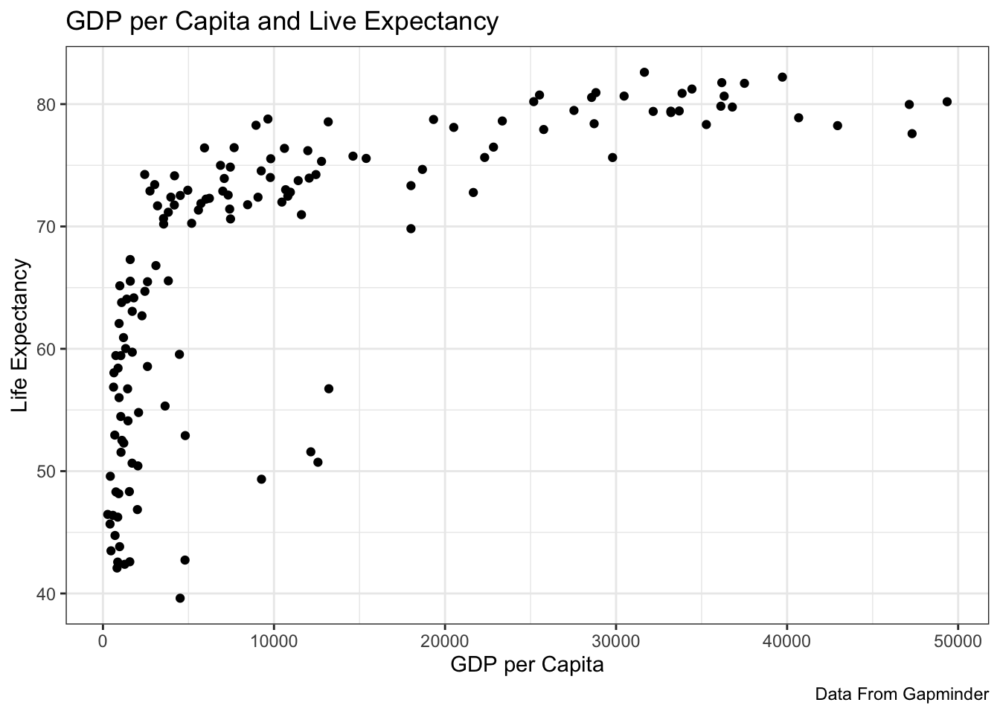
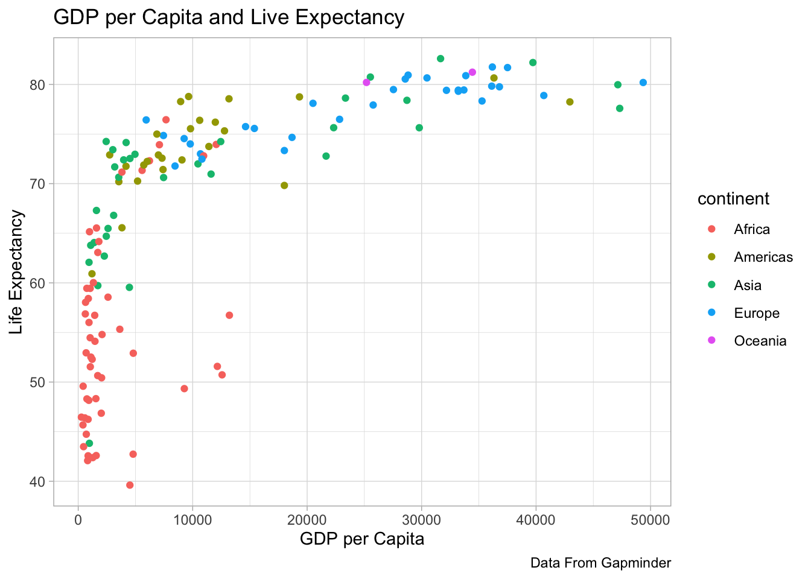
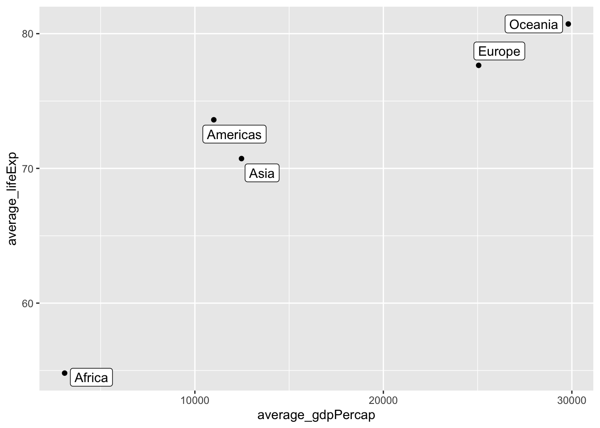
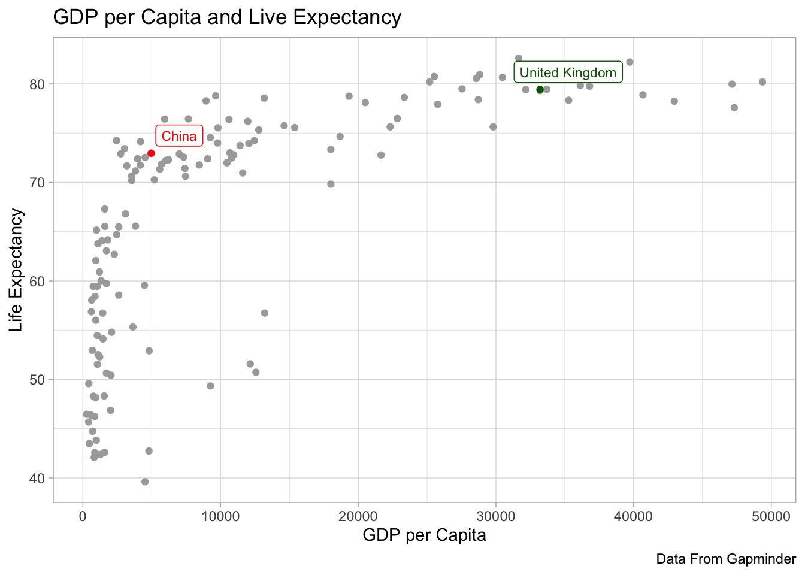
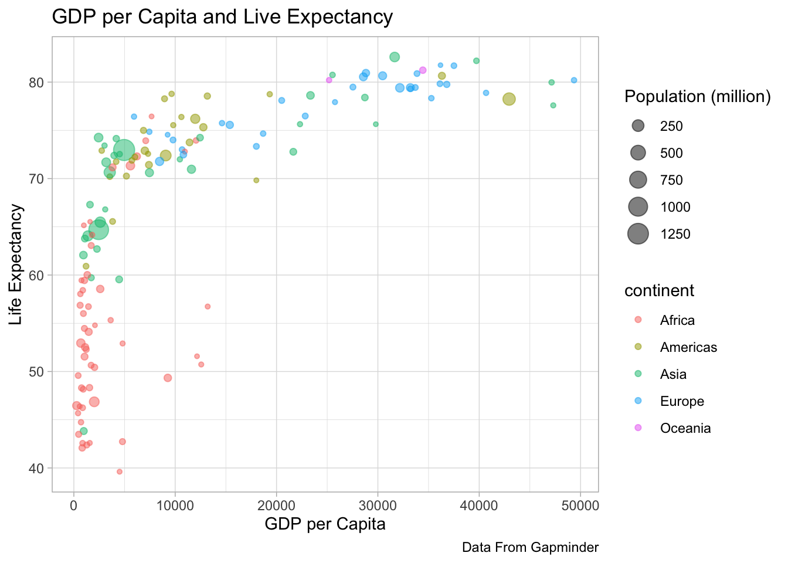
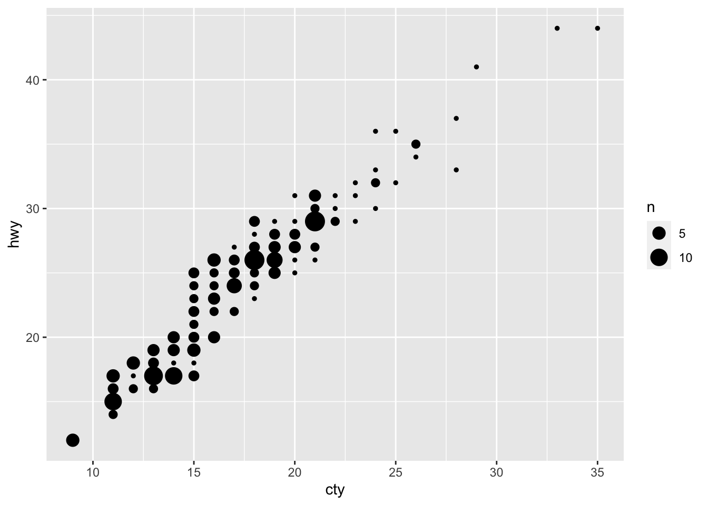
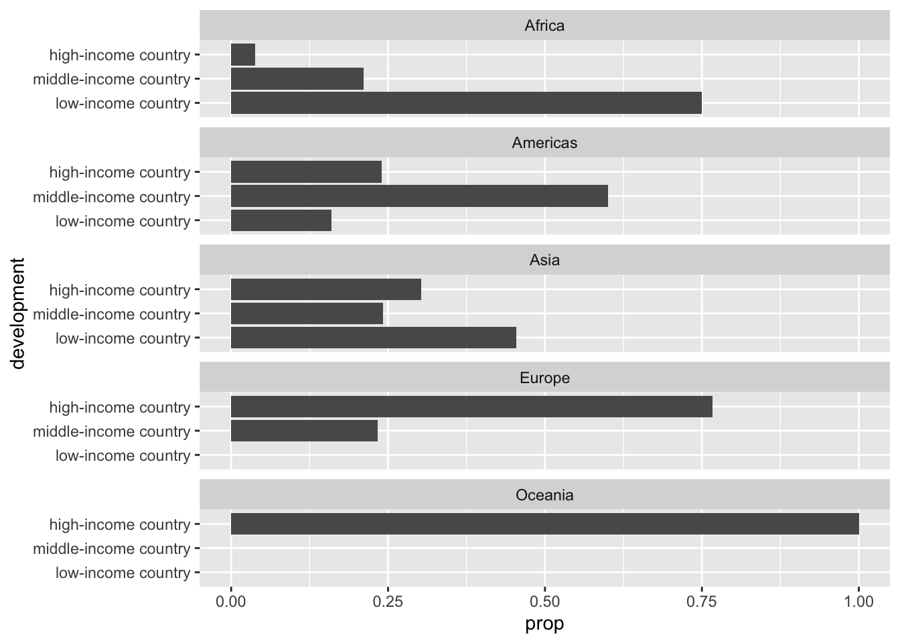
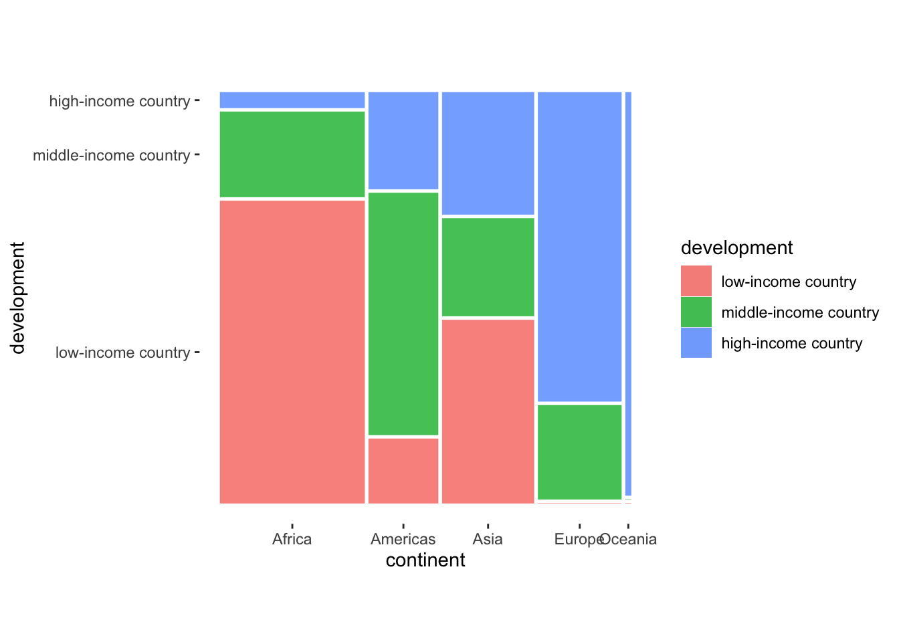
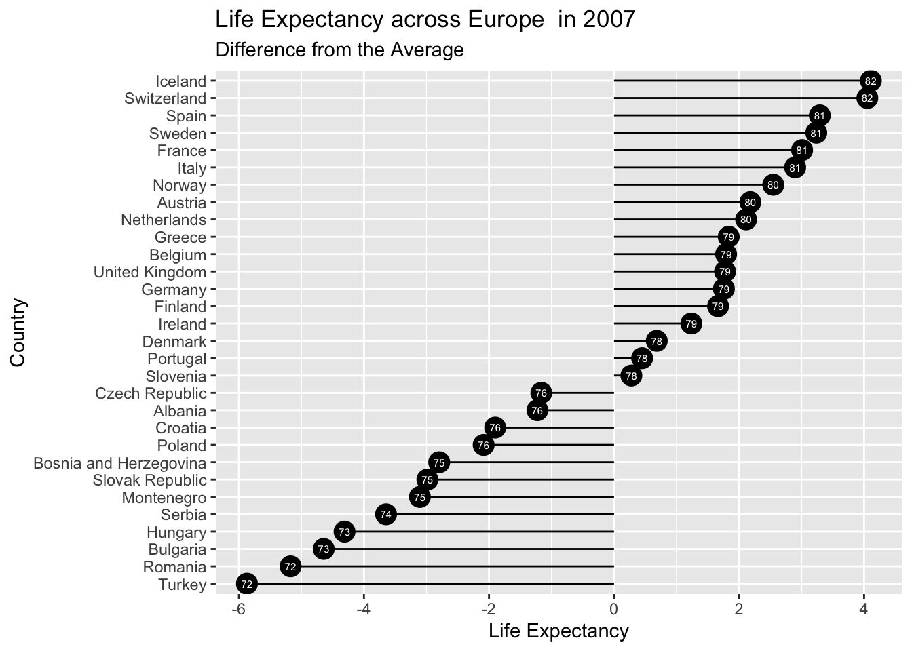

 

# Relationship between categorical and numerical variables

## Summary Statistics across different Categories

Numerical summaries can be constructed by taking the various ideas we’ve explored for numeric variables (means, medians, etc), and applying them to subsets of data defined by the values of the categorical variable. This is easy to do with the dplyr `group_by()` and `summarise()` pipeline.

For instance, in this example, after we grouped together different observations with the same value for the `continent` variable, we can calculate the average, lowest, and highest life expectancy (`lifeExp` variable) among all the observations of that group.


```r
gapminder %>%
    group_by(continent) %>%
    summarize(mean_le = mean(lifeExp),
			  min_le = min(lifeExp),
			  max_le = max(lifeExp)) 
#> # A tibble: 5 × 4
#>   continent mean_le min_le max_le
#>   <fct>       <dbl>  <dbl>  <dbl>
#> 1 Africa       48.9   23.6   76.4
#> 2 Americas     64.7   37.6   80.7
#> 3 Asia         60.1   28.8   82.6
#> 4 Europe       71.9   43.6   81.8
#> 5 Oceania      74.3   69.1   81.2
```


##  Graphical Summary


While the visualizations and summary statistics described above gives us important insights into a given numerical variable, often our analysis requires us to break down how these vary across different groups that are mapped in a categorical variable.

###  Boxplot and Violin Plots of different qualities

The most common visualisation for exploring categorical-numerical relationships is the ‘box plot’.

Within ggplot, we can draw a boxplot using the `geom_boxplot()` function that compares the distribution of a numerical variable across different levels of a categorical variable. This function  requires the following variable (within `aes()`):

-   y = the numerical variable

-   x = the categorical variable to be mapped on the x axis 


```r

#Filter the data for the year 2007
gap_2007 <- gapminder %>%
  filter(year == 2007) 

#Plot the distribution of gdp per capita in 2007
ggplot(data = gap_2007,
       mapping = aes(y = gdpPercap, 
                   x = continent)) +
  geom_boxplot()  
```


This visualization is helpful to summarise the distribution of the numeric variable within each of the categories (in this case the gdp per capita across different countries divided by their continent). 

Alternatively a violin plot is similar to box plot but shows the density within groups. It can be drawn using `geom_violin()`.


```r

#Filter the data for the year 2007
gap_2007 <- gapminder %>%
  filter(year == 2007) 

#Plot the distribution of gdp per capita in 2007
ggplot(data = gap_2007,
       mapping = aes(y = gdpPercap, 
                   x = continent)) +
  geom_violin()  
```


###  Multiple Histograms

Boxplots of different qualities compactly present information about the central tendency, dispersion and skewness of each distribution, as well as the presence of outliers.
However, there are cases where we may want to know more about how the distribution of the numerical variable changes across categories. One option in this case it to drop multiple histograms.

Histograms can be used to compare distributions of the same variable across different groups of observations.  One option to achieve this objective is to assign the categorical variable to the `fill` mapping in order to colour the different bin according to the value of the selected variable. We also set the position argument to "identity". This tells ggplot2 not to stack the histograms on top of one another. Instead, they are allowed to overlap. It’s for this reason that we also made them semi-transparent by setting the alpha argument.


```r
ggplot(data = gapminder, 
	mapping = aes(x = lifeExp, fill = continent)) + 
  geom_histogram(position = "identity", alpha = 0.6)  
```


This plot overlays different histograms one in front of the other, in a way that could be difficult to interpret in the case the different distributions overlap significantly. If this is the case, it may be preferable to split histograms in different plot window (*facet*), producing a different plot for each category.


```r
ggplot(data = gapminder, mapping = aes(x = lifeExp)) + #Select the dataset to be plotted
  geom_histogram()  +
  facet_wrap(~continent, ncol = 1)
```


###  Stacked and Conditional Density Plots
 

Similarly to the case of histograms described above, it is possible to use a density plot to compare the distribution of the same variable across groups of observations based on the value on a different variable. This can be achieved by assigning this variable to the colour and/or fill aesthetics.


```r

ggplot(data = gapminder, mapping = aes(x = lifeExp, fill = continent)) + #Select the dataset to be plotted
  geom_density(alpha = 0.1) 
```


It is also possible to "*stack*" different groups of observations (stacked density plot) by adding `position = "stack"` to the `geom_density` function.
In this case, it is helpful to specify that the y value should be a 'count' by using the expression `y = after_stat(count)`.
 

```r
ggplot(data = gapminder, 
       mapping = aes(x = lifeExp, 
                     after_stat(count), 
                     fill = continent)) +
  geom_density(position = "stack")
```


 


A **conditional density** plot is a way to visualize the conditional distribution of a categorical variable `y` changes over a numerical variable `x`.
You can use `position="fill"` within `geom_density` to produce a conditional density estimate.


```r

ggplot(data = gapminder, 
       mapping = aes(x = lifeExp, 
                     after_stat(count), 
                     fill = continent)) +
  geom_density(position = "fill")
```


 

### Bar Charts

Bar charts are helpful to compare the the value that a single continuous variables takes across different levels of a categorical value.

For instance, in the figure before we visualize the gdp per capita of different European countries in a single year.
In order to rank the different countries from the one with the highest life expectancy to the lowest, we use the function `reorder()`


```r

Europe_2007 <- gapminder %>% 
  filter(year == 2007) %>%
  filter(continent == "Europe")

ggplot(data = Europe_2007, 
       mapping = aes(x = lifeExp, 
                     y = reorder(country, lifeExp))) +
  geom_col() +
  geom_text(aes(label = round(lifeExp,1)), hjust = -0.2, size = 2.5) +
   labs(x = "Life Expectancy",
       y = "Country",
       title = "Life Expectancy across Europe  in 2007")
```


Bar charts can also be used to compare variation in values between small number of items (or categories) with respect to a fixed reference.

For instance, in the figure below we still compare the life expectancy across different European countries, but we visualize to what extent each country diverge from the average. Countries whose life expectancy is above the average have positive values, while countries whose life is below the average have negative values.


```r

# Filter observations for Europe in 2007
Europe_2007 <- gapminder %>% 
  filter(year == 2007) %>%
  filter(continent == "Europe") 

# Calculate the average life expectancy
Average_LifeExp = mean(Europe_2007$lifeExp)

# Calculate how much life expectancy in different countries varies from the average
Europe_2007 <- Europe_2007 %>%
  mutate(Diff_Average = lifeExp - Average_LifeExp) 

# Calculate if life expectancy is above or below average
Europe_2007 <- Europe_2007 %>%
  mutate(AboveLifeExp = ifelse(Diff_Average>0, "Above Average", "Below Average"))

#Plot
ggplot(data = Europe_2007, 
       mapping = aes(x = Diff_Average, 
                     y = reorder(country, Diff_Average),
                     fill = AboveLifeExp)) +
  geom_col() +
  geom_text(aes(label = round(lifeExp,1)), hjust = -0.2, size = 2.5) +
   labs(x = "Life Expectancy",
       y = "Country",
       title = "Life Expectancy across Europe  in 2007",
       subtitle = "Difference from the Average")
```


### Dot Plots


The same information conveyed by the bar charts can also be expressed by replacing the bar with dot, using `geom_point()`.


```r

Europe_2007 <- gapminder %>% 
  filter(year == 2007) %>%
  filter(continent == "Europe")

ggplot(data = Europe_2007, 
       mapping = aes(x = lifeExp, 
                     y = reorder(country, lifeExp))) +
  geom_point() +
  geom_text(aes(label = round(lifeExp,1)), hjust = -0.25, size = 2.5) +
   labs(x = "Life Expectancy",
       y = "Country",
       title = "Life Expectancy across Europe  in 2007")
```


This plot is pretty similar to our bar plot from earlier. However, notice that the x-axis of this `geom_point()` plot starts around 70, while the x-axis of our bar plot began at 0.
ggplot2 requires that the numerical axis of a bar plots starts at 0. 
As a result, the choice between points and bars is largely a choice between comparing values to 0 or comparing values to each other. 

#  Relationship between numerical variables

We have now seen that univariate descriptions provide important information about a single variable. For instance, we can use univariate plots or summary statistics to answer questions about central tendency and dispersion.

When we examine data, we often want to see how things are related. This is the purpose of bivariate analyses.

The main goal of this chapter is to show how to use descriptive statistics and visualisations to explore the relationship among different kinds of variables.

Now we will take a look at a series of graphs that examine relationships between two or more variables. There are different visual tools available, depending on the type of variables we are investigating.
 
## Graphical Summaries of the Relationship between Continuous Variables

###  Scatterplot

Scatterplots are one of the most common visualizations used in bivariate data analysis. By looking at scatter plots of two variables, we can see whether there might be a relationship between them.

Scatterplots are used to show the relationship between two ***continuous*** variables.

Each dot represents an observation in the dataset. Their position on the X (horizontal) and Y (vertical) axis represents the values of the 2 variables for that observation.

Scatterplots are built with `ggplot` using the `geom_point()` function. `geom_point()` requires two variables to be identified within the `aes()`:

-   `x` = variable to be plotted on the horizontal axis
-   `y` = variable to be plotted on the vertical axis  


```r
library(gapminder)
library(tidyverse)

# Load and filter the gapminder dataset
gap <- gapminder
gap <- gap %>% 
  filter(year=="2007")

#Plot scatterplot
ggplot(data = gap) +
  geom_point(aes(x=gdpPercap, 
                 y=lifeExp)) +
   labs(title = "GDP per Capita and Live Expectancy",
          x = "GDP per Capita",
          y = "Life Expectancy",
          caption = "Data From Gapminder") +
  theme_bw()
```



####  Customizing Scatterplots

It is possible to customize the graphical look of the scatterplot by specifying the following parameters within `geom_point()` options:

-   `color`: the stroke color, the circle outline

-   `stroke`: the stroke width

-   `fill`: color of the circle inner part

-   `shape`: shape of the marker. It takes a value betweeen 0 and 25 (see <https://www.datanovia.com/en/blog/ggplot-point-shapes-best-tips/#:~:text=In%20ggplot,%20point%20shapes%20can%20be%20specified%20in,you%20can%20set%20manually%20point%20shapes%20and%20colors.>)

-   `alpha`: circle transparency, [0-\>1], 0 is fully transparent

-   `size`: circle size

If these options are added manually in the geom_point call (outside of `aes`), they will be uniform among markers . You can also map them to a variable if put inside the `aes()` part of the code.

It is also possible to map any of the graphical elements of a `geom_point()` them to a variable if put inside the `aes()` part of the code.

For instance we can also use Scatter Plots to evaluate the relationship between two continuous variables while varying the colour or shape of the geom_point on the basis of different categories found in a Categorical Variable.


```r

# Load and filter the gapminder dataset
gap <- gapminder
gap <- gap %>% 
  filter(year=="2007")

#Plot
ggplot(data = gap) +
  geom_point(aes(x=gdpPercap, y=lifeExp, colour = continent)) +
   labs(title = "GDP per Capita and Live Expectancy",
          x = "GDP per Capita",
          y = "Life Expectancy",
          caption = "Data From Gapminder") +
  theme_light()
```




####  Adding Labels to a scatterplot

The geom `geom_text()` and `geom_label()`can be used to add text as markers. While `geom_text()` plots uniquely a given text, `geom_label()` adds a border around the text. Both `geom_text()` and `geom_label()` require the following values:

-   `x`: position along the x axis where the text will be added

-   `y`: position along the x axis where the text will be added

-   `label`: what text you want to display (required). This can be mapped to a variable

It is also possible to add the following optional values

-   `nudge_x` and `nudge_y`: shifts the text along X and Y axis (optional)

-   `check_overlap` tries to avoid text overlap (the package `ggrepel` can also be used to achieve avoid overlaps)


```r
#install.packages("ggrepel")
library(ggrepel)

# Load and filter the gapminder dataset
gap_2007 <- gapminder %>% 
  filter(year=="2007")


#Plot


continent_gap <- gap_2007 %>%
  group_by(continent) %>%
  summarize(average_gdpPercap = mean(gdpPercap),
            average_lifeExp = mean(lifeExp))


ggplot(data = continent_gap) +
geom_point(aes(x=average_gdpPercap, 
                 y=average_lifeExp)) +
  geom_label_repel(aes(x=average_gdpPercap, 
                 y=average_lifeExp, 
                 label = continent),
            nudge_x = 1)  
```




####  Highlighting specific observations


```r

# Load and filter the gapminder dataset
gap <- gapminder
gap <- gap %>% 
  filter(year=="2007")

#Plot
ggplot(data = gap) +
  geom_point(aes(x=gdpPercap, 
                 y=lifeExp),
             colour = "darkgrey") +
   geom_point(data=gap %>% filter(country == "China"),
            aes(x=gdpPercap, 
                 y=lifeExp),
            colour = "red") +
  geom_point(data=gap %>% filter(country == "United Kingdom"),
            aes(x=gdpPercap, 
                 y=lifeExp),
            colour = "Darkgreen") +
  geom_label_repel(data=gap %>% filter(country == "China"),
            aes(x=gdpPercap, 
                 y=lifeExp, 
                 label = country),
            size = 3,
            colour = "red") +
  geom_label_repel(data=gap %>% filter(country == "United Kingdom"),
            aes(x=gdpPercap, 
                 y=lifeExp, 
                 label = country),
            size = 3,
            colour = "Darkgreen") +
   labs(title = "GDP per Capita and Live Expectancy",
          x = "GDP per Capita",
          y = "Life Expectancy",
          caption = "Data From Gapminder") +
  theme_light()  
```



###  Bubble Plot

A [bubble plot](https://www.data-to-viz.com/graph/bubble.html) is a scatter plot, where the size of the different points is adjusted according to a third numerical variable.


```r

 
# Load and filter the gapminder dataset
gap_2007 <- gapminder %>% 
  filter(year=="2007") 


# Mutate Pop
gap_2007 <- gap_2007 %>%
  mutate(pop_million = pop/1000000)

#Plot
ggplot(data = gap_2007) +
  geom_point(aes(x=gdpPercap, 
                 y=lifeExp, 
                 colour = continent,
                size = pop_million),
             alpha=0.5) +
   labs(title = "GDP per Capita and Live Expectancy",
          x = "GDP per Capita",
          y = "Life Expectancy",
          caption = "Data From Gapminder",
        size = "Population (million)") +
  theme_light()  
```




###  Other visualizations

In addition to `geom_point()`, ggplot2 provides a couple of different geom functions for producing a visual summary of relationships between numeric variables in situations where over-plotting of points is obscuring the relationship. 

The `geom_count()` function is a variant of `geom_point()` that first group data into sets of identical observations. The number of cases in each group is counted, and this number is used to scale the size of points, This visualization works better with round numeric variables.


```r
ggplot(mpg, aes(cty, hwy)) +
 geom_count()
```



Similarly, the `geom_hex` function (part of the hexbin package) works in a similar way but it divides the plane into regular hexagons.  


```r
#install.packages("hexbin")

ggplot(mpg, aes(cty, hwy)) +
 geom_hex()
```


###  Plotting Linear Trends in R

`ggplot2` provides the `geom_smooth()` function that allows to add the linear trend and the confidence interval around it if needed (option `se=TRUE`).

The `method` argument allows to apply different smoothing method like lm, glm, loess and more

####  Linear Regression Line (method = "lm")


```r
# Load and filter the gapminder dataset
gap_2007 <- gapminder %>% 
  filter(year=="2007")

#Plot
ggplot(data = gap_2007) +
  geom_point(aes(x=gdpPercap, 
                 y=lifeExp, 
                 fill = continent),
             alpha=0.5, shape=21, color="black") +
  geom_smooth(aes(x=gdpPercap, 
                 y=lifeExp),
              method = "lm", se = FALSE) +
   labs(title = "GDP per Capita and Live Expectancy",
          x = "GDP per Capita",
          y = "Life Expectancy",
          caption = "Data From Gapminder",
        size = "Population") +
  theme_light()
```


####  Curve (method = "loess")


```r
# Load and filter the gapminder dataset
gap_2007 <- gapminder %>% 
  filter(year=="2007")

#Plot
ggplot(data = gap_2007) +
  geom_point(aes(x=gdpPercap, 
                 y=lifeExp, 
                 fill = continent),
             alpha=0.5, shape=21, color="black") +
  geom_smooth(aes(x=gdpPercap, 
                 y=lifeExp),
              method = "loess", se = FALSE) +
   labs(title = "GDP per Capita and Live Expectancy",
          x = "GDP per Capita",
          y = "Life Expectancy",
          caption = "Data From Gapminder",
        size = "Population") +
  theme_light()
```


 
##  Statistical measures of association between numeric variables

Statisticians have developed  different ways to quantify an association between two numeric variables. Correlation coefficients are the most common measure and the terms correlation and association are often used interchangeably.

###  Pearson's Correlation coefficient
Pearson's Correlation coefficient is the most frequently used summary statistic used to measure the strength of the linear relationship between two continuous variables.

A Pearson correlation attempts to draw a line of best fit through the data of two variables, and the Pearson correlation coefficient, r, indicates how far away all these data points are to this line of best fit (i.e., how well the data points fit this new model/line of best fit).

The mathematical formula for the Pearson’s correlation coefficient applied to a sample is:

$$ 
r = \frac{{\sum_{i}(x_i -\overline{x})(y_i -\overline{y})}}{\sqrt{\sum_{i}(x_i -\overline{x})^2}\sqrt{\sum_{i}(x_i -\overline{x})^2}}
$$
where:

- r	=	correlation coefficient
- x_{i}	=	values of the x-variable in a sample
- {x}	=	mean of the values of the x-variable
- y_{i}	=	values of the y-variable in a sample
- {y}	=	mean of the values of the y-variable


Pearson’s correlation coefficient takes a value of 0 if two variables are uncorrelated, and a value of +1 or -1 if they are perfectly related. 
When two variables are perfectly related, this means that we are able to predict the exact value of one variable given knowledge of the other. 

A positive value in the correlation coefficient (0-1) indicates that high values in one variable is associated with high values of the second. A negative correlation coefficient (-1-0) indicates that high values of one variable is associated with low values of the second.

For instance, the figure below shows a series of linear relationships that vary in their strength and direction.

{width=90%}(Source: Childs 2019)

###  Calculating Correlation Statistic in R

We can calculate Pearson's Correlation in R using the `cor()` function:


```r
cor(gapminder$lifeExp, gapminder$gdpPercap)
#> [1] 0.5837062
```

This is positive, indicating that life expectancy in a country tends to increase with increasing gdp per capita. The value (0.58) is quite large, indicating a clear association between teh two, but not  close to 1, indicating that one variable does not completely predict the other.


###  Interpreting the Correlation Coefficient

The Pearson's correlation coefficient needs to be interpreted carefully.

####  Linear vs. non-linear relationship

A correlation coefficient quantifies the degree to which an association tends to a certain pattern. In the case of Pearson’s correlation coefficient, the coefficient is designed to summarise the strength of a linear (i.e. ‘straight line’) association. As a result, the measure will be misleading when the relationship between the two variables is curved or hump-shaped.

For instance, the figure below reveals a number of combinations where two variables are related but not in a linear way, yet the correlation coefficient is always 0.  

{width=90%}(Source: Childs 2019)


####  Steepness

Moreover, even in the case  the relationship between two variables is linear, Pearson’s correlation coefficient tells us nothing about the slope (i.e. the steepness) of the relationship, and if an increase in the value of one variable will correspond to a large or small increase/decrease in the other variable. 

For instance, the figure below shows different configurations that have the same correlation coefficients but where the steepness of the relationship varies significantly.


{width=90%}(Source: Childs 2019)

####  Outliers

Outliers can have a very large effect on the line of best fit and the Pearson correlation coefficient/ This point is most easily illustrated by studying scatterplots of a linear relationship with an outlier included and after its removal, with respect to both the line of best fit and the correlation coefficient. This is illustrated in the two images below below:

{width:90%}(source: Laerd Statistics (2020).)

 
Visualizing the relationship between two continuous variables will reveal which of these scenarios is true.


###  Other measures of correlation

Other measures of correlation are available to assess whether two variables are associated in a non-linear way. 

Rank correlation is based not on the the actual values but on their ranked position in the distribution (e.g. ‘first, ’second’, ‘third’). Measures of rank correlation are based on a comparison of the resulting ranks.

he two most popular are Spearman’s ρ (‘rho’) and Kendall’s  
τ (‘tau’).We can calculate both rank correlation coefficients in R using the `cor()` function again, while specifying that`method = "kendall"` or `method = "spearman"`. 


```r
cor(gapminder$lifeExp, gapminder$gdpPercap, method = "kendall")
#> [1] 0.6369107
```


```r
cor(gapminder$lifeExp, gapminder$gdpPercap, method = "spearman")
#> [1] 0.8264712
```

Both coefficients of the Spearman’s ρ (‘rho’) and Kendall’s  τ (‘tau’) behave in a very similar way to Pearson’s correlation coefficient. They take a value of 0 if the ranks are uncorrelated, and a value of +1 or -1 if they are perfectly related, while the sign indicates the direction of the association.


#  Relationship between categorical variables

Exploring the association between pairs of categorical variable  primarily involves identifying which combinations of the different values are common and which are rare.

##  Contingency Table

The simplest approach to explore numerically the relationship between two categorical variable is ‘cross-tabulate’ the number of occurrences of each combination. The resulting table is called a contingency table. 

Each value in the table summarize the total counts of observations that fall into each combination of the levels of categorical variables. The counts in the table are sometimes referred to as frequencies.

In order to do this, we create a new categorical variable called "development" whereby be code all countries as "low-income", "middle-income", or "high-income depending on their level of gdp per capita.


```r
gapminder_dev <- gapminder %>%
  filter(year == 2007) %>%
    mutate(development = case_when(
      gdpPercap< 4045 ~ "low-income country",
      gdpPercap>= 4045 & gdpPercap<12535  ~ "middle-income country", 
      gdpPercap>= 12535  ~ "high-income country",
      TRUE ~ 'other')) %>%

mutate(development = fct_relevel(development, 
                             "low-income country","middle-income country","high-income country"))
```

We can create a contingency table by first counting the number of observations for each combination of the two categorical variable using the `count()` function and then reshaping the data to a wide format using `pivot_wider()`.


```r
gapminder_dev %>%
  count(continent, development) %>%
  pivot_wider(names_from = development, values_from = n) 
#> # A tibble: 5 × 4
#>   continent `low-income country` `middle-income country`
#>   <fct>                    <int>                   <int>
#> 1 Africa                      39                      11
#> 2 Americas                     4                      15
#> 3 Asia                        15                       8
#> 4 Europe                      NA                       7
#> 5 Oceania                     NA                      NA
#> # … with 1 more variable: high-income country <int>
```

Alternatively, the `table()` function can be used to build the same contingency table. The two variables need to be listed within the parentheses, using the format `dataset$variable`.


```r
dev_by_continent <- table(gapminder_dev$continent, gapminder_dev$development)
dev_by_continent
#>           
#>            low-income country middle-income country
#>   Africa                   39                    11
#>   Americas                  4                    15
#>   Asia                     15                     8
#>   Europe                    0                     7
#>   Oceania                   0                     0
#>           
#>            high-income country
#>   Africa                     2
#>   Americas                   6
#>   Asia                      10
#>   Europe                    23
#>   Oceania                    2
```

This tableshows us how many observations are associated with each combination of values of continent and development level.


Contingency tables can also be used to show the proportion of observations that fall into each combination of the levels of categorical variables 

We can build this by by first counting the number of observations for each combination of the two categorical variable using the `count()` and then dividing that for the total number of observations (`mutate(n = n/sum(n))`).

```r
gapminder_dev %>%
  count(continent, development) %>%
  mutate(n = n/sum(n)) %>%
  pivot_wider(names_from = development, values_from = n) 
#> # A tibble: 5 × 4
#>   continent `low-income country` `middle-income country`
#>   <fct>                    <dbl>                   <dbl>
#> 1 Africa                  0.275                   0.0775
#> 2 Americas                0.0282                  0.106 
#> 3 Asia                    0.106                   0.0563
#> 4 Europe                 NA                       0.0493
#> 5 Oceania                NA                      NA     
#> # … with 1 more variable: high-income country <dbl>
```

The function `prop_table` can also be used to achieve the same result.


```r
dev_by_continent <- table(gapminder_dev$continent, gapminder_dev$development)

prop.table(dev_by_continent)
#>           
#>            low-income country middle-income country
#>   Africa           0.27464789            0.07746479
#>   Americas         0.02816901            0.10563380
#>   Asia             0.10563380            0.05633803
#>   Europe           0.00000000            0.04929577
#>   Oceania          0.00000000            0.00000000
#>           
#>            high-income country
#>   Africa            0.01408451
#>   Americas          0.04225352
#>   Asia              0.07042254
#>   Europe            0.16197183
#>   Oceania           0.01408451
```

Alternatively contingency tables could be built in order to show the share of observations for each value in either of the categorical variable. 

For instance, the table below calculate the count of observations for each combination of the two categorical variable divided by the corresponding row totals.
 

```r
dev_by_continent <- table(gapminder_dev$continent, gapminder_dev$development)

prop.table(dev_by_continent, 1)
#>           
#>            low-income country middle-income country
#>   Africa           0.75000000            0.21153846
#>   Americas         0.16000000            0.60000000
#>   Asia             0.45454545            0.24242424
#>   Europe           0.00000000            0.23333333
#>   Oceania          0.00000000            0.00000000
#>           
#>            high-income country
#>   Africa            0.03846154
#>   Americas          0.24000000
#>   Asia              0.30303030
#>   Europe            0.76666667
#>   Oceania           1.00000000
```

Thus table below calculate the count of observations for each combination of the two categorical variable divided by the corresponding column totals.


```r
dev_by_continent <- table(gapminder_dev$continent, gapminder_dev$development)

prop.table(dev_by_continent, 2)
#>           
#>            low-income country middle-income country
#>   Africa           0.67241379            0.26829268
#>   Americas         0.06896552            0.36585366
#>   Asia             0.25862069            0.19512195
#>   Europe           0.00000000            0.17073171
#>   Oceania          0.00000000            0.00000000
#>           
#>            high-income country
#>   Africa            0.04651163
#>   Americas          0.13953488
#>   Asia              0.23255814
#>   Europe            0.53488372
#>   Oceania           0.04651163
```


##  Side-by-side bar charts

While a contingency table represents the counts numerically, it’s often more useful to represent them graphically.


We can display the distributions of two categorical variables on a bar plot concurrently. In particular, it is possible to produce a separate bar for each combination of categories in the two variables. The lengths of these bars is proportional to the values they represent, which is either the raw counts or the proportions in each category combination.

In order to visualize  information from two categorical variables using ggplot,we have to define two aesthetic mappings. 

This can be achieved by mapping one categorical variable to the `x` axis as in the case of univariate analysis, and the other variable to the `fill` colour in order to differentiate visually different combinations. The next step is to add a layer using `geom_bar` to produce a bar plot.


###  Stacked Bar Plot 

When we cross-classify categories in bar charts, there are several ways to display the results.  
By default geom_bar() produce a stacked bar chart which  counts within the stacked segments of the bars on the y axis.

In a stacked bar plot, each level in the variable mapped on the x axishas its own bar, and each bar has been divided up into different coloured segments, the length of which is determined by the number of observations associated with variable mapped to the fill aesthetic.

In the example below we analyze the relationship between the geographical location of a country and its status as developed or developing country.


```r
ggplot(data = gapminder_dev,
       mapping = aes(x = continent, fill = development)) +
  geom_bar()
```


It is difficult to say, based on this plot alone, how different development types vary across different continents.

As Healy (2018, p. 83) notes, with this type of visualization it could be "difficult for readers to compare lengths and areas on an unaligned scale". In particular it is easy to compare the relative position of the categories at the bottom since these are aligned in the x-axis, but the relative length and positions of other categories further along the axis is more difficult to assess.

###  Standardized Stacked Bar Plot

In order to more easily compare proportions across groups, it is possible set the bars all the same height by adding `position-"fill"` within `geom_bar()`. 


```r
 
ggplot(data = gapminder_dev,
       mapping = aes(x = continent, fill = development)) +
  geom_bar(position = "fill")
```


###  Dodged Bar Plot


If we want to show the proportion or percentage of our second variable of interest across different groups, we can present separate bars instead of stacking them.  In order to do this we can use `position="dodge"` inside the geom function to make the bars within each group appear side by side.


```r
 
ggplot(data = gapminder_dev,
       mapping = aes(x = continent, fill = development)) +
  geom_bar(position = "dodge", mapping = aes(y = ..prop.., group = development))
```


This visualization let us see what proposition of values can be found in different groups.

We can also facilitate the comparison across different groups by dividing the graph in different miniplots. For instance, the visualization below is broken down in 5 different plots, one for each value on the `continent` variable. Each mini-plot illustrates the proportion of low-income, middle-income and high-income countries found in each continent.


```r
 
ggplot(data = gapminder_dev,
       mapping = aes(x = development)) +
  geom_bar(position = "dodge", mapping = aes(y = ..prop.., group = continent)) +
  facet_wrap(~continent, ncol = 1) +
  coord_flip()
```



##  Mosaic Plot

A mosaic plot is an alternative visualization for contingency tables. It shares features with a standardized stacked plot. Unlike a bar plot, a mosaic plot also shows the relative group sizes of the primary variable.

In order to draw a mosaic plot using ggplot we have to install an add-in package called `ggmosaic`.


```r
install.packages("ggmosaic")

```

Once the package is loaded, we can use the geom `geom_mosaic()`. This function takes the following aesthetics:

- `x`: select variables to add to formula, declared as `x = product(var2, var1, ...)`
- `fill`: select a variable to be filled


```r
library(ggmosaic)
#> Loading required package: ggplot2
ggplot(data = gapminder_dev) +
  geom_mosaic(aes(x = product(continent), fill=development)) +
  theme_mosaic()
```




`Geom_segment()` can also be used to connect the dot to the 0 level on the axis.


```r

# Filter observations for Europe in 2007
Europe_2007 <- gapminder %>% 
  filter(year == 2007) %>%
  filter(continent == "Europe") 

# Calculate the average life expectancy
Average_LifeExp = mean(Europe_2007$lifeExp)

# Calculate how much life expectancy in different countries varies from the average
Europe_2007 <- Europe_2007 %>%
  mutate(Diff_Average = lifeExp - Average_LifeExp) 

# Calculate if life expectancy is above or below average
Europe_2007 <- Europe_2007 %>%
  mutate(AboveLifeExp = ifelse(Diff_Average>0, "Above Average", "Below Average"))

#Plot
ggplot(data = Europe_2007, 
       mapping = aes(x = Diff_Average, 
                     y = reorder(country, Diff_Average),
                     label = round(lifeExp))) +
  geom_point(stat='identity', fill="black", size=5)  +
  geom_segment(aes(x = 0, 
                   y = reorder(country, Diff_Average), 
                   xend = Diff_Average, 
                   yend = reorder(country, Diff_Average)), 
               color = "black") +
  geom_text(color="white", size=2) +
   labs(x = "Life Expectancy",
       y = "Country",
       title = "Life Expectancy across Europe  in 2007",
       subtitle = "Difference from the Average")
```




### Treemap

Treemap is a  way of displaying hierarchical data by using nested rectangles.
In order to create a treemap, the data must be converted to desired format using the `geom_treemap()` from the `treemapify` package. The important requirement is, your data must have one numerical variable each that describes the area of the tiles, a categorical variable for the fill color, and  a categorical variable for the parent group.

For instance, in the example below we plot the global population in 2007 from the gapminder dataset. Each country is represented by a rectangle whose area is proportional to its population. The colour of the different squares and their grouping is determined by the continent of each country.


```r
#install.packages("treemapify")


library(ggplot2) 
library(treemapify)


# plot
ggplot(data = gap_2007, 
       aes(area = pop, fill = continent, label = country, subgroup = continent)) +
  geom_treemap() +
  geom_treemap_text(fontface = "italic", colour = "white", place = "centre",
                    grow = TRUE) +
    geom_treemap_subgroup_border()
```


