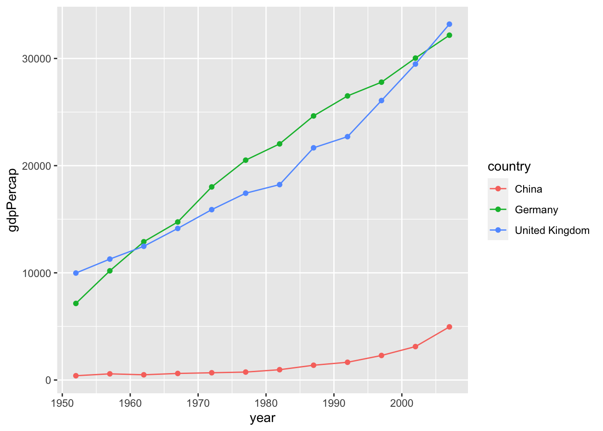
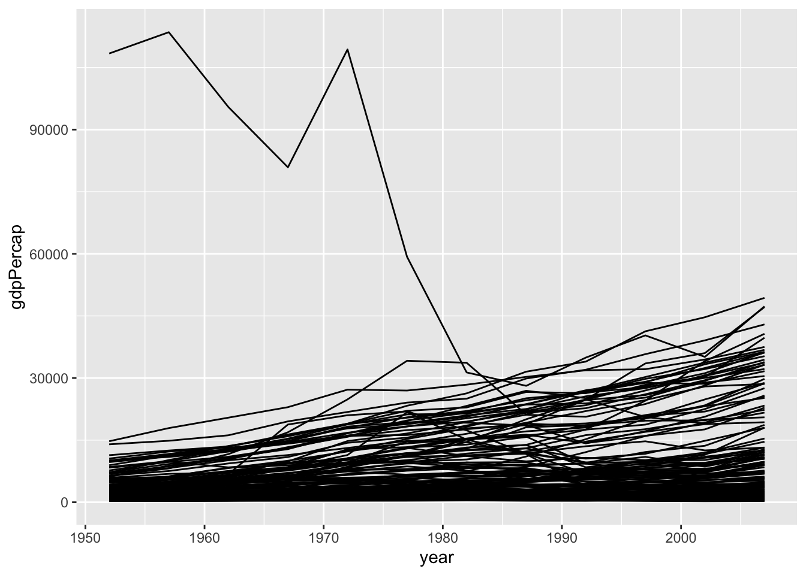
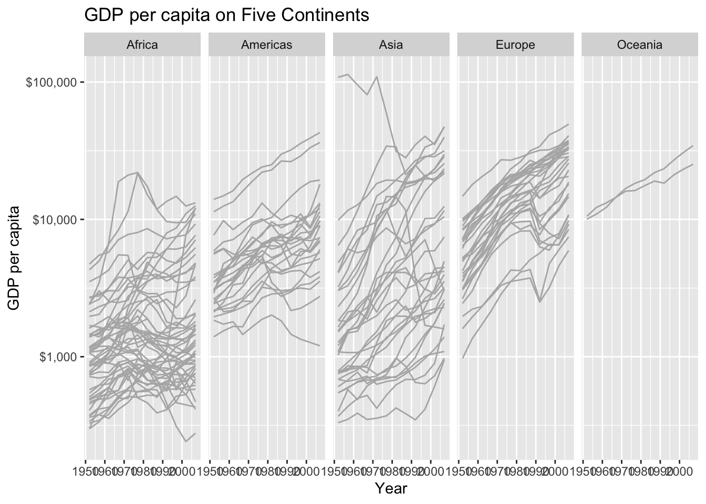
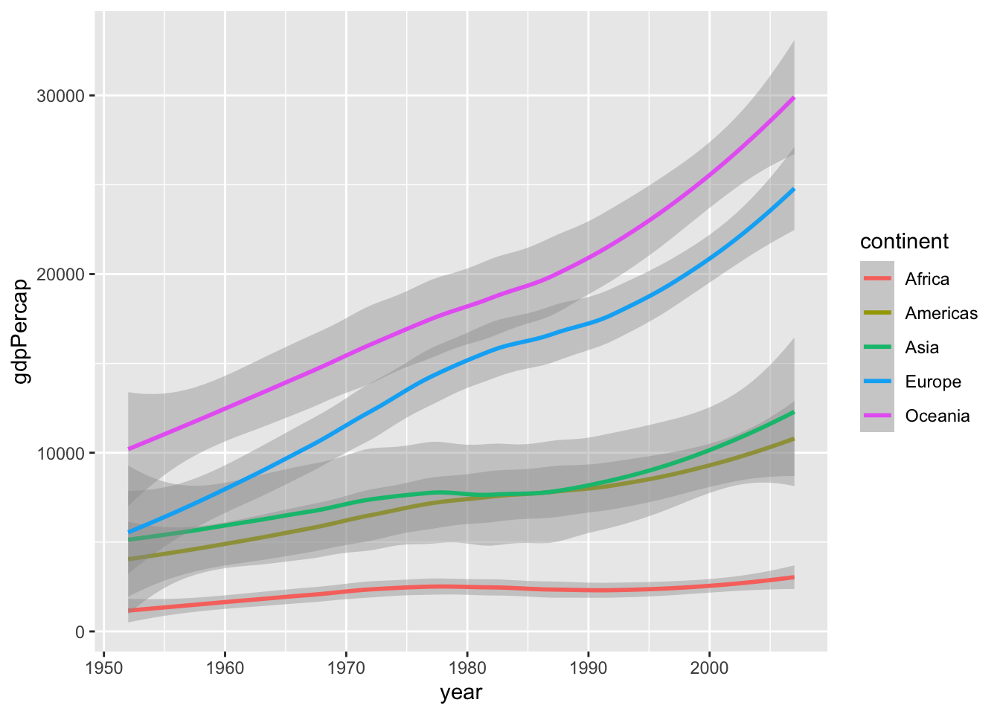
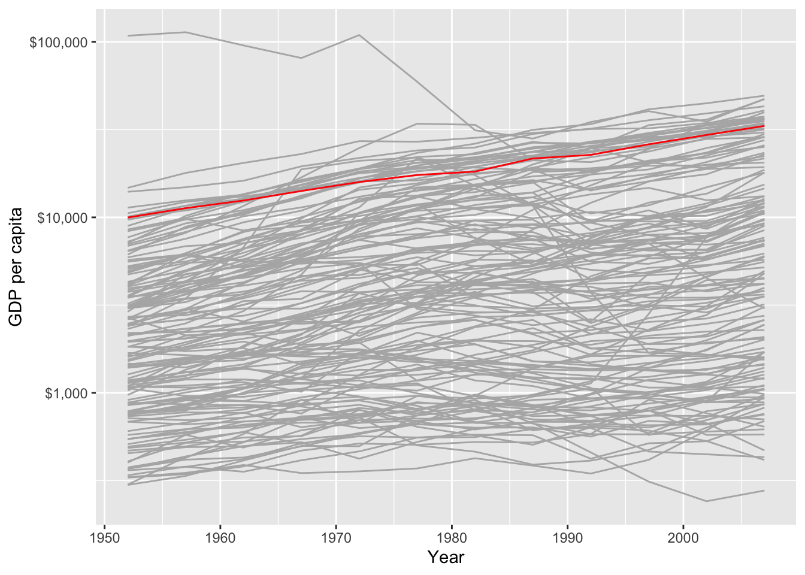

# Time Series

## The Concept

Much of political economy analysis examines ***times series*** data. Time series data refer to data for a single unit of analysis but over time. 
In other words, ***univariate time series*** is a sequence of values for a single variable collected over time for the same unit of analysis

### Differences from Cross Sectional Data

Time series data are very different from cross sectional data in two ways:

1. The values for any variable are NOT independent from one another. The value of each observation depends on the chronologically prior observation.
2. Data order matters because there is a chronological dependency of each observation on the prior observation. Changing this order would change the meaning and interpretation of the data.


### What we look for in Time Series Data

When looking at a time series, we want to know:

- Is there a trend (does the series rise on average or fall on average)?
- Is there seasonality (regularly repeating pattern of highs and lows related to calendar time)?
- Are there outliers (are there any points away from the general trend)?
- Is there constant variance over time, or is the variance non-constant?
- Are there any abrupt changes to either the level of the series or the variance of the series (that is, are there structural breaks)?


## Plotting Country-Year Time Series


### Line Plot for Single Country
The most common way to plot a time series is through a **line plot**.

In this section we will work with the gapminder dataset and plot the evolution of gdp per capita over time for different countries in the data.
We start by connecting observations in order of the variable on the x-axis by limiting the analysis to a single country
 
In the graph below we first filter the 'gapminder' data to include only observations related to the United Kingdom. We then plot this data usong ggplot, using the `geom_line`, listing the variable to be mapped on the x (year) and y (gdpPercap) axis.

In the visualization below we also mark the observations with a point `geom_point()`. Including points is important, however, if your data is irregularly distributed or the observations are sparse.


```r
library(tidyverse)
#> ── Attaching packages ─────────────────── tidyverse 1.3.1 ──
#> ✓ ggplot2 3.3.5     ✓ purrr   0.3.4
#> ✓ tibble  3.1.6     ✓ dplyr   1.0.7
#> ✓ tidyr   1.1.4     ✓ stringr 1.4.0
#> ✓ readr   2.1.1     ✓ forcats 0.5.1
#> ── Conflicts ────────────────────── tidyverse_conflicts() ──
#> x dplyr::filter() masks stats::filter()
#> x dplyr::lag()    masks stats::lag()
library(gapminder)

UK_gap <- gapminder %>%
  filter(country == "United Kingdom")

ggplot(data = UK_gap, 
       mapping = aes(x = year, y = gdpPercap))  + 
  geom_line() +
  geom_point()
```


### Line Plot for Multiple Countries

What happens if we want to compare the evolution across time of gdp per capita in multiple countries? In the graph below we filter the observations in the gapminder dataset for multiple countries and then plot the graph using `geom_line`. 


```r

UK_Ger_gap <- gapminder %>%
  filter(country == "United Kingdom" | country == "Germany" | country == "China")

ggplot(data = UK_Ger_gap, 
       mapping = aes(x = year, y = gdpPercap))  + 
  geom_line() +
  geom_point()
```


By simply listing the variable to be mapped on the x (year) and y (gdpPercap) axis, ggplot does not have the information regarding what the yearly observations should be connected to. As a result ggplot tries to connect all the lines for for each particular year in the order they appear in the dataset.
We have to specify that the line should be grouped by country by mapping the `group` variable. Grouping the data by country results in the right countries being connected. We also map the country to the `colour` of the line in order to differentiate between different countries.


```r
UK_Ger_gap <- gapminder %>%
  filter(country == "United Kingdom" | country == "Germany" | country == "China")

ggplot(data = UK_Ger_gap, 
       mapping = aes(x = year, 
                     y = gdpPercap,
                     group= country,
                     colour = country))  + 
  geom_line() +
  geom_point()
```



### Visualizing Time Series for Large Number of Countries

As the number of countries we want to visualize increase, so does the number of lines, making the results difficult to interpret


```r

ggplot(data = gapminder, 
       mapping = aes(x = year, 
                     y = gdpPercap,
                     group= country))  + 
  geom_line()
```



One option to improve the visualization is to break the graph into smaller plots based on the value of another categorical variable. In the graph below we break the graph across continents by adding `facet_wrap(~continent)`.


```r
ggplot(data = gapminder, 
       mapping = aes(x = year, y = gdpPercap))  + 
  geom_line(colour = "gray70", aes(group= country)) +
  scale_y_log10(labels = scales::dollar) +
  facet_wrap(~continent, ncol = 5) +
  labs(x= "Year", 
       y = "GDP per capita", 
       title = "GDP per capita on Five Continents")
```



Another option is to visualize a smoother (using `geom_smooth`) that summarize the tendency for each group.


```r
ggplot(data = gapminder, 
       mapping = aes(x = year, y = gdpPercap, color = continent))+
  geom_smooth(method = "loess")
#> `geom_smooth()` using formula 'y ~ x'
```




Another option is to highlight specific lines of interest to compare select values to the rest of the data. In the graph below we highlight the line associated with the UK by colouring this in red.


```r
ggplot(data = gapminder, 
       mapping = aes(x = year, y = gdpPercap))  + 
  geom_line(colour = "gray70", aes(group= country)) +
  geom_line(data = gapminder %>% filter(country == "United Kingdom"), color = "red") +
  scale_y_log10(labels = scales::dollar) +
  labs(x= "Year", 
       y = "GDP per capita")
```




Alternatively we treat the year as a categorical variable and visualize the distribution of our numerical variable of interest across different points in time. 

In the plot below we transform the numerical variable `lifeExp`  into a categorical variable using the function `as.factor().


```r

ggplot(data = gapminder, 
       mapping = aes(x = as.factor(year), y = lifeExp))  + 
  geom_boxplot() +
  labs(x= "Year", 
       y = "Life Expectancy")
```


 
 
 

