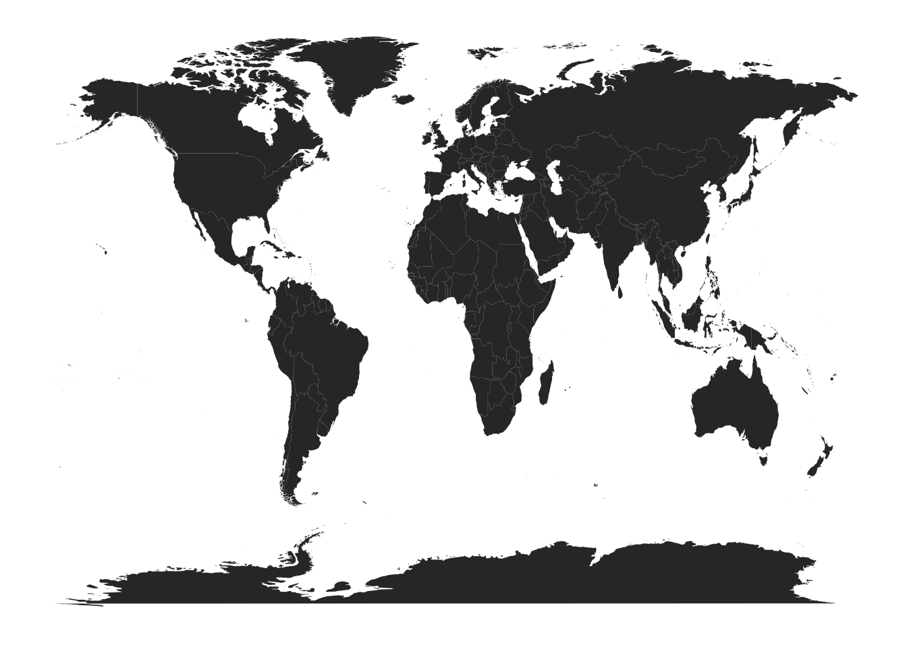
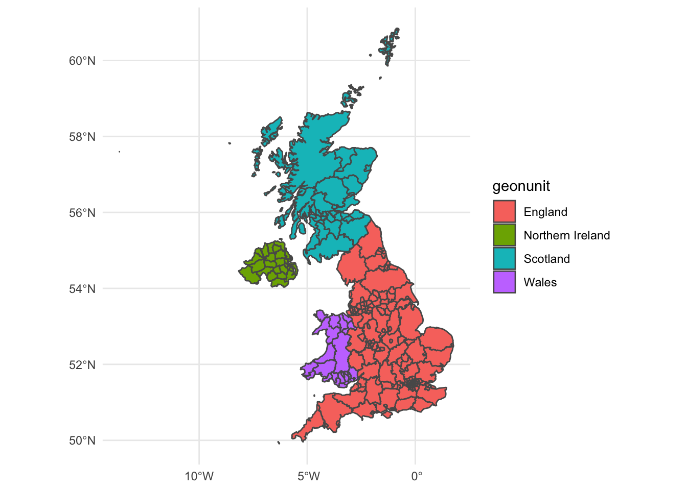
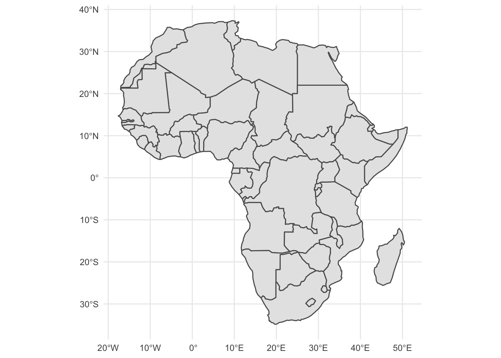
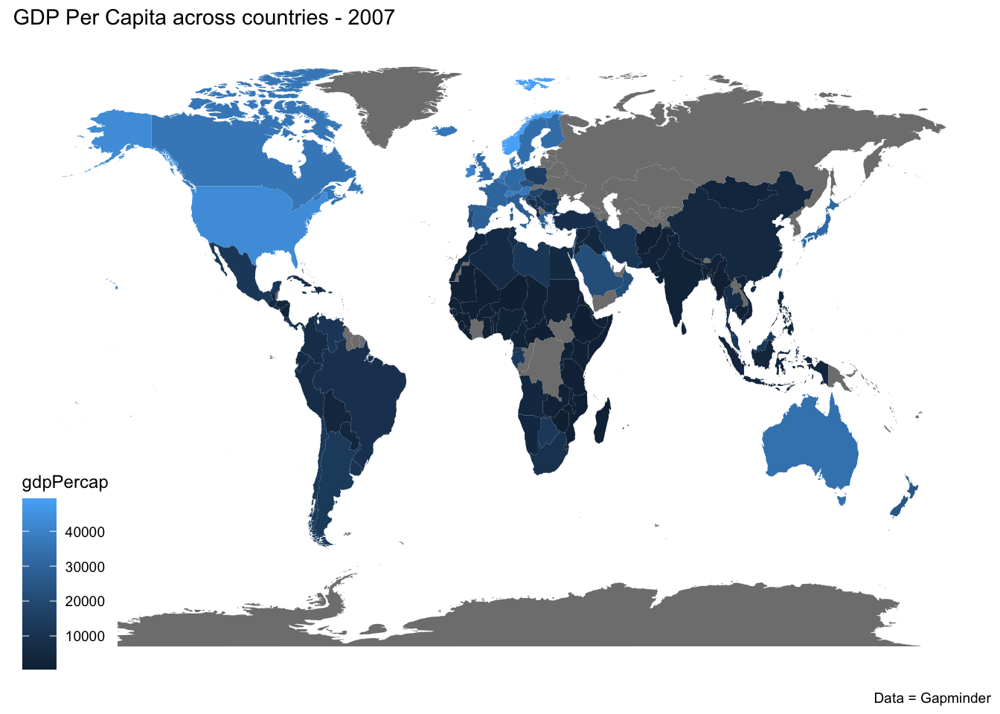
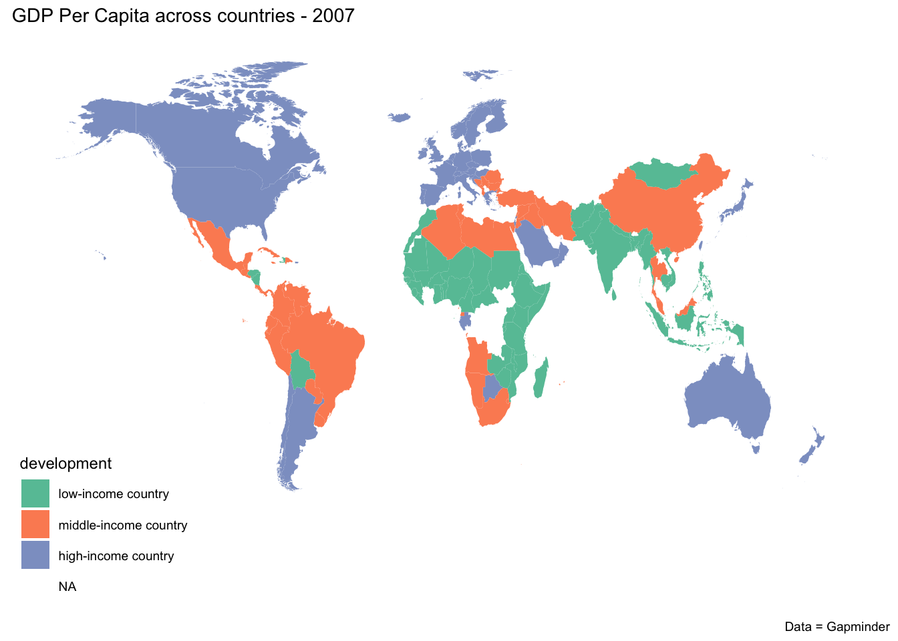
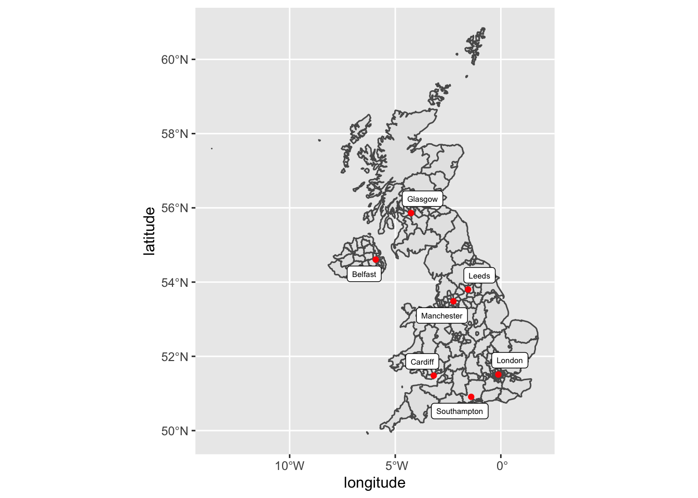

# Maps


Much of the data that we examine as political economists concerns geographical locations. For instance, we are often interested in exploring the behavior of different policymakers that represents geographically defined states or regions, or the economic characteristics of different countries.

For this reason, sometimes it is helpful to visualize our data in geographical space. Maps can be a useful tool for displaying information across geographical location.

In particular maps are helpful to give a sense for the geographical distribution of data and how does this evolve over time.

At the same time, just because you data is geographically-defined in some way doesn't mean you should map it. Maps are  helpful to communicate a geographical stgory about the data, but other visualization tools are more appropriate when we are not interested in highlighting the spatial dimension of our phenomenon of interest


## Shape maps

Shape maps are maps where the map is drawn and parceled into different areas. 

Shapes can draw continents, regions, countries, states, counties/municipalities, cities, districts, neighborhoods, blocks, etc...These shapes can be defined politically, administratively, or geologically, sociologically, economically, etc... Either way, they are based on geographical areas on the map

Shape maps are used when your data is geographically defined, that is, relate to the area or areas you are mapping. In other words, when each row of your data corresponds to a geographical area.

This is the case for most of the data examined by political economist, which frequently relate to areas (e.g. country gdp per capita,  country regime type, regional vote share of different parties).

### Shape Maps with `maps` and `geom_maps`


Shape maps require data on the shape being drawn, in the form of a shape file. This is a dataframe that specifies the longitude and latitude of the different borders to the geographical entities (countries, regions, municipalities) that we want to download.

Geographical shape files are widely available from a variety of sources, depending on the shapes you need.

For instance, world maps to visualize all countries across different conteninents are available through the `maps` package


```r
install.packages("maps")

```

The `map_data` function allows use to create a dataframe with the longitude and latitude of every country of the world. 


```r

world <- map_data("world")
head(world)
#>        long      lat group order region subregion
#> 1 -69.89912 12.45200     1     1  Aruba      <NA>
#> 2 -69.89571 12.42300     1     2  Aruba      <NA>
#> 3 -69.94219 12.43853     1     3  Aruba      <NA>
#> 4 -70.00415 12.50049     1     4  Aruba      <NA>
#> 5 -70.06612 12.54697     1     5  Aruba      <NA>
#> 6 -70.05088 12.59707     1     6  Aruba      <NA>
```

Once we have downloaded the shape file we need we can plot it using ggplot2. There are different ways to create a shape map in ggplot2. We will use a technique, which uses the `geom_map()` geom. `geom_map` takes a map argument, which is a dataframe that specifies the longitude and latitude of different countries of the world.

You can use `geom_map()` to plot these sets of national coordinates in the country borders and create a shape map. We map longitudine values to the `x` axis and latitudine to the `y` axis in order to draw the border, while mapping the variable containing the name of each country (`region`) to the aestetic `map_id`.
The function `theme_map` (from the `ggthemes` package) removes all grid lines, backgrounds and axes from the visualization.


```r
library(maps)
library(ggplot2)
library(ggthemes)
world <- map_data("world")

ggplot(data = world) + 
  geom_map(map = world,
           aes(x = long, y = lat, map_id = region)) +
    theme_map() 
```




### Shape Maps with rnaturalearth and geom_sf

In addition to teh approach presented above, there are other ways to download and plot shape files.

Shape files of the United Kingdom and a number of other countries can be found from the package `rnaturalearth` using the function `ne_states()`.

For instance, the code below installs the package `rnaturalearth` and then download the shape file for the United Kingdom. This includes information regarding different districts (e.g. Derry, Enfield), regions (e.g. East Wales) and nations (England, Northern Ireland Scotland, Wales).


```r
#Code to install rnaturalearthhires
#remotes::install_github("ropensci/rnaturalearthhires")
library(rnaturalearth) # for map data
uk_sf <- ne_states(country = "united kingdom", returnclass = "sf")

head(uk_sf)
#> Simple feature collection with 6 features and 83 fields
#> Geometry type: MULTIPOLYGON
#> Dimension:     XY
#> Bounding box:  xmin: -8.173837 ymin: 54.03457 xmax: -5.865834 ymax: 55.06932
#> Geodetic CRS:  SOURCECRS
#>             featurecla scalerank adm1_code diss_me
#> 325 Admin-1 scale rank         8  GBR-2083    2083
#> 326 Admin-1 scale rank         8  GBR-2135    2135
#> 327 Admin-1 scale rank         8  GBR-2136    2136
#> 331 Admin-1 scale rank         8  GBR-2089    2089
#> 332 Admin-1 scale rank         8  GBR-2085    2085
#> 333 Admin-1 scale rank         8  GBR-2086    2086
#>     iso_3166_2 wikipedia iso_a2 adm0_sr             name
#> 325     GB-DRY      <NA>     GB       1            Derry
#> 326     GB-STB      <NA>     GB       1         Strabane
#> 327     GB-FER      <NA>     GB       1        Fermanagh
#> 331     GB-DGN      <NA>     GB       1        Dungannon
#> 332     GB-ARM      <NA>     GB       1           Armagh
#> 333     GB-NYM      <NA>     GB       1 Newry and Mourne
#>        name_alt name_local     type               type_en
#> 325 Londonderry       <NA> District London Borough (city)
#> 326        <NA>       <NA> District              District
#> 327        <NA>       <NA> District              District
#> 331        <NA>       <NA> District              District
#> 332        <NA>       <NA> District              District
#> 333      Mourne       <NA> District              District
#>     code_local code_hasc note hasc_maybe           region
#> 325       <NA>     GB.LD <NA>       <NA> Northern Ireland
#> 326       <NA>     GB.SB <NA>       <NA> Northern Ireland
#> 327       <NA>     GB.FE <NA>       <NA> Northern Ireland
#> 331       <NA>     GB.DN <NA>       <NA> Northern Ireland
#> 332       <NA>     GB.AM <NA>       <NA> Northern Ireland
#> 333       <NA>     GB.NM <NA>       <NA> Northern Ireland
#>     region_cod provnum_ne gadm_level check_me datarank
#> 325       <NA>          3          2       20        5
#> 326       <NA>          3          2       20        5
#> 327       <NA>          3          2       20        5
#> 331       <NA>          3          2       20        5
#> 332       <NA>          3          2       20        5
#> 333       <NA>          3          2       20        5
#>     abbrev postal area_sqkm sameascity labelrank name_len
#> 325   <NA>     LD         0         NA         9        5
#> 326   <NA>     SB         0         NA         9        8
#> 327   <NA>     FE         0         NA         9        9
#> 331   <NA>     DN         0         NA         9        9
#> 332   <NA>     AM         0         NA         9        6
#> 333   <NA>     NM         0         NA         9       16
#>     mapcolor9 mapcolor13 fips fips_alt   woe_id woe_label
#> 325         6          3 UK70     UKS6 20078338      <NA>
#> 326         6          3 UK77     UKT4 20078345      <NA>
#> 327         6          3 UK66     UKS2 20078335      <NA>
#> 331         6          3 UK65     UKS1 20078342      <NA>
#> 332         6          3 UK54     UKQ8 20078322      <NA>
#> 333         6          3 UK73     UKS9 20078333      <NA>
#>             woe_name latitude longitude sov_a3 adm0_a3
#> 325            Derry  54.9694  -7.21329    GB1     GBR
#> 326         Strabane  54.8064  -7.41337    GB1     GBR
#> 327        Fermanagh  54.3798  -7.66047    GB1     GBR
#> 331        Dungannon  54.4791  -6.94613    GB1     GBR
#> 332           Armagh  54.3304  -6.62144    GB1     GBR
#> 333 Newry and Mourne  54.1804  -6.26952    GB1     GBR
#>     adm0_label          admin         geonunit gu_a3
#> 325          7 United Kingdom Northern Ireland   NIR
#> 326          7 United Kingdom Northern Ireland   NIR
#> 327          7 United Kingdom Northern Ireland   NIR
#> 331          7 United Kingdom Northern Ireland   NIR
#> 332          7 United Kingdom Northern Ireland   NIR
#> 333          7 United Kingdom Northern Ireland   NIR
#>       gn_id                   gn_name   gns_id
#> 325 2643737             City of Derry -2601895
#> 326 2636745         Strabane District -2608907
#> 327 2649533        Fermanagh District -2596082
#> 331 2650730        Dungannon District -2594881
#> 332 2657061           Armagh District -2588528
#> 333 2641580 Newry and Mourne District -2604059
#>                      gns_name gn_level gn_region gn_a1_code
#> 325            Derry, City of        2      <NA>      GB.S6
#> 326         Strabane District        2      <NA>      GB.T4
#> 327        Fermanagh District        2      <NA>      GB.S2
#> 331        Dungannon District        2      <NA>      GB.S1
#> 332           Armagh District        2      <NA>      GB.Q8
#> 333 Newry and Mourne District        2      <NA>      GB.S9
#>                             region_sub sub_code gns_level
#> 325          North of Northern Ireland     <NA>         1
#> 326          North of Northern Ireland     <NA>         1
#> 327 West and South of Northern Ireland     <NA>         1
#> 331 West and South of Northern Ireland     <NA>         1
#> 332 West and South of Northern Ireland     <NA>         1
#> 333 West and South of Northern Ireland     <NA>         1
#>     gns_lang gns_adm1 gns_region min_label max_label
#> 325      eng     <NA>       UK01        10        11
#> 326      cym     <NA>       UK01        10        11
#> 327      eng     <NA>       UK01        10        11
#> 331      eng     <NA>       UK01        10        11
#> 332      cym     <NA>       UK01        10        11
#> 333      eng     <NA>       UK01        10        11
#>     min_zoom wikidataid name_ar name_bn
#> 325       10   Q1200370    <NA>    <NA>
#> 326       10   Q1198500    <NA>    <NA>
#> 327       10   Q1198461    <NA>    <NA>
#> 331       10   Q1198466    <NA>    <NA>
#> 332       10   Q4792580    <NA>    <NA>
#> 333       10    Q606825    <NA>    <NA>
#>                        name_de
#> 325                      Derry
#> 326                   Strabane
#> 327                  Fermanagh
#> 331 Dungannon and South Tyrone
#> 332                     Armagh
#> 333           Newry and Mourne
#>                                        name_en name_es
#> 325                         Derry City Council    <NA>
#> 326                  Strabane District Council    <NA>
#> 327                 Fermanagh District Council    <NA>
#> 331 Dungannon and South Tyrone Borough Council    <NA>
#> 332                                     Armagh  Armagh
#> 333          Newry and Mourne District Council    <NA>
#>                                    name_fr name_el name_hi
#> 325                         Ville de Derry    <NA>    <NA>
#> 326                   District de Strabane    <NA>    <NA>
#> 327                  District de Fermanagh    <NA>    <NA>
#> 331 District de Dungannon and South Tyrone    <NA>    <NA>
#> 332                                 Armagh    <NA>    <NA>
#> 333           District de Newry and Mourne    <NA>    <NA>
#>     name_hu name_id                               name_it
#> 325    <NA>    <NA>                    distretto di Derry
#> 326    <NA>    <NA>                 distretto di Strabane
#> 327    <NA>    <NA>                Distretto di Fermanagh
#> 331    <NA>    <NA> distretto di Dungannon e South Tyrone
#> 332    <NA>    <NA>                   distretto di Armagh
#> 333    <NA>    <NA>           distretto di Newry e Mourne
#>     name_ja name_ko                   name_nl name_pl
#> 325    <NA>    <NA>        Derry City Council    <NA>
#> 326    <NA>    <NA>                  Strabane    <NA>
#> 327    <NA>    <NA>                 Fermanagh    <NA>
#> 331    <NA>    <NA> Dungannon en South Tyrone    <NA>
#> 332    <NA>    <NA>                      <NA>    <NA>
#> 333    <NA>    <NA>          Newry and Mourne    <NA>
#>     name_pt name_ru                    name_sv name_tr
#> 325   Derry    <NA>                       <NA>    <NA>
#> 326    <NA>    <NA>                   Strabane    <NA>
#> 327    <NA>    <NA>                  Fermanagh    <NA>
#> 331    <NA>    <NA> Dungannon and South Tyrone    <NA>
#> 332  Armagh    <NA>                       <NA>    <NA>
#> 333    <NA>    <NA>           Newry and Mourne    <NA>
#>     name_vi name_zh      ne_id
#> 325    <NA>    <NA> 1159312781
#> 326    <NA>    <NA> 1159312823
#> 327    <NA>    <NA> 1159312825
#> 331    <NA>    <NA> 1159312793
#> 332    <NA>    <NA> 1159312785
#> 333    <NA>    <NA> 1159312787
#>                           geometry
#> 325 MULTIPOLYGON (((-7.415755 5...
#> 326 MULTIPOLYGON (((-7.707951 5...
#> 327 MULTIPOLYGON (((-8.168467 5...
#> 331 MULTIPOLYGON (((-6.870015 5...
#> 332 MULTIPOLYGON (((-6.648448 5...
#> 333 MULTIPOLYGON (((-6.605217 5...
```

After having downloaded the shape file from the United Kingdom, we can plot it using ggplot and the geom `geom_sf()`


```r
ggplot(data = uk_sf) + 
  geom_sf(aes(fill = geonunit)) +
  theme_minimal()
```



 

While the function `ne_countries()` from the `rnaturalearth` can be used to download information to plot the boundaries of sub-national level entities within a country, the function `ne_states()` can be used to download national borders.

For instance, the code below first downloads shape files for all African countries and then plot this information. 


```r
library(rnaturalearth) # for map data
Africa_sf <- ne_countries(continent = "Africa", returnclass = "sf")

ggplot(data = Africa_sf) + 
  geom_sf() +
  theme_minimal()
```




### Choropleth Map

In addition to drawing the shape of different geographically-defined units (e.g. countries), we can also fill these shapes based on some the data that we would like to visualize. A choropleth map is a type of statistical thematic map that uses intensity of color to correspond with an aggregate summary of a geographic characteristic within spatial units. 

For instance, below we want to use the world map to visualize the gdp per capita of different countries as present in the `gapminder` dataset. In order to do so we need to pair the two dataset by using a common `key` variable. In this case, this is the variable containing the name of each country. 

In order to do this, a few adjustemnts are needed in this case.

- The key variable containing the name of each country is named `region` in the `world` dataset and `country` in the `gapminder` dataset. As a result, so we need to specify that we are joining variables with a different title
- When merging the two datasets, observations where the name of the country is same across the two tables will be paired. In this case, some countries are assigned two different names across the two datasets. We need to adjust the values using the `recode()` function
- Maps are suitable to visualize the variation in the value taken by a variable across different countries. A single map is not suitable to illustrate the evolution across time. Since the Gapminder dataset includes different observations for the same countries across different years, we need to subset the data by selecting a single year we want to visualize

Once we have joined the two datasets, we can map the variable we want to associate with the colour of different country to the `fill` aesthetic.


```r
library(gapminder)
library(maps)
library(ggthemes)


gap_2007 <- gapminder %>%
  filter(year == 2007) %>%
  mutate(country = recode(country,
   "United States"="USA",
   "United Kingdom"="UK"))

world <- map_data("world")

world_gap <- left_join(world, gap_2007, by = c("region" = "country"))

ggplot(data = world_gap) + 
  geom_map(map = world_gap,
           aes(x = long, 
               y = lat, 
               map_id = region,
               fill = gdpPercap)) +
    theme_map() +
  labs(title = "GDP Per Capita across countries - 2007",
       caption = "Data = Gapminder")
```


 
Since we are mapping a continuous variable, values will be represented using a colour gradient. If we instead map to the colour (`fill` aesthetic) a categorical variable, a different colour will be selected for each value of the selected variable.

For instance, in the figure below we transform the measure of gdp per capita in the gapminder dataset from a continuous to a categorical variable, differentiating between high-, middle- and low-income countries


```r
gapminder_dev <- gapminder %>%
  filter(year == 2007) %>%
    mutate(development = case_when(
      gdpPercap< 4045 ~ "low-income country",
      gdpPercap>= 4045 & gdpPercap<12535  ~ "middle-income country", 
      gdpPercap>= 12535  ~ "high-income country",
      TRUE ~ 'other')) %>%
      mutate(development = fct_relevel(development, "low-income country","middle-income country","high-income country")) %>%
  mutate(country = recode(country,
   "United States"="USA",
   "United Kingdom"="UK"))


world <- map_data("world")

world_gap <- left_join(world, gapminder_dev, by = c("region" = "country"))

ggplot(data = world_gap) + 
  geom_map(map = world_gap,
           aes(x = long, 
               y = lat, 
               map_id = region,
               fill = development)) +
    theme_map() +
  scale_fill_brewer(palette = "Set2") +
labs(title = "GDP Per Capita across countries - 2007",
       caption = "Data = Gapminder")
```


 

### Point maps

Point maps are maps where data is plotted as points on a map. Points could be used to plot events, locations or incidents, or anything that that can be associated to a specific location on a map. Points can be colored, sized, and labeled based on the value found in a variable in the our data in order to convey additional information beyond the location.

Unlike shape maps where each observation corresponds to a geopgraphical unit, point map are used when your data is locatable within these larger geographical units. Here, each row of your data corresponds to a particular location within that geographical unit.

As a result, point maps require geo-coded data, with the longitude and latitude of the location.

We can create a point map by overlaying to a normal map points based on the coordinate of the location we want to visualize. We can do this with ggplot using `geom_point()`.

For instance, in the example below we overlay on a shape map of the UK the coordinates of some of the main cities.


```r

library(ggrepel)
UK_Cites <- tibble::tribble( 
  ~city,           ~lat,     ~lon,
  "Leeds",    53.801277, -1.548567,  
  "Southampton", 50.909698, -1.404351, 
  "Manchester",  53.483959, -2.244644, 
  "London",  51.509865, -0.118092, 
  "Cardiff",     51.481583, -3.179090, 
  "Glasgow",    55.860916, -4.251433, 
  "Belfast",  54.607868, -5.926437 
)


ggplot(data = uk_sf) + 
  geom_sf( mapping = aes(x = longitude, y = latitude)) +
  geom_point(data = UK_Cites, mapping = aes(x = lon, y = lat), colour = "red") + 
  geom_label_repel(data = UK_Cites, mapping = aes(x = lon, y = lat, label = city), size = 2)  
```




 
