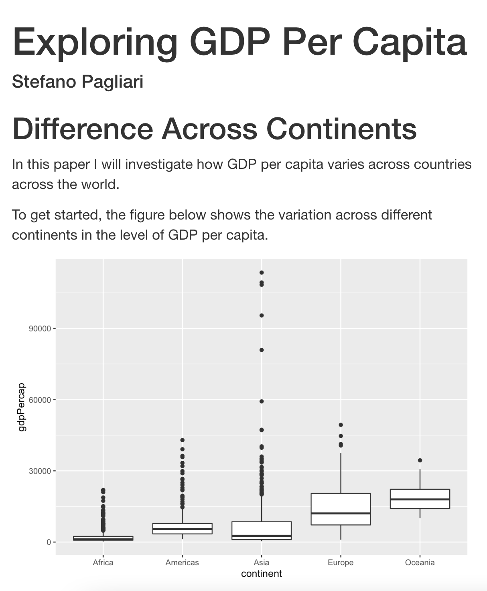

# (PART) Communicate {-} 
 
# RMarkdown

## What is RMarkdown

*R Markdown* scripts are scripts that combine R code with "markdown" text. Markdown is a lightweight markup language that you can use to add formatting elements to plain text document.

Each RMarkdown file is a plain text file that has the extension ".Rmd" and that can be opened with any text editor. 

RMarkdown files contains three types of content: 

- An header surrounded by `---` that specifies the type of output
- R code chunks surrounded by ```
- Text mixed with simple text formatting

For an introduction to RMarkdown see the video below

<iframe src="https://player.vimeo.com/video/178485416?h=8a57bf9b88&color=428bca" width="640" height="400" frameborder="0" allow="autoplay; fullscreen; picture-in-picture" allowfullscreen></iframe>
<p><a href="https://vimeo.com/178485416">What is R Markdown?</a> from <a href="https://vimeo.com/rstudioinc">RStudio, Inc.</a> on <a href="https://vimeo.com">Vimeo</a>.</p>


## Text

RMarkdown documents includes text that is written using a text format called *Markdown*. Markdown is widely used in online documents, blogging, collaborative software, and other files.

{width="80%"}


## Code Chunk

Rmarkdown file integrate text with the output of R code that are included in "code chunks".

You can quickly insert chunks into your file with

- the keyboard shortcut Ctrl + Alt + I (OS X: Cmd + Option + I)
- the Add Chunk  command in the editor toolbar
- or by typing the chunk delimiters ```{r} and ```.


It is possible to run the code included in a code chunk by selecting the green arrow next to the chunk:

{width="90%"}

### Chunk options

Arguments can be added to the chunk header to provided further customisation.

The most important set of options controls if your code block is executed and what results are inserted in the finished report:

- `eval = FALSE` prevents code from being run and the results from being displayed. This option is useful for displaying example code.
- `include = FALSE` runs the code, but doesn’t show the code or results in the final document. Use this for setup code that you don’t want cluttering your report.
- `echo = FALSE` prevents code, but not the results from appearing in the finished file. Use this when writing reports aimed at people who don’t want to see the underlying R code.
- `message = FALSE` or `warning = FALSE` prevents messages or warnings from appearing in the finished file.
- `error = TRUE` causes the render to continue even if code returns an error.  

{width="90%"}

## Header (Type of RMarkdown File)

The initial part of a Rmarkdown file will specify what type of document is being produced.

After you create a new RMarkdown file from RStudio (*File --> New File --> RMarkdown), you will be prompted to chose the type of output among a number of pre-loaded types, while others can be added by installing and loading specific packages. 
This will generate a markdown file with a pre-populated header.

It is then possible to tweak the parameters oof the header to change the nature and look of the document produced.

To produce a complete report containing all text, code, and results, click “Knit” or press Cmd/Ctrl + Shift + K. 

When you render your .Rmd file, RMarkdown will run each code chunk and embed the results beneath the code chunk in a self-contained file that you can share with others.

## Type of Outputs


For a demo of the different outputs that can be produced using RMarkdown, see the video below by Yihui Xie

<iframe width="560" height="315" src="https://www.youtube.com/embed/qLEkUjxk7e8" title="YouTube video player" frameborder="0" allow="accelerometer; autoplay; clipboard-write; encrypted-media; gyroscope; picture-in-picture" allowfullscreen></iframe>

### Documents

Among the documents that you can produce there are different formats such as 

- [HTML Documents](https://bookdown.org/yihui/rmarkdown/html-document.html) (`output: html_document`), 
- [PDF Documents](https://bookdown.org/yihui/rmarkdown/pdf-document.html) (`output: pdf_document`)
- [Word Documents](https://bookdown.org/yihui/rmarkdown/word-document.html) (`output: word_document`)
 
{width="90%"}
{width="90%"}

### Slide Presentations

RMarkdown renders to different type of presentation formats by adding the following output to the header:

- HTML Presentations via [ioslides](https://bookdown.org/yihui/rmarkdown/ioslides-presentation.html) (`output: ioslides_presentation`), [slidy](https://bookdown.org/yihui/rmarkdown/slidy-presentation.html) (`output: slidy_presentation`), [revealjs](https://bookdown.org/yihui/rmarkdown/revealjs.html) (via the `revealjs` package and `output: revealjs::revealjs_presentation`), [xaringan](https://bookdown.org/yihui/rmarkdown/xaringan.html) (via the `xaringan` package and `output: revealjs::revealjs_presentation`), 
- [PDF Presentations](https://bookdown.org/yihui/rmarkdown/beamer-presentation.html) 
- [Powerpoint Presentations](https://bookdown.org/yihui/rmarkdown/powerpoint-presentation.html) 
 
 
You can create a slide show broken up into sections by using the # and ## heading tags. It is also create a new slide without a header using a horizontal rule (---).

{width="90%"}
{width="90%"}
{width="90%"}

### Other Output Types

 
- [Books] (https://rmarkdown.rstudio.com/lesson-13.html)
- [Websites] (https://bookdown.org/yihui/rmarkdown/rmarkdown-site.html)
- [Interactive Documents] (https://rmarkdown.rstudio.com/lesson-14.html)


## Tables

By default, R Markdown prints data frames and matrices as you’d see them in the console:


```r
library(gapminder)
library(dplyr)
#> 
#> Attaching package: 'dplyr'
#> The following objects are masked from 'package:stats':
#> 
#>     filter, lag
#> The following objects are masked from 'package:base':
#> 
#>     intersect, setdiff, setequal, union
gap_summary <- gapminder %>%
  filter(year == 2007) %>%
  group_by(continent) %>%
  summarise(Average_LifeExp = mean(lifeExp),
            Median_LifeExp = median(lifeExp))

gap_summary
#> # A tibble: 5 × 3
#>   continent Average_LifeExp Median_LifeExp
#>   <fct>               <dbl>          <dbl>
#> 1 Africa               54.8           52.9
#> 2 Americas             73.6           72.9
#> 3 Asia                 70.7           72.4
#> 4 Europe               77.6           78.6
#> 5 Oceania              80.7           80.7
```

It is possible to display a table with additional formatting using the `knitr::kable` function.


```r
knitr::kable(gap_summary)
```


|continent | Average_LifeExp| Median_LifeExp|
|:---------|---------------:|--------------:|
|Africa    |        54.80604|        52.9265|
|Americas  |        73.60812|        72.8990|
|Asia      |        70.72848|        72.3960|
|Europe    |        77.64860|        78.6085|
|Oceania   |        80.71950|        80.7195|

While this function without additional parameters can be used to produce a simple table, it is also possible to further customize different elements regarding the formatting and look of the table, as well as how the information is displayed (for more information see [this page](https://bookdown.org/yihui/rmarkdown-cookbook/kable.html)).

For instance, in the example below we specify further parameters to the `kable` function to change the title of the columns, their alignment, the number of digits to be displayed, and to add a caption to the table.


```r
knitr::kable(gap_summary,
             col.names = c("Continent", "Average Life Expectancy", "Median Life Expectancy"),
             align = "lcc",
             digits = 2,
             caption = "Life Expectancy Across Continents in 2007")
```


Table: (\#tab:unnamed-chunk-3)Life Expectancy Across Continents in 2007

|Continent | Average Life Expectancy | Median Life Expectancy |
|:---------|:-----------------------:|:----------------------:|
|Africa    |          54.81          |         52.93          |
|Americas  |          73.61          |         72.90          |
|Asia      |          70.73          |         72.40          |
|Europe    |          77.65          |         78.61          |
|Oceania   |          80.72          |         80.72          |

The package (kableExtra)[https://cran.r-project.org/web/packages/kableExtra/vignettes/awesome_table_in_html.html] can be used to add additional customizations such as colours, images, and text specifications.


```r
#install.packages("kableExtra")
library(kableExtra)
#> 
#> Attaching package: 'kableExtra'
#> The following object is masked from 'package:dplyr':
#> 
#>     group_rows
knitr::kable(gap_summary, col.names = c("Continent", "Average", "Median")) %>%
  kable_styling("striped",  full_width = F) %>%
  footnote(general = "Source: Gapminder.") %>%
  add_header_above(c(" " = 1, "Life Expectancy" = 2)) %>%
  column_spec(1, color = "white", background = "red")
```

<table class="table table-striped" style="width: auto !important; margin-left: auto; margin-right: auto;border-bottom: 0;">
 <thead>
<tr>
<th style="empty-cells: hide;border-bottom:hidden;" colspan="1"></th>
<th style="border-bottom:hidden;padding-bottom:0; padding-left:3px;padding-right:3px;text-align: center; " colspan="2"><div style="border-bottom: 1px solid #ddd; padding-bottom: 5px; ">Life Expectancy</div></th>
</tr>
  <tr>
   <th style="text-align:left;"> Continent </th>
   <th style="text-align:right;"> Average </th>
   <th style="text-align:right;"> Median </th>
  </tr>
 </thead>
<tbody>
  <tr>
   <td style="text-align:left;color: white !important;background-color: red !important;"> Africa </td>
   <td style="text-align:right;"> 54.80604 </td>
   <td style="text-align:right;"> 52.9265 </td>
  </tr>
  <tr>
   <td style="text-align:left;color: white !important;background-color: red !important;"> Americas </td>
   <td style="text-align:right;"> 73.60812 </td>
   <td style="text-align:right;"> 72.8990 </td>
  </tr>
  <tr>
   <td style="text-align:left;color: white !important;background-color: red !important;"> Asia </td>
   <td style="text-align:right;"> 70.72848 </td>
   <td style="text-align:right;"> 72.3960 </td>
  </tr>
  <tr>
   <td style="text-align:left;color: white !important;background-color: red !important;"> Europe </td>
   <td style="text-align:right;"> 77.64860 </td>
   <td style="text-align:right;"> 78.6085 </td>
  </tr>
  <tr>
   <td style="text-align:left;color: white !important;background-color: red !important;"> Oceania </td>
   <td style="text-align:right;"> 80.71950 </td>
   <td style="text-align:right;"> 80.7195 </td>
  </tr>
</tbody>
<tfoot>
<tr><td style="padding: 0; " colspan="100%"><span style="font-style: italic;">Note: </span></td></tr>
<tr><td style="padding: 0; " colspan="100%">
<sup></sup> Source: Gapminder.</td></tr>
</tfoot>
</table>


 
