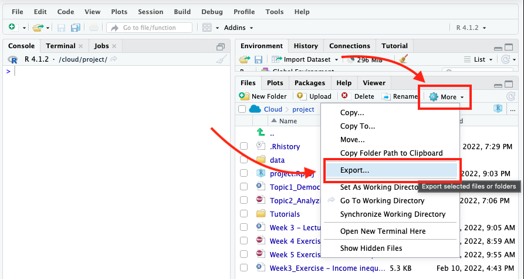
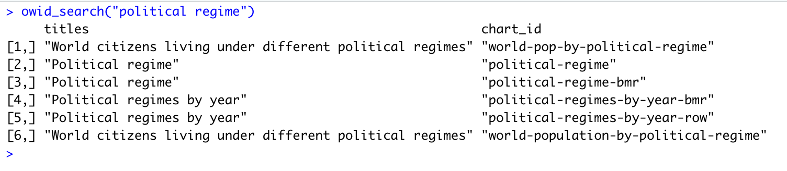

# Assessment Guidance

## Instructions for Completing your Assignment

Here are the key steps to complete your assignment

1. Open the Project IP2038 Assessment on RStudio Cloud ([link](https://rstudio.cloud/spaces/212048/project/3688736))

2.  Open the file "IP2038 Assessment 2021-22.rmd"

3.  The assessment template lays out 4 main pieces of analysis that you will have to do for the selected data. Complete the different tasks by editing the RMarkdown file you have imported. For each of these tasks:

    -   ***Part A:*** Complete the R code chunk in the first part of each task with code to produce the required numeric or graphicalresults. This include adding comments to the code using the `#`sign in order to explain what you have done.
    -   **Part B:** Interpret the output of the code chunk

4.  Save the file and export it outside of RStudio into your computer (select More in the File pane --> Export)

{width="90%"}

5.  Submit the completed RMarkdown (.rmd) file to the submission pointon Moodle. *Please note that only the version of the assignment submitted on Moodle can be assessed. The copy of the file available on RStudio cannot be considered a valid submission.*

## Data

In order to complete the assignment you will have to select, load in your R environment, and analyze of the following datasets (all availablethrough the `owidR` package):

1. **Electoral Democracy from the Varieties of Democracy dataset**
  - Download Code: `data <- owid("electoral-democracy")`
  - More information: http://v-dem.net
2.  **Transparency International Corruption Perception Index**
  - Download Code: `data <- owid("TI-corruption-perception-index")`
  - More information: https://www.transparency.org/cpi2018
3.  **OECD Gender Wage Gap Data**
  - Download Code: `data <- owid("gender-wage-gap-oecd")`
  - More information:  https://data.oecd.org/earnwage/gender-wage-gap.htm#indicator-chart
4.  **CO2 Emissions Data by Country from the Global Carbon Project**
  - Download Code: `data <- owid("annual-co2-emissions-per-country")`
  - More information: https://doi.org/10.5281/zenodo.5569235
5.  **OECD Data on Social Expenditures as a share of GDP**
  - Download Code: `data <- owid("social-spending-oecd-longrun")`
  - More information: http://stats.oecd.org/Index.aspx?datasetcode=SOCX_AGG
6.  **SIPRI Military Expenditure Database**
  - Download Code: `data <- owid("military-expenditure-total")`
  - More information:  https://www.sipri.org/databases/milex
7.  **World Bank Data on Global Poverty**
  - Download Code: `data <- owid("above-or-below-extreme-poverty-line-world-bank")`
  - More information: http://iresearch.worldbank.org/PovcalNet/povDuplicateWB.aspx
8. **World Bank Data on Income Inequality (Gini Index)**
  - Download Code: `data <- owid("economic-inequality-gini-index")`
  - More information: https://data.worldbank.org/indicator/SI.POV.GINI
9 - **United Nations Development Programme (UNDP) Human Development Index**
  - Download Code: `data <- owid("human-development-index")`
  - More information: https://hdr.undp.org/en/indicators/137506#
10 - **World Bank Data on Government Expenditure on Education as a share of GDP**
  - Download Code: `data <- owid("total-government-expenditure-on-education-gdp")`
  - More information: http://data.worldbank.org/data-catalog/world-development-indicators


You will need to download the selected data directly from RStudio using the [owidR package](https://github.com/piersyork/owidR).

In order to do this, you need to:

-   Install the `owidR` package using the command `install.packages("owidR")` . This step is required only the first time

-   Load the `owidR` package using the command `library(owidR)`

-   Download the selected dataset calling the `owidR()` function, passing the name of the dataset as an argument within parentheses.

For instance you can download the Polity IV dataset (named `"political-regimes-over-time"`) using the function


```r
# Install the owidR package (this needs to be done only the first time)
install.packages("owidR")

#Load the owidR packagee
library(owidR)

#download the "political-regimes" dataset
data <- owid("political-regimes")
```

## Question 1: Summary of the Selected Data

In this question you will have to provide a description of the main characteristics of the selected dataset, including how the main variable of interest  (e.g. CO2 emission, level of democracy, military spending) is constructed and the main summary statistics.  

 

### Summary Statistics

The code section of the answer (1.A) should provide a graph or summary table showing the distribution of the key variable chosen across all the observations or key summary statistics. The text part of the answer (1.B) should interpret these findings.

Different elements can be addressed in this section:
- number of observations
- distribution of the key variable of interest
- central tendency measures (e.g. mean, median, modal) of the variable of interest
- range of values (e.g. min, max)
- completeness of the data and presence of missing values


### Explaninig the variable
The text part of the answer (1.B) should also summarize how the selected variable is constructed and how its values should be interpreted. In order to do that, please consult the original website of the dataset and its codebook (if available).

You can obtain more information on the about the source of data and how the variables are calculated by using `owid_source()`, as in the example below.   


```r
data <- owid("political-regimes")

owid_source(data)
```


## Question 2. Analysis of the Selected Data Across Countries

The code section of the answer (2.A) should produce a graph showing the distribution of the key variable across different countries. The text part of the answer (2.B) should interpret these findings.

### Selecting Countries
Comparing your variable across countries could be difficult to visualize and assess in the case the dataset includes a large number of countries. In this case, you can:

- **Number of countries**: select a handful of key countries to illustrate key differences and similarities
- **Group countries**: instead of comparing individual countries, you can  group them based on certain features, such as their location (e.g. `continent` as listed in the gapminder dataset)
- **Key country**: you could focus on how exploring how the selected variable in one or few specific countries (e.g. largest polluters when exploring CO2 emissions) stand in comparison with others

### Selecting Years
In the case of dataset covering a wide range of years, it is possible to:

- limit the analysis to one or few significant significant years (e.g. most recent year in the dataset). In this case a a visualization like a bar plot may more appropriate to illustrate the value of of the observation for each country in the sepcific period.
- discuss the difference  across countries across a broader range. In this case a a visualization like a boxplot may more appropriate to illustrate the range of observations associated with each country

 
## Question 3. Analysis of the Selected Data Over Time

In this question you will have to analyze how the variable of interest varies across time. For instance, has it increased/decreased across time? is the evolution linear or cyclical? are there any significant turning points?
The code section of the answer (3.A) should produce a graph showing the distribution of the key variable chosen across time. The text part of the answer (3.B) should interpret these findings.
 

### Selecting Time Period
In the case of datasets covering a long range of years, it may be appropriate to limit the analysis or emphasize in the visualization the time period that is most relevant for your analysis.

### Selecting Countries
When analyzing the evolution of the variable of interest across you time, different options are available regarding the data selected. In this case, you can:

- **Key country**: you could focus on how exploring how the selected variable varies across time in a selected number of countries (between 1 and 3)
- **Global Average/Median**: you could analyze the evolution on the average level of the variable across time
- **Group countries**: you can group countries  based on certain features, such as their location


## Question 4.  Association between the Selected Data and Other Variables

How does the selected variable relate to other political and economic factors characteristics? The aim of this part of the analysis is to identify other variables that may be associated with the variable you are exploring and to provide an interpretation for this relationship (or lack of). It is also relevant to this question to highlight how variables that could be expected to be associated with the variables of interest does not appear to be from the analysis.

The code section of the answer (4.A) should  produce a suitable plot to illustrate the relationship between the different variables.The text part of the answer (4.B) should interpret these findings.

### Finding data from owidR

To answer this question you will need to identify at least one additional datasets available from Our World in Data using the `owidR` package (e.g. gdp per capita, level of democracy,) and join this data to your selected variable to your dataset. 

In order to identify suitable datasets to be integrated in your analysis, you can use the `owid_search()` to scan the Our World in Data website for datasets that include in their title the keywords within brackets using quotation marks. For instance:


```r
owid_search("")
```

For instance the command `owid_search("political regime")` returns the following output:

{width=90%}

After having identified a dataset of interest, you can find more about it by doing the following:

1. download the dataset it using the `owid()` function, adding the chart_id within brackets (e.g. `political_regime_data <- owid ("political-regime")`)
2. view the data by using the function `View()` function to open the data visualizer (e.g. `View(political_regime_data)`)
3. retrieve more information on the source of the data by using the `owid_source()` function, adding the name of the object where the data is stored within brackets

{width=90%}

It is answer this question by looking at any of the datasets listed at the beginning of the assessment template.

### Combining the data

In order to analyse to what extent the new data is related to the original variable of interest, the two datasets need to be combined. This can be done using the `left_join()` function. For more information on how to do this, please consult the section on relational data in the course material.


### Suggested datasets

Some helpful starting points include:

- Level of Democracy from the Varieties of Democracy dataset: `owid("electoral-democracy")`
- Freedom of Expression from the Varieties of Democracy Dataset: `owid("freedom-of-expression")`
- World Bank's Data on GDP per Capita: `owid("gdp-per-capita-in-us-dollar-world-bank")`
- Share of GDP by Economic Sector: `owid("shares-of-gdp-by-economic-sector")`
- Level of Urbanization: `owid("urbanization-last-500-years")`
- Population by Age Group: `owid("population-by-broad-age-group")`


## Question 5 : what have we learnt through the analysis of this data? (approx 200-400 words)

Write a concluding section identifying the main findings of your analysis, any limitation, or remaining issues for further analysis.


