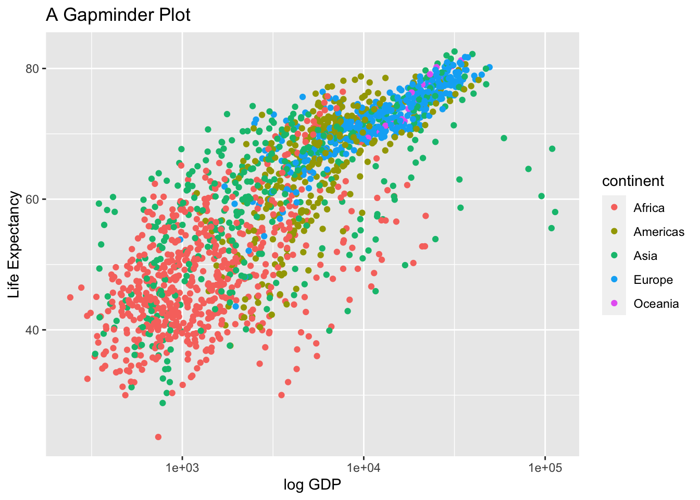
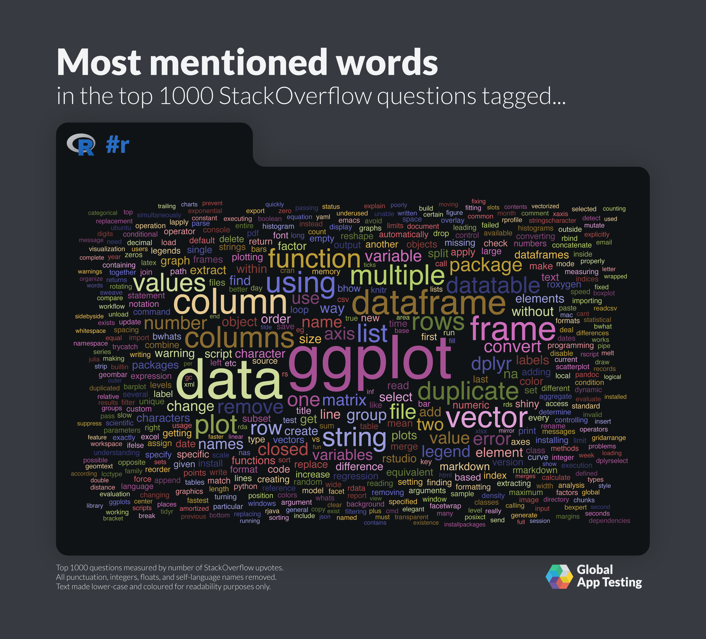

--- 
title: "IP2038 - Analysing Political and Economic Data in the Real World - Course Material"
author: "Stefano Pagliari"
date: "2022-02-05"
site: bookdown::bookdown_site
documentclass: book
# url: your book url like https://bookdown.org/yihui/bookdown
# cover-image: path to the social sharing image like images/cover.jpg
description: |
 This is page includes the key course material for the module IP2038.
 
---
 
# Introduction to the Module


## Key People

- **Module Convenor:**  Dr. Stefano Pagliari
	- Office Hour: Wednesday 10:30-12:30.
	- Please book using the IP Dept Booking  [link](https://outlook.office365.com/owa/calendar/OfficeHour202021@cityuni.onmicrosoft.com/bookings/s/VGUsxz9d_E6qI1xaXKgkrQ2)

- **Tutorial Leader**: Dr. Pedro Machado

- **Course Office:**
	- Email: IntPol.PG@city.ac.uk, 
	- Room: A129


---

## Timetable

-   **Lecture (online):** Monday 09:00-09:50. Join on Ms Teams ([link](https://teams.microsoft.com/l/meetup-join/19%3ameeting_YzJmZjQ1NTYtYzAyZC00YWNkLTkxYTctMjhlM2NkMTMzYTdj%40thread.v2/0?context=%7b%22Tid%22%3a%22dd615949-5bd0-4da0-ac52-28ef8d336373%22%2c%22Oid%22%3a%22c767c468-b609-4e4a-8987-7b08205110ae%22%7d))  
-   **Tutorial 1 (in person):**  Friday 10:00 to 10:50 in EG01
-   **Tutorial 2 (in person):** Friday 11:00 to 11:50 in EG01
-   **Tutorial 3 (in person):** Friday 12:00 to 12:50 in EG01

---

## Focus of the Module

In this module you will learn to answer substantive questions related to the study of political economy by analyzing real-world political and economic data. In particular, you will learn to

	- find and evaluate datasets 
	- wrangle data into a usable format
	- explore and describe the data through visualizations

 
## Introduction to R


<br>

In this module, you will learn how to download, manipulate, and examine and visualize data in "R". R is a programming language designed for statistical computing that is widely used in academia and the data science community.

Unlike softwares like Excel or SPSS, R works by entering instructions (code) at a prompt. When you type an instruction and hit return, R interprets it and sends any resulting output back to the console. 
For instance, the boxes show you how typing instructions in R works. The part of the box that starts with `#> [1]` displays the results returned by R. Instead of simply reading these code examples, you are encouraged to type these code snippets in your RStudio Cloud project to replicate the results.

At the most basic, R works as a simple calculator that is able to perform mathematical operations with a line of code. For instance, see what happens when you instruct R to calculate the square root of 9 using the `sqrt()` function. 


```r
sqrt(9)
#> [1] 3
```

In a similar way, it is possible to write to code to instruct R to download data, manipulate it, and plot it. For instance, the code snippet below creates a plot comparing the evolution of the gdp per capita of the United Kingdom and Japan in the postwar era.


```r
library(gapminder)
library(tidyverse)

countries <- c("United Kingdom","Japan")

gapminder %>% filter(country %in% countries) %>% 
  ggplot(aes(x = year, 
             y = gdpPercap, 
             colour = country)) +
  geom_line()
```



You can copy  the content of the code in RStudio selecting the "copy to clipboard" icon and typing is manually. For instance, what happens if you replace "Japan" with France?

The reason why we will be using R in this module include"

- **R** is s free and open-source (unlike Stata, SPSS, and SASS)
- It is powerful and able to handle large datasets (more so than MS Excel)
- It has a shorter learning curve than other computing languages (like Python).
- It has a large and expanding user community building "packages" containing tools we can use to import and analyze data


## How will we learn Data Analysis with R

There is no assigned textbook for R for this module. Instead, the lectures, these notes, and the weekly sessions in the computer lab will introduce you to all the main steps required to get started with doing data analysis in R and to complete the assignment for this module.
More specifically:

- The weekly lectures will provide you with an introduction to the different steps involved in the doing exploratory data analysis
- The course notes in this document will explain how these steps can be completed using R and provide code examples that you can copy and adapt to your project. You are encouraged to replicate the code snippets found in these course notes using RStudio, and to experiment on what happens when you change the code.
- The weekly computer labs will allow you to put in practice what we learnt with the help the tutorial leader

## Additional Resources

These two freely available e-books provide an excellent and accessible reference to respectively data analysis and data visualization using R.


:::: {style="display: grid; grid-template-columns: 40% 40%; grid-column-gap: 5%; "}

::: {}

+ Wickham, Hadley, and Garrett Grolemund (2017). "R for Data Science". O’Reilly. [link](https://r4ds.had.co.nz)

:::

::: {}
{width=80%}

:::

::: {}

+ Healey, Kieran (2018), "Data Visualization. A Practical Introduction", Princeton University Press [link](https://socviz.co)

:::

::: {}


{width=80%}

:::

::::


---


## Searching for Help Online

A key skill in learning to programme is to learn to search the internet. This is something that both novel programmers as well as experienced data analysts do routinely. It is important that you learn how to "look for help" on the internet. 

Two common approaches are:

+ Search what you are trying to achieve on a search engine, by specifying the language (R) or specific package (e.g. `tidyverse`, `ggplot`) you are using. For instance, you could search on Google "how to filter a dataframe in R" or "how to change the label colour in ggplot")
+ Often the first results that will be returned by a search engine are pages on Stackoverflow. This is a website where users post questions and receive advise. The most useful answer is usually voted up and found at the top. You can search this website for previously posted questions similar to yours or ask new questions. 

{width=50%}
[](https://i.imgur.com/AFH3v7h.png)

---
 
