# RStudio and RStudio Cloud


```{r setup, include=FALSE}

knitr::opts_chunk$set(echo = FALSE)
```


**RStudio** is an integrated development environment (IDE) used to programme in R. In other words, RStudio is a software that helps you to write R code, examine data, produce graphs, present your findings.

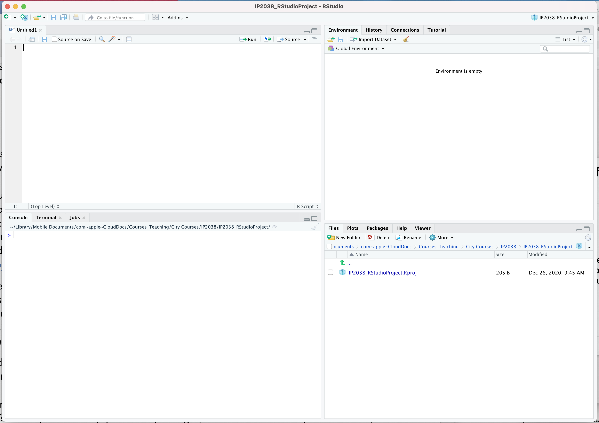{width=80%}


---

## (Optional) Installing RStudio on your personal computer 


R and RStudio are free to download and use on your personal computer. In order to install RStudio on your computer you need to:

+ **Download and install R** (the programming language) from https://cran.r-project.org/. R is maintained by an international team of developers who make the language available through the web page of [The Comprehensive R Archive Network](http://cran.r-project.org/). The top of the web page provides three links for downloading R. Follow the link that describes your operating system: Windows, Mac, or Linux.
+ **Download and install RStudio Desktop** on your computer from https://rstudio.com/products/rstudio/download/. Once you’ve installed RStudio, you can open it like any other program on your computer—usually by clicking an icon on your desktop.

*Please note that this is not required for this module as we will use the browser-based version RStudio (RStudio Cloud)*

---

## RStudio Cloud
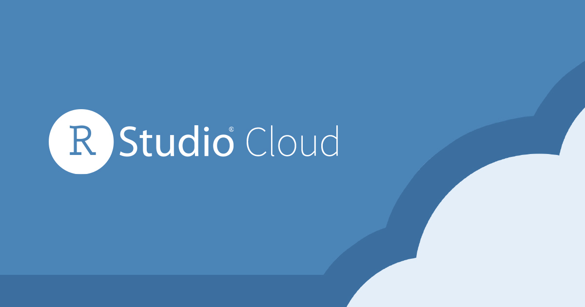{width=70%}

 
**RStudio Cloud** (<https://rstudio.cloud/>) is a lightweight, cloud-based version of RStudio that runs on a browser. City has paid for a module subscription, which will make it easier for you to access RStudio and complete the module.
You can switch over to a free individual RStudio Cloud plan once the module is completed.

---

### Getting Started in RStudio Cloud

- You should have received an email from RStudio Cloud that looks like this:

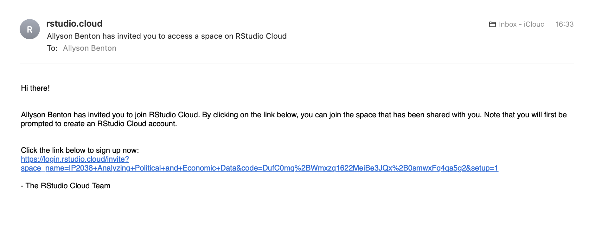{width=70%}

- The email contains a link that will direct you towards the webpage where you can create your account. In order to do to:

+ You must use your City email address

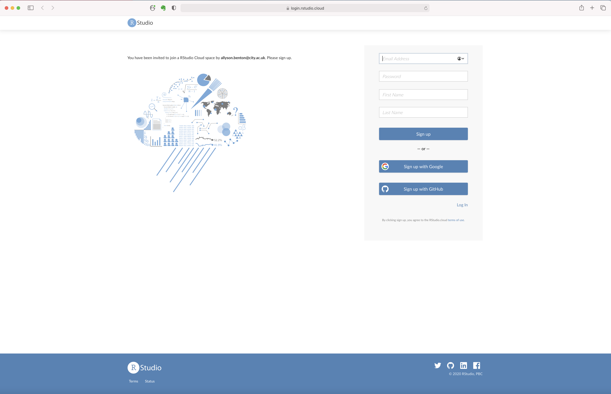{width=70%}

+ Choose a strong password
+ You must use your first and last names registered with City


After you have completed your registration, you can access RStudio Cloud from your browser by navigating to: https://rstudio.cloud/ using your browser. Here you will need to sign in using your city email and your new RStudio Cloud password. 

---

### RStudio Cloud Interface

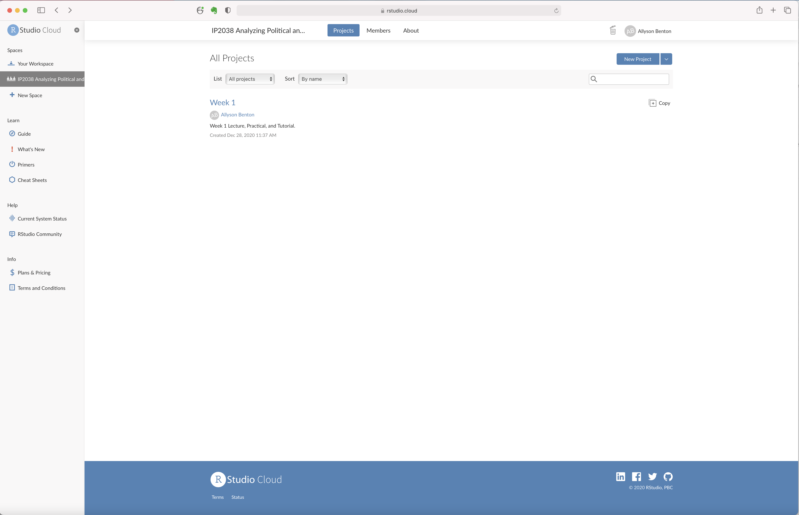{width=90%}

When you open RStudio Cloud, you will see different elements:

+ **Your Workspace**: here you can create your own projects as well as copy your own versions of the weekly worksheets
+ **Tutorials**: This folder contains code used in the tutorials of this module. You can run the code included in these projects but you cannot edit it. In order to edit it, you will need to create your own copy of the projects. Save this weekly project as a new file by clicking on "Save a Permanent Copy".

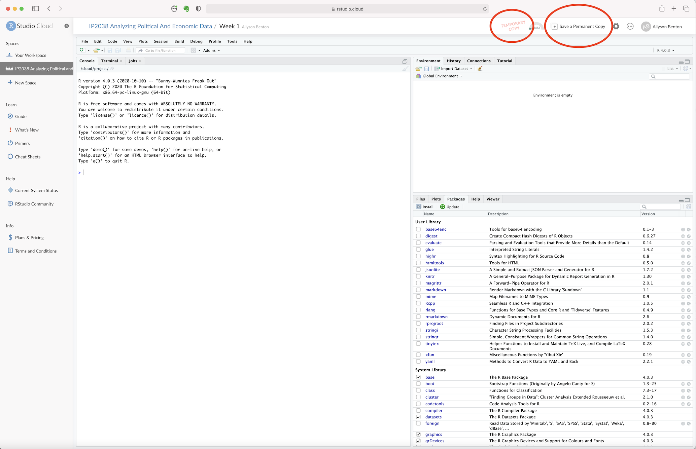{width=90%}


## RStudio Working Environment 

When you open a project in RStudio/RStudio Cloud, you will access the main working environment.

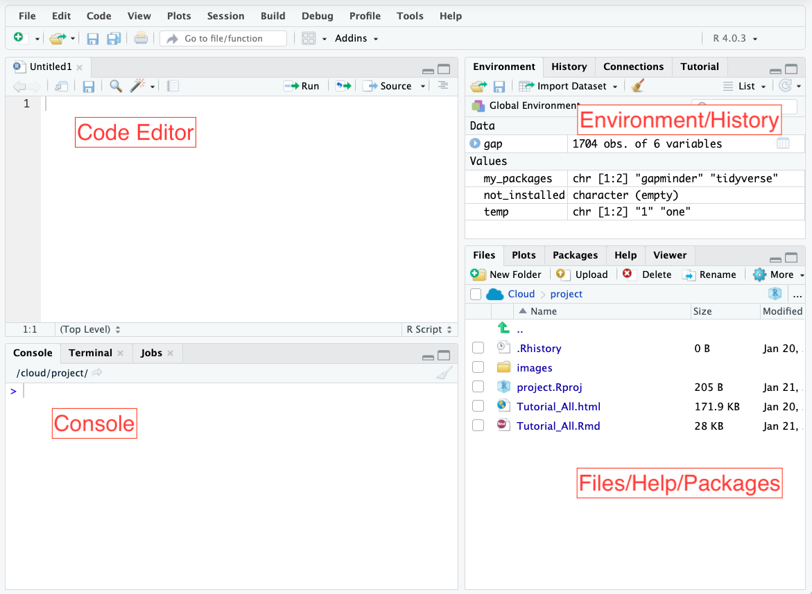{width=90%}


This has has four main panels.

+ **Console**: where you can execute commands and see the results. Commands run here are temporary and if you close R, you lose this command history and thus the ability to replicate what you have done.
+ **Code Editor**: where you work on different code files that can be saved. Just as we "save" files (like MS Word documents), so that we don't lose our work, in R you can save your R Scripts, so that you don't lose the various R commands that you have executed. A script is a series of commands that you can save, modify, and re-run whenever you like. In RStudio, you will create, edit, and save scripts from the code editor panel
+ **Environment/History**: this space shows the objects that you create and work with
+ **Files/Help/Packages**: in this space you can see your files, plots and graphs that you produce, R packages that you install, help with packages.
 
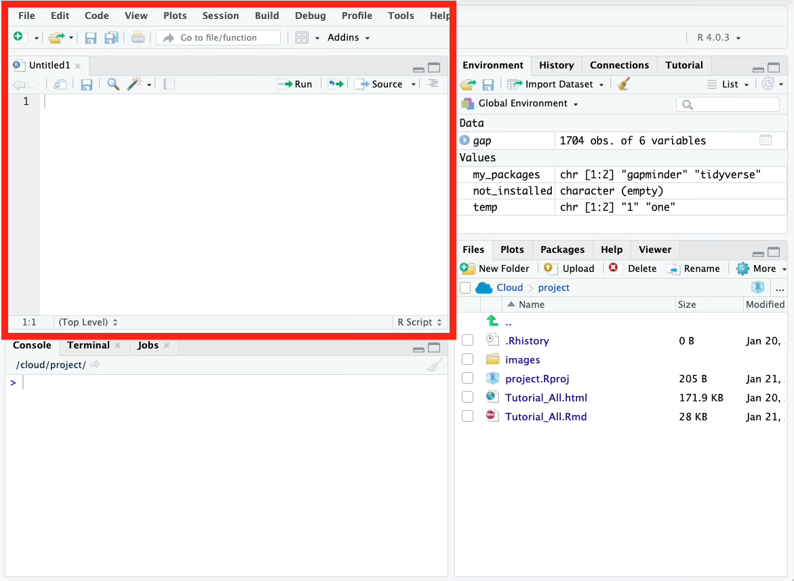{width=90%}

---

### How to create a R Script

In order to create a new R Script:

- Go to the Code Editor panel and click on the "New File" button
- Select "R Script"
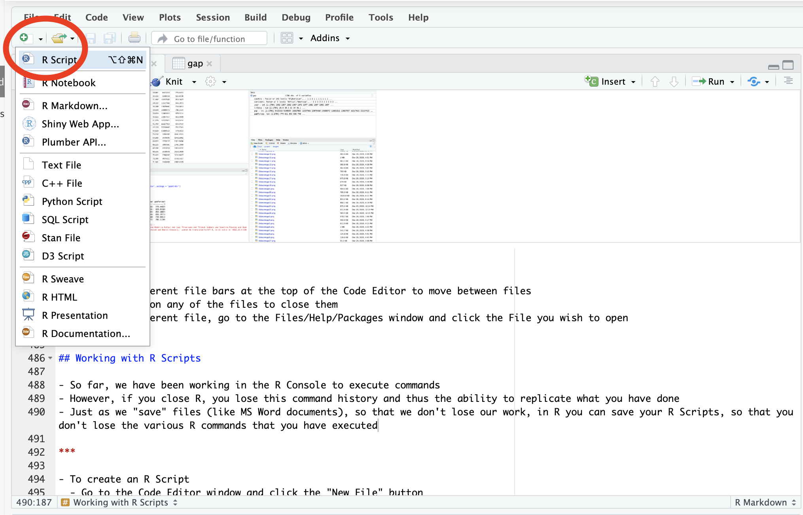{width=90%}
 
 Once you have created a script, you can then type multiple instructions within different lines of your code, run, and save the script.

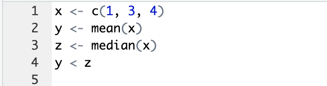{width=50%}
 

### How to Run a R Script

There are different ways to run a script. You can:

- Type the command in the Console 
- You can run your script line by clicking on a line and typing Command+Enter (Mac OS) or Control+Enter (Windows) to run the line, or hitting `Run` from the dropdown menu.
- To run the whole script, type Ctrl+Shift+Enter on Windows, Command+Shift+Enter.
- You can also process your script by clicking on the "Run" icon at the top of the script editor. If a line is selected, this will run only that line. Otherwise, the entire script will be compiled.

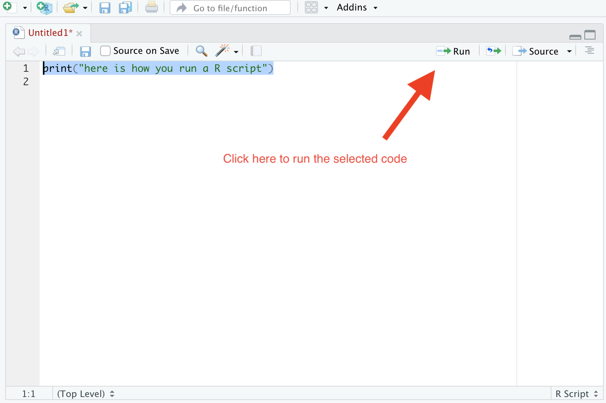{width=90%}

---

### How to Save a R Script

In order to save a R script you can:

- type Control + S (panels) or Command + S (Mac OS)
- Click the "save" button
- By default the script will be saved in the folder of your project.


---

### Commenting your code

 R code can be hard to read. If someone else tries to read it (or you later on), it might be hard to figure out what you have done. Adding comments make code easier to read. 

In R you can insert a comment in your script by placing `#` at the beginning of your code. 
 
See this example:

```{r ExampleComment, echo = T}
#This script creates data and returns TRUE if the mean is less than the median.

# Create the number vector (sequence of numbers) called x
x <- c(1, 3, 4)
# Compute the mean of vector x and store value it in object y
y <- mean(x)
# Compute the median of vector x and store value it in object z
z <- median(x)
# Compare the mean and median of vector x with a logical expression
y < z

```

It is also possible to place a comment (`#`) at the end of a line of code.

```{r ExampleComment2, echo = T}
#This script creates data and returns TRUE if the mean is less than the median.

x <- c(1, 3, 4) # Create the number vector (sequence of numbers) called x
y <- mean(x) # Compute the mean of vector x and store value it in object y
z <- median(x) # Compute the median of vector x and store value it in object z
y < z # Compare the mean and median of vector x with a logical expression

```

---

### Importing/Exporting files from RStudio Cloud

 
From the Files tab you can manage the files that are stored in your project folder. In particular, here you will find the commands to:

- **upload** a file from your computer to the project folder
- **delete** a file from  the project folder
- **rename** a file in your project folder
- download a file from the project folder to your computer (**more --> export **)

---


